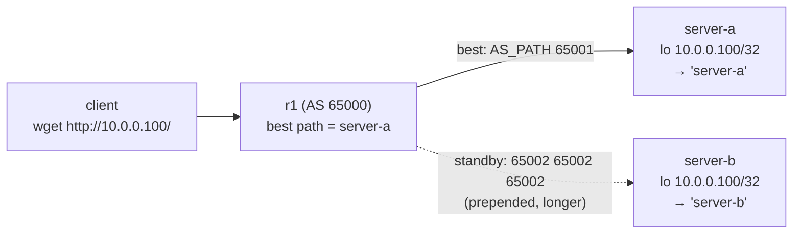

この記事は、ネットワークプロトコルを実際に手を動かして学ぶフリー教材シリーズ **Protocol Lab** の一部です。containerlab を使って小さなトポロジを組み、プロトコルの挙動を自分の目で観察していきます。

- リポジトリ: https://github.com/pathvector-studio/protocol-lab

今回のテーマは **Anycast** です。想定時間は 45〜60分。事前に [BGP Lab 01: eBGP で prefix を広告する](https://github.com/pathvector-studio/protocol-lab/blob/main/examples/bgp-01-ebgp-announce.md) を済ませておくとスムーズです。あわせて [Anycast の RFC ノート](https://github.com/pathvector-studio/protocol-lab/blob/main/rfc-notes/anycast.md) も読みものとしておすすめです。

## ゴール

一つ前のマルチキャスト（Lab 29）では、1つのパケットを *group へ* 送りました。**Anycast** はちょうど逆の技です。**同じアドレス**が**複数**のサーバに存在し、routing システムが各クライアントを**そのうち1つ**へと導きます。

面白いのは、パケットのどこにも「最寄りのサーバへ送れ」とは書かれていない点です。BGP がすでにそのアドレスへの best path を1つだけ知っていて、パケットはそれに従うだけ。特別な仕組みは要りません。

この Lab では、2台のサーバが同じ `10.0.0.100/32` を BGP に announce します。

- `server-b` は自分の AS を prepend（AS_PATH を長く）するので、`r1` は **server-a** を優先する
- クライアントが `http://10.0.0.100/` を取得すると **`server-a`** が応答する
- そこで `server-a` の uplink が**落ちる**と、BGP がその経路を withdraw し、`r1` は **server-b** に再収束する
- クライアントは**同じ** `http://10.0.0.100/` を叩き続けているのに、今度は **`server-b`** が応答する——クライアント側は一切変更なしの自動フェイルオーバー

最終的に、次の表を自分の言葉で説明できるようになるのがゴールです。

| 状態 | r1 の `10.0.0.100` への best path | クライアントに返るもの |
|---|---|---|
| 両方 up | server-a 経由（AS_PATH `65001`、短い） | `server-a` |
| server-a down | server-b 経由（AS_PATH `65002 65002 65002`） | `server-b` |

## この Lab で学べること

- **anycast** とは何か：1つの prefix を複数箇所から announce し、routing が best path を1つだけインストールする
- 「最寄り」が地理ではなく **routing metric 上の最寄り**（ここでは AS_PATH 長）である理由
- BGP の **best-path 選択**が、2つの同一 announce を1つのインストール済み経路にまとめる仕組み
- **フェイルオーバー**の動き：勝者の経路が withdraw されると、routing が自動で再収束する
- anycast が使われている場所（root DNS、`1.1.1.1` / `8.8.8.8`、CDN、DDoS の吸収）と、stateful な通信での注意点

一方で、次の内容は扱いません。

- インスタンス間の細かいロードバランシング（anycast は1クライアントを1インスタンスに固定する）
- 長寿命 TCP のための stateful anycast（セッション同期、consistent hashing）
- IGP ベースの anycast（OSPF/IS-IS の metric）——ここでは eBGP の AS_PATH を使います

## RFC で読む場所

| 資料 | 読むポイント |
|---|---|
| RFC 4271 §9.1 | BGP best-path 選択（AS_PATH 長で1つ選ぶ） |
| RFC 4786 | anycast サービスの運用（複数 announce、catchment、切り替え） |
| RFC 7094 | anycast の定義と stateful 通信での注意 |
| RFC 5737 / RFC 1918 | Lab で使うアドレスがローカル/ドキュメント用であること |

## 実験の全体像

client の後ろに r1（AS 65000）を置きます。r1 は server-a（AS 65001）と server-b（AS 65002）に eBGP で接続し、両サーバが同じ VIP を announce します。

```text
 client            r1 (AS 65000)          server-a (AS 65001)  lo 10.0.0.100/32
 10.0.9.2 --- eth1 ---+--- eth2 --- 10.0.1.0/30 --- (BGP: network 10.0.0.100/32)
                      |
                      +--- eth3 --- 10.0.2.0/30 --- server-b (AS 65002)  lo 10.0.0.100/32
                                    (BGP: network 10.0.0.100/32, prepend 65002 65002)
```

r1 は VIP への2経路を受け取り、AS_PATH が短い server-a を best に選びます。server-a に障害が起きたときは server-b へ再収束します。



:::message
`10.0.0.0/8`（RFC 1918）はローカル閉域として使います。VIP は `10.0.0.100`。実際のインターネットには一切広告しません。
:::

## 必要なもの

推奨環境:

- Linux / WSL2 / Linux VM
- Docker
- containerlab

使用イメージ:

- `frrouting/frr:latest`（r1・server-a・server-b の BGP。python3 も同梱で HTTP responder に使う）
- `nicolaka/netshoot:latest`（client。`wget`、`traceroute`）

追加イメージは不要です。

## 実行手順

一括で回すなら次の1行です。

```bash
./scripts/labctl.sh run anycast-31
```

以下では手順を1つずつ追っていきます。

### 1. 作業ディレクトリへ移動する

```bash
cd protocol-lab/examples/anycast-31
```

### 2. 起動する

```bash
sudo containerlab deploy -t anycast-31.clab.yml
```

両サーバは `lo` に `10.0.0.100/32`（VIP）を持ち、FRR で `network 10.0.0.100/32` を announce します。server-b は outbound の route-map で自 AS を prepend します。

### 3. サーバの identity responder を起動する

```bash
docker exec -d clab-anycast-31-server-a python3 /responder.py server-a
docker exec -d clab-anycast-31-server-b python3 /responder.py server-b
```

各サーバは `0.0.0.0:80` で「自分の名前」を返す小さな HTTP responder です（VIP 宛でも応答します）。どちらのサーバが応答したかを名前で見分けるための仕掛けです。

### 4. BGP の best path を確認する（server-a が優先）

```bash
docker exec clab-anycast-31-r1 vtysh -c "show bgp ipv4 unicast 10.0.0.100/32"
docker exec clab-anycast-31-r1 ip route get 10.0.0.100     # via 10.0.1.2 (server-a)
```

2経路が見え、AS_PATH の短い server-a（`65001`）が best に選ばれています。

### 5. クライアントから VIP を取得する（server-a が応答）

```bash
docker exec clab-anycast-31-client wget -qO- http://10.0.0.100/     # → server-a
docker exec clab-anycast-31-client traceroute -n 10.0.0.100
```

### 6. フェイルオーバー: server-a のリンクを落とす

```bash
docker exec clab-anycast-31-server-a ip link set eth1 down
sleep 5
docker exec clab-anycast-31-r1 ip route get 10.0.0.100     # via 10.0.2.2 (server-b)
docker exec clab-anycast-31-client wget -qO- http://10.0.0.100/     # → server-b
```

宛先は同じ VIP のまま、応答が server-b に切り替わります。

### 7. 戻す

```bash
docker exec clab-anycast-31-server-a ip link set eth1 up
```

## 期待される出力

- `show bgp ... 10.0.0.100/32`: 2経路が見え、best は AS_PATH の短い server-a
- `ip route get 10.0.0.100`: 障害前は `via 10.0.1.2`（server-a）、障害後は `via 10.0.2.2`（server-b）
- `wget http://10.0.0.100/`: 障害前は `server-a`、障害後は `server-b`（宛先 IP は不変）

## なぜそう動くのか

**anycast** を一言でいえば「1つのアドレス、複数のインスタンス、routing が決める」です。同じ prefix（ここでは `10.0.0.100/32`）を複数のノードが routing に announce し、各ルータはその prefix への **best path を1つ**だけ FIB に入れます。だから、そのルータ配下のクライアントは常に1インスタンスへ届きます。送信側は特別なことをしません——宛先はただの1つの IP です。

- **best-path 選択**: r1 は VIP への2経路を受け取り、BGP は1つを best に選びます。ここで決め手になるのは **AS_PATH 長**です。server-a は `65001`（長さ1）、server-b は prepend で `65002 65002 65002`（長さ3）。短い server-a が勝ちます。つまり「nearest」は物理距離ではなく、**routing metric 上の近さ**です。
- **catchment**: どのクライアントがどのインスタンスに落ちるかは、routing のトポロジが決めます。実運用では地理と相関することが多いですが、実際に決めているのは BGP/IGP です。
- **フェイルオーバー**: server-a のリンクが落ちると、r1–server-a 間の BGP セッションが切れ、server-a の経路が無効化されます。r1 は残る server-b を best に選び、FIB を更新します（再収束）。宛先アドレスは同じまま、トラフィックは server-b へ流れます。クライアントの設定変更は不要です。
- **なぜ便利か**: root DNS や `1.1.1.1` / `8.8.8.8`、CDN は、同じ IP を世界中の多数インスタンスで提供しています。最寄りに落ちて低遅延、1つ落ちても自動で別へ切り替わり、攻撃トラフィックも分散して吸収できます。

要点は、**同一 prefix を複数から announce するだけで、通常の routing が「選択」と「フェイルオーバー」の両方を担ってくれる**ことです。専用プロトコルは要りません。

## 詰まりやすい点

- **anycast をロードバランサと混同する**。1クライアントは基本的に1インスタンスへ固定的に落ちます。分散は「多数のクライアントがそれぞれ別々の best を持つ」ことで生じます。細かい負荷分散は別の仕組みが必要です。
- **「最寄り」を地理だと思う**。実際は AS_PATH / IGP metric 上の最寄りです。prepend の数で優先度が変わります。
- **stateful 通信の移動**。長寿命 TCP の途中で best path が変わると、別インスタンスへ飛んで接続が切れることがあります。古典的には DNS（UDP）向きです。CDN は収束が安定していることを前提に HTTP でも使います。
- **VIP を router-id にしない**。FRR の router-id は VIP とは別にします（この Lab では `10.11.11.11` / `10.22.22.22`）。
- **戻り経路**。サーバ側には client サブネットへの戻り経路が必要です（この Lab では default route を r1 へ向けています）。
- **収束時間**。フェイルオーバーは即時ではありません。BGP セッション断の検出＋再計算に数秒かかります（この環境で約2秒）。

:::message
フェイルオーバーは瞬時ではなく、BGP セッション断の検出と再計算に数秒かかります。切り替え直後の `ip route get` や `wget` を焦って叩くと、まだ切り替わっていないように見えることがあります。手順の `sleep 5` はそのための待ち時間です。
:::

## 後片付け

```bash
sudo containerlab destroy -t anycast-31.clab.yml --cleanup
```

`labctl.sh run anycast-31` を使った場合は、スクリプトが最後に自動で destroy します。

## 確認問題

1. anycast とは何か。unicast / multicast と何が違うか。
2. 2つのサーバが同じ `10.0.0.100/32` を announce したとき、r1 はなぜ1つだけを使うのか。
3. この Lab で「server-a が優先」になるのはなぜか。server-b は何をしているか。
4. 「最寄り」とは何の意味での最寄りか。地理的距離とどう違いうるか。
5. server-a が落ちたとき、同じ VIP がなぜ server-b から応答できるのか。何が起きているか。
6. anycast が DNS に向き、長寿命 TCP には注意が要るのはなぜか。

## 検証済み実行ログ（2026-07-07）

この Lab は実機で再現性を確認済みです。

実行環境:

- Ubuntu 26.04 LTS (kernel 7.0.0-27-generic, x86_64)
- Docker 29.1.3
- containerlab 0.77.0
- r1 / server-a / server-b: `frrouting/frr:latest`（BGP + python3 responder）
- client: `nicolaka/netshoot:latest`（wget、traceroute）

`PATH="/tmp/pl-shim:$PATH" ./scripts/labctl.sh run anycast-31` で deploy → verify → destroy を実行し、`verification.json` は `"status": "verified"` を返しました。

### 同じ VIP が、障害前は server-a・障害後は server-b

```text
[protocol-lab][anycast-31] r1 route to 10.0.0.100 is via 10.0.1.2 (after 8s)
[protocol-lab][anycast-31] before failover: server-a server-a server-a
[protocol-lab][anycast-31] + docker exec clab-anycast-31-server-a ip link set eth1 down
[protocol-lab][anycast-31] r1 route to 10.0.0.100 is via 10.0.2.2 (after 2s)
[protocol-lab][anycast-31] after failover: server-b server-b server-b
```

クライアントは終始 `http://10.0.0.100/`（同一 VIP）を叩いているだけです。障害前は3回とも `server-a`、server-a のリンクを落とすと**約2秒で再収束**し、以後3回とも `server-b`。宛先アドレスは一切変えていません。

### r1 の BGP best-path が語る「選択」と「フェイルオーバー」

```text
# 障害前 — 2経路。AS_PATH の短い server-a が best
Paths: (2 available, best #2, table default)
  65002 65002 65002        <- server-b(prepend で長い)
    10.0.2.2 from 10.0.2.2 (10.22.22.22)
  65001                    <- server-a(短い)
    10.0.1.2 from 10.0.1.2 (10.11.11.11)
      Origin IGP, metric 0, valid, external, best (AS Path)

# 障害後 — server-a の経路が消え、残る server-b が best
Paths: (1 available, best #1, table default)
  65002 65002 65002
    10.0.2.2 from 10.0.2.2 (10.22.22.22)
      Origin IGP, metric 0, valid, external, best (First path received)
```

- 障害前は `best (AS Path)` の理由で server-a（`65001`）が選ばれています。server-b は prepend で `65002 65002 65002`（長さ3）なので、非優先の待機系です。
- server-a のリンク断で BGP セッションが落ち、その経路が withdraw されます。r1 は残る server-b を best に選び直し、FIB を `via 10.0.2.2` に更新します。専用の切り替え機構ではなく、**通常の BGP 再収束**がそのままフェイルオーバーになっているのがポイントです。

障害前の `traceroute 10.0.0.100` は `client → 10.0.9.1 (r1) → 10.0.0.100` の2ホップで、VIP へ素直に届いていることを示しました。

### Cleanup

```bash
containerlab destroy -t anycast-31.clab.yml --cleanup
```

---

## おわりに

この記事は、ネットワークプロトコルを手を動かして学ぶフリー教材シリーズ **Protocol Lab** の1本でした。他の Lab（BGP、TCP、TLS、DNS、QUIC、Multicast など）も同じリポジトリにまとまっています。

- シリーズ一覧: https://github.com/pathvector-studio/protocol-lab

役に立ったら、リポジトリに ⭐ を付けてもらえると励みになります。次回は、今回の best-path 選択と地続きのテーマとして、BGP の経路広告を第三者がどう検証するか——**RPKI による origin validation** を扱う予定です。
