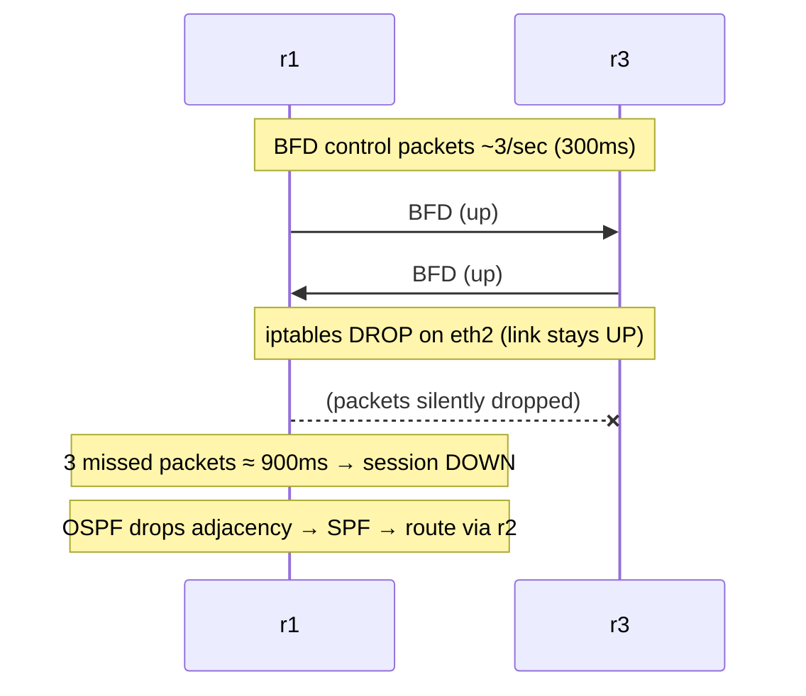

この記事は、ネットワークプロトコルを手を動かして学ぶフリー教材シリーズ **Protocol Lab** の一部です。実際に containerlab でトポロジを立ち上げ、コマンドを叩きながら「なぜそう動くのか」を自分の言葉で説明できるようになることを目指しています。

- リポジトリ: https://github.com/pathvector-studio/protocol-lab

今回は **Lab #35: BFD — サイレント障害を1秒未満で捕まえる** です。

想定時間は 40〜55分。前提として [Lab 34: OSPF](https://github.com/pathvector-studio/protocol-lab/blob/main/examples/ospf-34-link-state.md) を先にやっておくと理解がスムーズです。

## ゴール

Lab 34 の OSPF が速く再収束できたのは、インターフェースを *down* にすると即座に検出できたからでした。しかし現実の障害はそんなに親切とは限りません。

**リンクは up（carrier あり）のままなのに、転送だけが静かに壊れる**——こういう故障が実際に起きます。

- 間に挟まった dumb スイッチ
- 片方向だけ通らない障害
- wedge して応答しなくなった隣接ルータ

carrier は生きているので、OSPF は自分の **dead timer**（既定 **40秒**）が切れるまで異常に気づけません。その間ずっとトラフィックは壊れた経路に吸い込まれ、blackhole され続けます。

これを解決するのが **BFD**（Bidirectional Forwarding Detection）です。隣接どうしで極小の hello を毎秒数回やり取りし、数個連続で欠けたら「path down」と判断して、OSPF に即座に通知します。

このLabでやることは次のとおりです。

- r1 / r2 / r3 で OSPF に **BFD**（300ms × 3 ≈ **900ms** で検出）を全隣接に追加する
- r1 は直リンク r1-r3 経由で target に到達する
- **サイレント障害**を再現する（r1 の `eth2` で全パケットを drop、ただしリンクは **UP** のまま）
- BFD がそれを捕捉し、OSPF が **約900ms** で r2 経由へ再収束する様子を観察する

最終的に、この差を自分の言葉で説明できるようになるのがゴールです。

| | サイレント障害の検出方法 | 検出時間 |
|---|---|---|
| OSPF 単独 | dead timer が切れる | 40秒 |
| OSPF + BFD | BFDパケットが欠ける（300ms × 3） | 約0.9秒 |

## このLabで学べること

- **BFD** とは何か、そしてルーティングプロトコル自身の hello では検出が遅すぎる理由
- **検出時間 = 受信間隔 × detect multiplier**（300ms × 3 ≈ 900ms）という関係
- **link-down 障害**と**サイレントな転送障害**の違い
- OSPF が BFD に**登録**し（`ip ospf bfd`）、BFD の "down" に反応する仕組み
- BFD は up/down を報告するだけで、経路計算は依然ルーティングプロトコルが行うということ

逆に、このLabでは次は扱いません。

- BFD echo モード、LAG メンバー上の micro-BFD
- Multihop BFD（RFC 5883）
- フラップ／誤検出とのトレードオフを踏まえた timer チューニングの詳細

## RFCで読む場所

| 資料 | 読むポイント |
|---|---|
| RFC 5880 | BFD 本体（session, timer, detection time） |
| RFC 5881 | 隣接間 single-hop の BFD |
| RFC 5882 | OSPF/BGP が BFD down をどう使うか |
| RFC 2328 | OSPF の dead 間隔（BFD が置き換える遅い検出） |

読書ガイドは [`rfc-notes/bfd.md`](https://github.com/pathvector-studio/protocol-lab/blob/main/rfc-notes/bfd.md) にまとめてあります。

## 実験の全体像

Lab 34 と同じ OSPF area-0 の三角形トポロジに、全隣接へ BFD を追加します。

```text
              r1
    (OSPF+BFD)/  \(OSPF+BFD)
             r2 -- r3 --- target 10.0.30.1
                (OSPF+BFD)
```

r1 → target は直リンク r1-r3 を通ります。この `eth2` を `iptables DROP` で（リンクは up のまま）転送だけ殺し、サイレント障害を作ります。



:::message
アドレスは `10.0.0.0/8` のローカル閉域を使います。実際のインターネットには一切広告しません。
:::

## 必要なもの

推奨環境:

- Linux / WSL2 / Linux VM
- Docker
- containerlab

使用イメージ:

- `frrouting/frr:latest`（r1/r2/r3、ospfd + bfdd）
- `nicolaka/netshoot:latest`（target）

追加イメージは不要です。

## 実行手順

一発で回すなら次のコマンドで deploy → verify → destroy まで実行できます。

```bash
./scripts/labctl.sh run bfd-35
```

以下は手順を1つずつ追う場合です。

### 1. 作業ディレクトリへ移動する

```bash
cd protocol-lab/examples/bfd-35
```

### 2. 起動する

```bash
sudo containerlab deploy -t bfd-35.clab.yml
```

各ルータは OSPF（area 0）に加え、transit インターフェースで `ip ospf bfd` により BFD を有効化しています。

### 3. BFDセッションとタイマを確認する

```bash
docker exec clab-bfd-35-r1 vtysh -c "show bfd peers"
docker exec clab-bfd-35-r1 vtysh -c "show ip ospf interface eth2" | grep "Timer intervals"
```

`Status: up`、`Receive/Transmission interval: 300ms`、`Detect-multiplier: 3`（≈900ms 検出）になっているはずです。一方 OSPF 側は `Dead 40s` のままです。

### 4. 直リンク経由の到達を確認する

```bash
docker exec clab-bfd-35-r1 ip route get 10.0.30.1     # via 10.0.13.2 (r3 direct)
docker exec clab-bfd-35-r1 ping -c2 10.0.30.1
```

### 5. サイレント障害を起こす（リンクは up のまま転送を殺す）

```bash
docker exec clab-bfd-35-r1 sh -c 'iptables -A INPUT -i eth2 -j DROP; iptables -A OUTPUT -o eth2 -j DROP'
sleep 2
docker exec clab-bfd-35-r1 ip -br link show eth2       # まだ UP,LOWER_UP
docker exec clab-bfd-35-r1 ip route get 10.0.30.1      # もう via 10.0.12.2 (r2)
docker exec clab-bfd-35-r1 ping -c2 10.0.30.1          # まだ届く
```

BFD が約900msで down を検出し、OSPF が r2 へ再収束します。それでもリンク自体は依然 UP のままである点に注目してください。

### 6. 元に戻す

```bash
docker exec clab-bfd-35-r1 sh -c 'iptables -D INPUT -i eth2 -j DROP; iptables -D OUTPUT -o eth2 -j DROP'
```

## 期待される出力

- `show bfd peers`: 2セッションが `Status: up`、間隔 300ms、multiplier 3
- OSPF interface: `Dead 40s`（BFD が無ければ待たされる時間）
- サイレント障害後: eth2 は `UP,LOWER_UP` のまま、route は `via 10.0.12.2`（r2）へ、再収束は **1秒未満**（この環境で約900ms）
- target は終始到達可能

## なぜそう動くのか

**BFD** は「next-hop 用の高速なデッドマンスイッチ」だと考えると分かりやすいです。ルーティングプロトコルも自前の hello で障害を検出しますが、タイマが遅い（OSPF の dead は40秒）。BFD はその検出だけを専任で肩代わりします。

### なぜ hello だけでは遅いのか

OSPF Hello は 10秒ごと、dead は 40秒です。間隔を詰めれば早くなりますが、CPU負荷や誤検出が増えます。そこで **検出専用の軽量プロトコル（BFD）** を分けて走らせ、ルーティング側はそれに「down を教えて」と登録するという分業にします。

### 検出時間

BFD は制御パケットを交渉した間隔（ここでは 300ms）でやり取りし、**detect multiplier**（既定 3）個連続で欠けたら down とみなします。つまり ≈ 300ms × 3 = **900ms**。OSPF の40秒の約1/40です。

### サイレント障害が肝

リンクが **down** すれば OS が carrier loss を即検出でき、ルーティングもすぐ反応します（Lab 34 の veth はこれで速かった）。しかし現実には **リンク up・転送死** という障害があります——間の dumb スイッチ、片方向障害、wedge した隣接。carrier が生きているので、ルーティングは dead 間隔まで気づけません。

このLabは `iptables DROP` でリンクを up のまま転送を殺し、この状況を再現します。BFD の制御パケットも一緒に drop されるので、r1 は900msで session down を宣言できるわけです。

### OSPFとの結合

`ip ospf bfd` でその隣接に BFD を紐づけます。BFD が down を報告すると、OSPF は隣接を即 down 扱いにし、SPF をやり直して r2 経由に再収束します。

ここで大事なのは、**BFD は経路を選ばない**ということ。up/down を報告するだけで、経路はあくまで OSPF が計算します。

要点はこうです。**遅いルーティング hello の代わりに、軽量な BFD がサイレント障害を1秒未満で検出し、ルーティングの再収束を早める。** 検出（BFD）と経路計算（OSPF/BGP）の役割分担、と覚えてください。

## 詰まりやすい点

- **BFD が経路を選ぶと思う** → 選びません。up/down を報告するだけ。経路は OSPF/BGP。
- **リンク down のために BFD が要ると思う** → link-down は OS が即検出します。BFD の価値は **サイレント障害**（リンク up・転送死）。このLabの `iptables DROP` がその再現です。
- **hello を詰めれば十分だと思う** → ルーティング hello の過度な短縮は負荷・誤検出を増やします。軽量な BFD を分けるのが定石。
- **速いほど良いと思う** → 攻めすぎると瞬断で誤 down（フラップ）します。timer / multiplier は環境に合わせて調整を。
- **BFD 単独で動くと思う** → ルーティングと結合して初めて再収束が起きます。

## 後片付け

```bash
sudo containerlab destroy -t bfd-35.clab.yml --cleanup
```

`labctl.sh run bfd-35` を使った場合は、スクリプトが最後に destroy まで実行します。

## 確認問題

1. BFD は何をするプロトコルか。経路選択をするか。
2. 検出時間はどう決まるか。300ms・multiplier 3 なら何 ms か。
3. link-down 障害とサイレント障害の違いは何か。どちらで BFD が効くか。
4. OSPF の dead 間隔（40秒）に対し、BFD はなぜ桁違いに速いのか。
5. OSPF は BFD の down をどう使うか。`ip ospf bfd` は何をするか。
6. BFD の timer を攻めすぎると何が起きうるか。

## 検証済み実行ログ (2026-07-07)

このLabは実機で再現性を確認済みです。

実行環境:

- Ubuntu 26.04 LTS (kernel 7.0.0-27-generic, x86_64)
- Docker 29.1.3
- containerlab 0.77.0
- r1 / r2 / r3: `frrouting/frr:latest`（ospfd + bfdd）
- target: `nicolaka/netshoot:latest`

`PATH="/tmp/pl-shim:$PATH" ./scripts/labctl.sh run bfd-35` で deploy → verify → destroy を実行し、`verification.json` は `"status": "verified"` を返しました。

### BFDセッション（サブ秒タイマ）と OSPF の40秒 dead

```text
peer 10.0.13.2 vrf default interface eth2
    Status: up
    Detect-multiplier: 3
    Receive interval: 300ms
    Transmission interval: 300ms

OSPF: Timer intervals configured, Hello 10s, Dead 40s, Wait 40s, Retransmit 5
```

BFD の検出時間 ≈ 300ms × 3 = **約900ms**。OSPF 単独の dead は **40秒**——BFD は約40倍速い計算です。

### サイレント障害を918msで検出・再収束

r1 の eth2 に `iptables DROP`（in/out 両方）を入れ、リンクを **UP のまま** 転送を殺しました。

```text
reconverged: 1
elapsed_ms: 918
link_at_failure: eth2@if1136  UP  <BROADCAST,MULTICAST,UP,LOWER_UP>
```

- 障害の瞬間も eth2 は **`UP,LOWER_UP`**（carrier あり）——OS からは「リンクは生きている」ように見えるサイレント障害です。
- それでも BFD が制御パケットの途絶を約900msで検知し、OSPF が r2 経由へ **918ms** で再収束しました。
- 同じ状況で BFD が無ければ、OSPF は Hello が dead 間隔（40秒）ぶん途切れるまで壊れた直リンクを使い続け、その間トラフィックを blackhole し続けます。
- 再収束後も target（10.0.30.1）は r2 経由で到達可能でした。

### Cleanup

```bash
containerlab destroy -t bfd-35.clab.yml --cleanup
```

## References

- [RFC 5880: Bidirectional Forwarding Detection (BFD)](https://www.rfc-editor.org/rfc/rfc5880)
- [RFC 5881: BFD for IPv4 and IPv6 (Single Hop)](https://www.rfc-editor.org/rfc/rfc5881)
- [RFC 5882: Generic Application of BFD](https://www.rfc-editor.org/rfc/rfc5882)
- [FRRouting BFD documentation](https://docs.frrouting.org/en/latest/bfd.html)
- [RFC 5737: IPv4 Address Blocks Reserved for Documentation](https://www.rfc-editor.org/rfc/rfc5737)

---

## Protocol Lab シリーズについて

この記事は、ネットワークプロトコルを手を動かして学ぶフリー教材 **Protocol Lab** の一本です。他のLab（BGP、OSPF、TCP、TLS、DNS、QUIC など）も同じリポジトリで公開しています。

- シリーズ一覧・全Lab: https://github.com/pathvector-studio/protocol-lab

「役に立った」と思ったら、ぜひ GitHub で ⭐ スターをつけていただけると励みになります。教材を続けていく力になります。

次回は、OSPF/BFD で速い再収束を手に入れたレイヤの一つ上——**BGP を実際に2台のルータで動かし、経路広告（AS_PATH や NEXT_HOP）を自分の言葉で説明できるようになる**Labを扱う予定です。お楽しみに。
