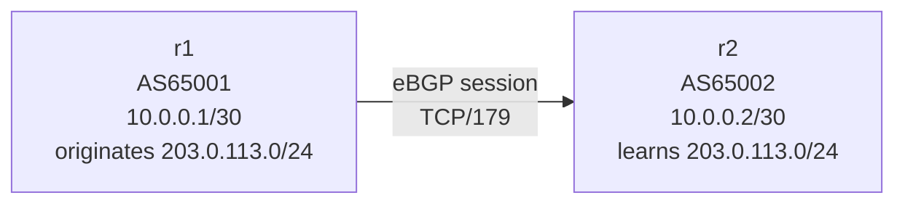
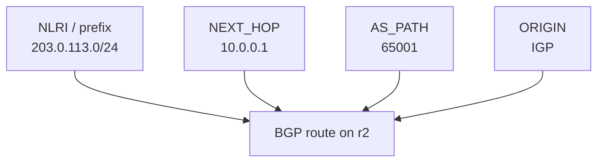

この記事は、ネットワークプロトコルを手を動かして学ぶフリー教材シリーズ **Protocol Lab** の一部です。教材本体（実行スクリプト・サンプル設定・RFCノート）はGitHubで公開しています。

- リポジトリ: https://github.com/pathvector-studio/protocol-lab

今回のテーマはシンプルです。**2つのASの間でeBGPセッションを張り、片方が1つのprefixを広告し、もう片方が学習した経路を、RFC 4271の言葉で読めるようになる**こと。最終的に、次の1行を自分の言葉で説明できる状態を目指します。

```text
203.0.113.0/24 via 10.0.0.1, AS_PATH 65001, ORIGIN IGP
```

想定時間は45〜60分です。

## このLabで学べること

- AS は BGP の外部経路交換における管理単位である。
- prefix は到達可能な宛先アドレス範囲である。
- BGP の route は `prefix + path attributes` である。
- UPDATE message で経路広告が運ばれる。
- 受信側では NLRI、AS_PATH、NEXT_HOP、ORIGIN を対応づけて読む。

逆に、今回は次を扱いません: 経路選択アルゴリズムの詳細、withdraw、RPKI / ROA / ROV、iBGP、route reflector、本物のインターネットへの広告。

## RFCで読む場所

必読は RFC 4271 の以下です。

| 章 | 読むポイント |
|---|---|
| 1.1 | AS、BGP speaker、EBGP、IBGP、NLRI、Route |
| 3 | BGP が network reachability information を交換すること |
| 3.1 | route は prefix と path attributes の組で、UPDATE で広告されること |
| 4.2 | OPEN message に My Autonomous System が入ること |
| 4.3 | UPDATE message の構造。Path Attributes と NLRI を見る |
| 5 | ORIGIN、AS_PATH、NEXT_HOP が mandatory attributes であること |

RFCノートも用意しています: https://github.com/pathvector-studio/protocol-lab/blob/main/rfc-notes/bgp-rfc4271.md

## 実験の全体像

2台の仮想ルータを作ります。

```text
AS65001 / r1                         AS65002 / r2
10.0.0.1/30  ----------------------  10.0.0.2/30

r1 advertises:
  203.0.113.0/24

r2 learns:
  prefix:   203.0.113.0/24
  next hop: 10.0.0.1
  as path:  65001
  origin:   IGP
```



見てほしい点:

- `r1` と `r2` は別々の AS にいるので、このセッションは eBGP。
- `r1` は `203.0.113.0/24` を originate する。
- `r2` は UPDATE を受け取り、`203.0.113.0/24` への route を BGP table に入れる。

:::message
`203.0.113.0/24` は RFC 5737 の documentation prefix です。外部へは広告せず、Lab 内の閉じた Docker 環境だけで使います。実インターネットには一切広告しません。
:::

## 必要なもの

推奨環境:

- Linux / WSL2 / Linux VM
- Docker
- containerlab
- ホスト側の tcpdump / Wireshark

使用イメージは `frrouting/frr:latest`。

:::message
macOS の場合は、macOS のターミナルから直接 containerlab を動かすのではなく、Linux VM / OrbStack / Colima などの Linux 環境に入ってから実行してください。BGP の packet capture は Linux の network namespace 上で見る方が扱いやすいです。生成した pcap は必要に応じて macOS 側の Wireshark で開きます。
:::

## 手順

リポジトリを持っている場合は、検証スクリプトで一気に流せます。

```bash
./scripts/labctl.sh run bgp-01
```

`labctl.sh run bgp-01` は topology deploy、FRR 出力確認、pcap 取得、destroy まで行います。以下は手動で1ステップずつ追う場合の手順です。

### 1. 作業ディレクトリを作る

```bash
mkdir -p bgp-01
cd bgp-01
```

### 2. containerlab topology を作る

`bgp-01.clab.yml`:

```yaml
name: bgp-01

topology:
  nodes:
    r1:
      kind: linux
      image: frrouting/frr:latest
      binds:
        - ./r1/frr.conf:/etc/frr/frr.conf
        - ./r1/vtysh.conf:/etc/frr/vtysh.conf
        - ./r1/daemons:/etc/frr/daemons
      exec:
        - ip addr add 10.0.0.1/30 dev eth1
        - ip link set eth1 up
        - ip addr add 203.0.113.1/24 dev lo
        - sysctl -w net.ipv4.ip_forward=1
    r2:
      kind: linux
      image: frrouting/frr:latest
      binds:
        - ./r2/frr.conf:/etc/frr/frr.conf
        - ./r2/vtysh.conf:/etc/frr/vtysh.conf
        - ./r2/daemons:/etc/frr/daemons
      exec:
        - ip addr add 10.0.0.2/30 dev eth1
        - ip link set eth1 up
        - sysctl -w net.ipv4.ip_forward=1

  links:
    - endpoints: ["r1:eth1", "r2:eth1"]
```

### 3. FRRouting config を作る

```bash
mkdir -p r1 r2
```

`r1/daemons` と `r2/daemons`（共通）:

```text
zebra=yes
bgpd=yes
```

`r1/vtysh.conf` と `r2/vtysh.conf`（共通）:

```text
service integrated-vtysh-config
```

`r1/frr.conf`:

```text
frr version 10.0
frr defaults traditional
hostname r1
service integrated-vtysh-config
!
router bgp 65001
 bgp router-id 1.1.1.1
 no bgp ebgp-requires-policy
 neighbor 10.0.0.2 remote-as 65002
 !
 address-family ipv4 unicast
  network 203.0.113.0/24
 exit-address-family
!
line vty
```

`r2/frr.conf`:

```text
frr version 10.0
frr defaults traditional
hostname r2
service integrated-vtysh-config
!
router bgp 65002
 bgp router-id 2.2.2.2
 no bgp ebgp-requires-policy
 neighbor 10.0.0.1 remote-as 65001
 !
 address-family ipv4 unicast
 exit-address-family
!
line vty
```

### 4. 起動する

```bash
sudo containerlab deploy -t bgp-01.clab.yml
```

neighbor が Established になるまで数秒待ってから BGP summary を見ます。

```bash
docker exec -it clab-bgp-01-r1 vtysh -c "show bgp summary"
docker exec -it clab-bgp-01-r2 vtysh -c "show bgp summary"
```

観察ポイント:

- `r1` の AS は `65001`、`r2` の AS は `65002`。
- peer が Established 相当になる。
- `r2` 側の `State/PfxRcd` に `1` が表示される（r1 から1本受信）。

### 5. r2 で受け取った経路を見る

```bash
docker exec -it clab-bgp-01-r2 vtysh -c "show bgp ipv4 unicast"
```

期待する読み方:

```text
Network          Next Hop        Path
*> 203.0.113.0/24 10.0.0.1       65001 i
```

この1行は、単なる表示ではなく RFC 4271 の `route = prefix + path attributes` を小さく観察したものです。列とRFC用語の対応は次の通り。

| 表示 | RFC 4271 の対応 |
|---|---|
| `203.0.113.0/24` | NLRI / prefix |
| `10.0.0.1` | NEXT_HOP |
| `65001` | AS_PATH |
| `i` | ORIGIN = IGP |



詳細表示も見ておきます。

```bash
docker exec -it clab-bgp-01-r2 vtysh -c "show bgp ipv4 unicast 203.0.113.0/24"
```

`Paths` に `65001`、`from 10.0.0.1`、`origin IGP` が出れば、`route = prefix + path attributes` を1本ぶん読めています。

### 6. UPDATE を packet capture で見る

FRRouting のコンテナに tcpdump が入っているとは限らないので、ホスト側から containerlab が作った network namespace に入って capture します。

```bash
sudo ip netns list | grep clab-bgp-01
sudo ip netns exec clab-bgp-01-r2 tcpdump -i eth1 -nn -s 0 -w bgp-01-r2.pcap tcp port 179
```

capture を開始したまま、r1 から BGP session を張り直します。

```bash
docker exec -it clab-bgp-01-r1 vtysh -c "clear bgp 10.0.0.2"
```

数秒後に `Ctrl-C` で止め、`bgp-01-r2.pcap` を Wireshark で開きます。見る場所:

- `BGP OPEN`: `My AS: 65001` / `BGP Identifier: 1.1.1.1`
- `BGP UPDATE`: `ORIGIN` / `AS_PATH: 65001` / `NEXT_HOP: 10.0.0.1` / `NLRI: 203.0.113.0/24`

:::message
BGP session がすでに Established になった後に capture を始めると、最初の UPDATE を取り逃がすことがあります。capture を開始してから `clear bgp` でセッションを張り直すのがコツです。
:::

## なぜそう動くのか

`r1` は `router bgp 65001` の中で `network 203.0.113.0/24` を設定し、さらに `lo` に `203.0.113.1/24` を持たせています。FRRouting の `network` 文は「対応する prefix が routing table に存在するとき」に広告するので、この loopback があることで広告条件を満たします。

`r1` は external peer である `r2` に UPDATE を送ります。RFC 4271 Section 5.1.2 の考え方では、originating speaker が external peer に送るとき AS_PATH には自分の AS 番号が入るため、`r2` から見る AS_PATH は `65001` になります。そして `r2` は「`203.0.113.0/24` へは `10.0.0.1` に送ればよい」と学びます。これが NEXT_HOP です。

## よくある誤解

- `Network` 列の prefix は next hop ではない。到達したい宛先範囲である。
- `Next Hop` は origin AS ではない。転送時に次に向かう IP アドレスである。
- AS_PATH は物理的なルータ名の列ではない。AS 番号の列である。
- `i` は iBGP の意味ではない。ORIGIN attribute の `IGP` を表す表示である。
- BGP table に出たからといって、実インターネットに広告されたわけではない。

## 検証済み実行ログ（2026-05-10）

このLabは実機（Ubuntu 24.04 / Docker 29.4.0 / containerlab 0.75.0 / FRRouting）で再現性を確認済みです。`r2` から見た route は次の通り。

```text
$ docker exec clab-bgp-01-r2 vtysh -c "show ip bgp"

   Network          Next Hop            Metric LocPrf Weight Path
*> 203.0.113.0/24   10.0.0.1                 0             0 65001 i

Displayed  1 routes and 1 total paths
```

冒頭のゴール `203.0.113.0/24 via 10.0.0.1, AS_PATH 65001, ORIGIN IGP` が、実機の出力とそのまま対応していることが確認できます。

| RFC 4271 用語 | 実機の表示 |
|---|---|
| NLRI (prefix) | `Network: 203.0.113.0/24` |
| NEXT_HOP | `Next Hop: 10.0.0.1` |
| AS_PATH | `Path: 65001` |
| ORIGIN | `Origin IGP`（route 行末の `i`） |

## 練習問題

1. `203.0.113.0/24` の NLRI、AS_PATH、NEXT_HOP、ORIGIN はそれぞれどれか。
2. `r1` の AS 番号を `65010` に変えたら、`r2` から見える AS_PATH はどう変わるか。
3. `r1` の `network 203.0.113.0/24` を消して再読み込みしたら、`r2` の BGP table はどう変わるか。これは RFC 4271 のどの概念につながるか。
4. `NEXT_HOP` が `10.0.0.1` になる理由を、自分の言葉で説明する。
5. `ORIGIN = IGP` は、どんな意味で「IGP」なのか。

## 後片付け

```bash
sudo containerlab destroy -t bgp-01.clab.yml
```

---

**Protocol Lab について**

この記事は、ネットワークプロトコルを手を動かして学ぶフリー教材シリーズ Protocol Lab の一部です。全Labの一覧・実行スクリプト・RFCノートはこちらにあります。

- シリーズ一覧 / リポジトリ: https://github.com/pathvector-studio/protocol-lab

役に立ったら、リポジトリに ⭐️ をいただけると励みになります。

次回は AS を3つに増やして、AS_PATH が伸びる様子と経路取り消し（withdraw）を扱います。
