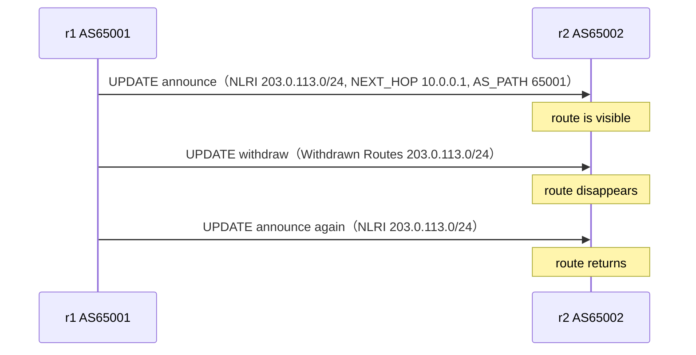

この記事は、ネットワークプロトコルを手を動かして学ぶフリー教材シリーズ **Protocol Lab** の一部です。教材本体（実行スクリプト・サンプル設定・RFCノート）はGitHubで公開しています。

- リポジトリ: https://github.com/pathvector-studio/protocol-lab

前回（[BGP Lab 01](https://zenn.dev/nkchan/articles/protocol-lab-bgp-01)）では、1本の経路が `r2` に現れるところを RFC 4271 の言葉で読みました。今回はその1本の経路を、**UPDATE message による広告（announce）と取り下げ（withdraw）という「動き」**として見直します。

最終的に、次のシーケンスを自分の言葉で説明できる状態を目指します。

```text
203.0.113.0/24 が r2 に見えている
203.0.113.0/24 を r1 が withdraw する
203.0.113.0/24 が r2 から消える
203.0.113.0/24 を r1 が再び announce する
203.0.113.0/24 が r2 に戻る
```

想定時間は45〜60分です。

## このLabで学べること

- BGP UPDATE message は route announcement と route withdrawal の**両方**に使われる。
- announcement では prefix が NLRI に入り、ORIGIN / AS_PATH / NEXT_HOP などの path attributes が付く。
- withdrawal では、取り下げる prefix が `Withdrawn Routes` に入る。
- withdraw は、その route の AS_PATH や NEXT_HOP を**再説明しなくてよい**。
- BGP table から route が消えることを、FRRouting の出力と pcap の両方で確認できる。

今回は扱いません: competing origins、route leaks、RPKI / ROA / ROV、BGP decision process、iBGP、route reflector、実インターネットへの広告。

## RFCで読む場所

必読は RFC 4271 の以下です。

| 章 | 読むポイント |
|---|---|
| 3.1 | route は UPDATE で広告され、withdraw されること |
| 4.3 | UPDATE message の `Withdrawn Routes` / `Path Attributes` / `NLRI` |
| 5 | UPDATE に NLRI がある場合の mandatory attributes |
| 5.1.1 / 5.1.2 / 5.1.3 | ORIGIN / AS_PATH / NEXT_HOP |

RFCノート: https://github.com/pathvector-studio/protocol-lab/blob/main/rfc-notes/bgp-rfc4271-lab02.md

## 実験の全体像

Lab 01 と同じ2台構成を使います。

```text
AS65001 / r1                         AS65002 / r2
10.0.0.1/30  ----------------------  10.0.0.2/30

Step 1: r1 announces 203.0.113.0/24  → r2 learns it
Step 2: r1 withdraws 203.0.113.0/24  → r2 removes it
Step 3: r1 announces it again        → r2 learns it again
```



ポイントは、**announce と withdraw で UPDATE の「見る場所」が違う**ことです。announce は `Path Attributes + NLRI`、withdraw は `Withdrawn Routes` を見ます。

:::message
`203.0.113.0/24` は RFC 5737 の documentation prefix です。外部へは広告せず、Lab 内の閉じた Docker 環境だけで使います。
:::

## 必要なもの

- Linux / WSL2 / Linux VM、Docker、containerlab
- ホスト側の tcpdump、Wireshark または tshark
- イメージ: `frrouting/frr:latest`

:::message
macOS の場合は Linux VM / OrbStack / Colima などの Linux 環境で実行してください。BGP の packet capture は Linux の network namespace 上で見る方が扱いやすいです。
:::

## 手順

リポジトリを持っていれば、検証スクリプトで一気に流せます（deploy → route出現確認 → withdraw → 消失確認 → 再広告 → pcap取得 → destroy）。

```bash
./scripts/labctl.sh run bgp-02
```

以下は手動で1ステップずつ追う手順です。

### 1. 起動して route がある状態を見る

```bash
cd protocol-lab/examples/bgp-02
sudo containerlab deploy -t bgp-02.clab.yml
```

neighbor が Established になるまで数秒待ってから、`r2` の BGP table を見ます。

```bash
docker exec -it clab-bgp-02-r2 vtysh -c "show bgp ipv4 unicast"
```

```text
Network          Next Hop        Path
*> 203.0.113.0/24 10.0.0.1       65001 i
```

`203.0.113.0/24` が NEXT_HOP `10.0.0.1`、AS_PATH `65001`、ORIGIN `i`（IGP）で入っていれば、Lab 01 と同じ状態です。

### 2. packet capture を開始する

別ターミナルで、withdraw を打つ**前に** capture を始めます（先に消してしまうと withdraw UPDATE を取り逃がします）。

```bash
sudo ip netns list | grep clab-bgp-02
sudo ip netns exec clab-bgp-02-r2 tcpdump -i eth1 -nn -s 0 -w bgp-02-r2.pcap tcp port 179
```

### 3. route を withdraw する

capture を動かしたまま、`r1` から `network` statement を外します。

```bash
docker exec -it clab-bgp-02-r1 vtysh \
  -c "configure terminal" \
  -c "router bgp 65001" \
  -c "address-family ipv4 unicast" \
  -c "no network 203.0.113.0/24"
```

数秒待ってから `r2` を見ると、route が消えています。

```bash
docker exec -it clab-bgp-02-r2 vtysh -c "show bgp ipv4 unicast"
```

```text
Displayed 0 routes and 0 total paths
```

:::message
消えたのは **session ではなく route** です。neighbor は Established のままで構いません。ここがこのLabの一番のポイントです。
:::

### 4. route を再広告する

同じ `r1` で `network` statement を戻します。

```bash
docker exec -it clab-bgp-02-r1 vtysh \
  -c "configure terminal" \
  -c "router bgp 65001" \
  -c "address-family ipv4 unicast" \
  -c "network 203.0.113.0/24"
```

数秒後、`r2` に `203.0.113.0/24` が戻ります。NEXT_HOP と AS_PATH は最初の announcement と同じです。tcpdump は `Ctrl-C` で止めます。

### 5. pcap で UPDATE を見る

Wireshark で `bgp-02-r2.pcap` を開き、`10.0.0.1 -> 10.0.0.2` の UPDATE に注目します。

- **announce UPDATE**: `Path attributes`（ORIGIN / `AS_PATH: 65001` / `NEXT_HOP: 10.0.0.1`）と `NLRI: 203.0.113.0/24`
- **withdraw UPDATE**: `Withdrawn Routes` に `203.0.113.0/24`

announcement は `Path Attributes + NLRI`、withdrawal は `Withdrawn Routes` を見る——この違いが今回の核心です。

## なぜそう動くのか

RFC 4271 Section 4.3 の UPDATE message には、`Withdrawn Routes` / `Path Attributes` / `Network Layer Reachability Information (NLRI)` の3つの領域があります。

`r1` が `network 203.0.113.0/24` を持つとき、`r1` はその prefix を **NLRI** として広告し、UPDATE には ORIGIN / AS_PATH / NEXT_HOP が付きます。`no network 203.0.113.0/24` を実行すると、`r1` は以前広告した reachability を取り下げます。このとき取り下げる prefix は **`Withdrawn Routes`** に入り、`r2` は該当 route を BGP table から消します。再び `network` を設定すると、同じ prefix が再広告され、route が戻ります。

重要なのは、**withdraw は「到達不能な next hop」を再広告する message ではない**ことです。取り下げる prefix を `Withdrawn Routes` に載せることで、以前の reachability を無効化します。だから withdraw には AS_PATH や NEXT_HOP を再説明する必要がありません。

## よくある誤解

- withdraw は BGP session を切ることではない。neighbor は Established のまま、route だけが消える。
- withdraw は「到達不能な値」を送ることではない。取り下げる prefix を `Withdrawn Routes` に載せる。
- `no network 203.0.113.0/24` は loopback の IP を消す操作ではない。BGP で originate する設定を外している。
- route が BGP table から消えても、実インターネットに何かをしたわけではない。閉じた Docker 環境だけの話。

## 検証済み実行ログ（run id: 20260508T232252Z, status: verified）

実機で、`203.0.113.0/24` が `r2` に出現 → withdraw で消失 → re-advertise で復帰、を確認済みです。

```text
[bgp-02] BGP route present after 3s: before withdraw
[bgp-02] withdrawing 203.0.113.0/24 from r1
[bgp-02] BGP route absent after 2s: after withdraw
[bgp-02] announcing 203.0.113.0/24 from r1
[bgp-02] BGP route present after 1s: after reannounce
[bgp-02] verification OK
```

withdraw 後の `r2`:

```text
No BGP prefixes displayed, 0 exist
```

re-advertise 後は table version が変わり、同じ route（`203.0.113.0/24`, `10.0.0.1`, `65001 i`）が戻ります。BGP session が落ちたのではなく、**Established session 上で route だけが withdraw / re-advertise された**ことが要点です。

## 練習問題

1. announcement UPDATE で `203.0.113.0/24` はどの部分に入るか。
2. withdrawal UPDATE で `203.0.113.0/24` はどの部分に入るか。
3. withdraw に AS_PATH や NEXT_HOP が必須でない理由を、自分の言葉で説明する。
4. withdraw 後も neighbor が Established のままでよい理由を説明する。
5. `no network 203.0.113.0/24` と `ip addr del 203.0.113.1/24 dev lo` は、観察結果として何が似ていて何が違うか。

## 後片付け

```bash
sudo containerlab destroy -t bgp-02.clab.yml
```

---

**Protocol Lab について**

この記事は、ネットワークプロトコルを手を動かして学ぶフリー教材シリーズ Protocol Lab の一部です。全Labの一覧・実行スクリプト・RFCノートはこちらにあります。

- シリーズ一覧 / リポジトリ: https://github.com/pathvector-studio/protocol-lab

役に立ったら、リポジトリに ⭐️ をいただけると励みになります。

次回は、同じ prefix が**異なる origin AS から見える**状態を作り、competing origins と route leak の入口を見ます（BGP Lab 03）。
