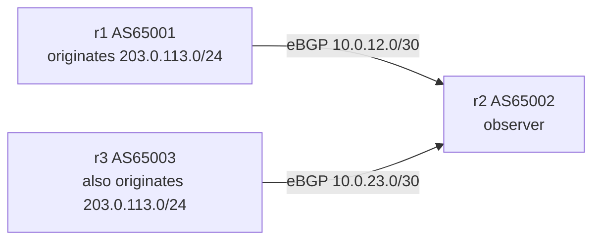

この記事は、ネットワークプロトコルを手を動かして学ぶフリー教材シリーズ **Protocol Lab** の一部です。教材本体（実行スクリプト・サンプル設定・RFCノート）はGitHubで公開しています。

- リポジトリ: https://github.com/pathvector-studio/protocol-lab

[BGP Lab 01](https://zenn.dev/nkchan/articles/protocol-lab-bgp-01) / [Lab 02](https://zenn.dev/nkchan/articles/protocol-lab-bgp-02) では、1本の経路の広告と取り下げを見ました。今回は視点を変えて、**2つの異なるASが同じprefixを広告し、観察者がそれを「2つのpath」として見る**状態を作ります。

テーマはシンプルです。**BGPでprefixが見えることと、誰がそれをoriginateしてよいかを知っていることは別**です。最終的に、次の観察を自分の言葉で説明できる状態を目指します。

```text
203.0.113.0/24 が r2 に2つのpathで見える
via 10.0.12.1 は origin AS65001
via 10.0.23.2 は origin AS65003
```

想定時間は45〜60分です。

## このLabで学べること

- AS_PATH の**右端**の AS が、その route の origin AS として読まれる。
- 同じ prefix が複数の origin AS から見えることがある。
- competing origin は、誤設定・意図したマルチホーム・route leak・hijack など複数の理由で起きうる。
- **BGP table だけでは、その origin AS が本当に許可されているかは分からない**。
- RPKI origin validation（次のLab）が、この問いに答えるための材料になる。

今回は扱いません: RPKI / ROA / ROV、route leak の詳細分類、BGP decision process の詳細、AS path validation、実インターネットへの広告。

## RFCで読む場所

| 章 | 読むポイント |
|---|---|
| RFC 4271 1.1 | AS、BGP speaker、route、RIB の用語 |
| RFC 4271 3.1 | route は prefix と path attributes の組であること |
| RFC 4271 5.1.2 | AS_PATH と AS_SEQUENCE |
| RFC 4271 9 | 受け取った UPDATE を処理し route を保持・選択すること |
| RFC 7908 | route leak の problem statement（入口として） |

RFCノート: https://github.com/pathvector-studio/protocol-lab/blob/main/rfc-notes/bgp-rfc4271-lab03.md

## 実験の全体像

今回は3台構成です。`r2` が観察者で、`r1`(AS65001) と `r3`(AS65003) が**同じ** `203.0.113.0/24` を広告します。

```text
AS65001 / r1                AS65002 / r2                AS65003 / r3
10.0.12.1/30 ---- 10.0.12.2/30
                  10.0.23.1/30 ---- 10.0.23.2/30

r1 advertises 203.0.113.0/24
r3 advertises 203.0.113.0/24
r2 observes both:
  203.0.113.0/24 via 10.0.12.1, AS_PATH 65001
  203.0.113.0/24 via 10.0.23.2, AS_PATH 65003
```



`203.0.113.0/24` は RFC 5737 の documentation prefix です。

:::message alert
documentation prefix を実インターネットへ広告してはいけません。このLabは閉じた Docker 環境の中だけで動かします。
:::

## 手順

```bash
./scripts/labctl.sh run bgp-03   # deploy → 出力確認 → pcap → destroy を一括
```

以下は手動手順です。

### 1. 起動して neighbor を確認する

```bash
cd protocol-lab/examples/bgp-03
sudo containerlab deploy -t bgp-03.clab.yml
docker exec -it clab-bgp-03-r2 vtysh -c "show bgp summary"
```

`r2` の local AS が `65002`、neighbor `10.0.12.1` が AS65001、`10.0.23.2` が AS65003 で、どちらからも prefix を1本受信していることを確認します。

### 2. 同じ prefix の2pathを見る

```bash
docker exec -it clab-bgp-03-r2 vtysh -c "show bgp ipv4 unicast 203.0.113.0/24"
```

```text
Paths: (2 available, best #1, table default)
  65001
    10.0.12.1 from 10.0.12.1 (1.1.1.1)
      Origin IGP, metric 0, valid, external, best (Router ID)
  65003
    10.0.23.2 from 10.0.23.2 (3.3.3.3)
      Origin IGP, metric 0, valid, external
```

同じ `203.0.113.0/24` に対して、AS_PATH `65001` と `65003` の2つの origin AS が見えます。FRRouting はどちらか一方を best path に選びますが、**best に選ばれなかった path も観察上は重要**です。

### 3. pcap で2つの UPDATE を見る

```bash
sudo ip netns exec clab-bgp-03-r2 tcpdump -i any -nn -s 0 -w bgp-03-r2.pcap tcp port 179
# 別ターミナルで session を張り直して両方の UPDATE を捕まえる
docker exec -it clab-bgp-03-r2 vtysh -c "clear bgp *"
```

Wireshark で開き、次の2つを見ます。

- `10.0.12.1 -> 10.0.12.2` の UPDATE: `AS_PATH: 65001`, `NLRI: 203.0.113.0/24`
- `10.0.23.2 -> 10.0.23.1` の UPDATE: `AS_PATH: 65003`, `NLRI: 203.0.113.0/24`

**prefix は同じ、origin AS は違う。そして BGP UPDATE だけでは、どちらが許可された origin なのか分かりません。**

## なぜそう動くのか

`r1` は AS65001 として、`r3` は AS65003 として、同じ `203.0.113.0/24` を originate します。`r2` は2つの eBGP neighbor から同じ NLRI を持つ UPDATE を受け取り、それぞれ異なる AS_PATH を見ます。

この時点で `r2` が見ているのは「同じ prefix へ行けるという2つの主張」です。これは常に攻撃とは限りません——意図されたマルチホームや移行作業でも複数 origin は起こり得ます。一方で、誤広告・route leak・prefix hijack の入口にもなります。**BGP table だけでは、その origin AS が許可されているかを判断できません。**

## よくある誤解

- competing origin は必ず hijack という意味ではない。
- route leak と competing origin は同義ではない。route leak は経路広告の伝播範囲・関係性の問題、competing origin は同じ prefix の origin AS が複数見える状態。
- best path に選ばれなかった path も観察上は重要。
- AS_PATH は「prefix を所有している証明」ではない。

## 検証済み実行ログ（run id: 20260509T060606Z, status: verified）

観察点 `r2` では、2つの eBGP neighbor がそれぞれ1 prefix を広告しています。

```text
Neighbor    V    AS   ...  State/PfxRcd  PfxSnt
10.0.12.1   4  65001  ...       1           1
10.0.23.2   4  65003  ...       1           1
```

同じ `203.0.113.0/24` に対して、`r2` の BGP table には2つの path が見えます。

```text
   Network          Next Hop       Metric LocPrf Weight Path
*> 203.0.113.0/24   10.0.12.1           0             0 65001 i
*                   10.0.23.2           0             0 65003 i

Displayed  1 routes and 2 total paths
```

| Next hop | AS_PATH | Origin AS | status |
|---|---:|---:|---|
| `10.0.12.1` | `65001` | `65001` | valid, best |
| `10.0.23.2` | `65003` | `65003` | valid |

この実行では FRRouting が AS65001 由来の path を best に選びました（Router ID による決定）。ただし、**BGP table に見える best path は「許可された origin」の証明ではありません**。どちらの origin AS が正当かを判断するには、次のLabで扱う ROA / VRP と origin validation が必要です。

## 練習問題

1. `r2` で見える `203.0.113.0/24` の2つの AS_PATH は何か。
2. それぞれの origin AS はどれか。
3. 同じ prefix に複数 origin が見えることは、なぜ危険の入口になるのか。
4. competing origin と route leak は何が違うか。
5. BGP table だけでは「許可された origin」か判断できない理由を説明する。

## 後片付け

```bash
sudo containerlab destroy -t bgp-03.clab.yml
```

---

**Protocol Lab について**

この記事は、ネットワークプロトコルを手を動かして学ぶフリー教材シリーズ Protocol Lab の一部です。全Labの一覧・実行スクリプト・RFCノートはこちらにあります。

- シリーズ一覧 / リポジトリ: https://github.com/pathvector-studio/protocol-lab

役に立ったら、リポジトリに ⭐️ をいただけると励みになります。

次回は、RPKI の ROA / VRP と BGP route を照合し、origin AS が valid / invalid / not found になる理由を見ます（RPKI Lab 04）。「誰がこの prefix を originate してよいか」に、ようやく答えます。
