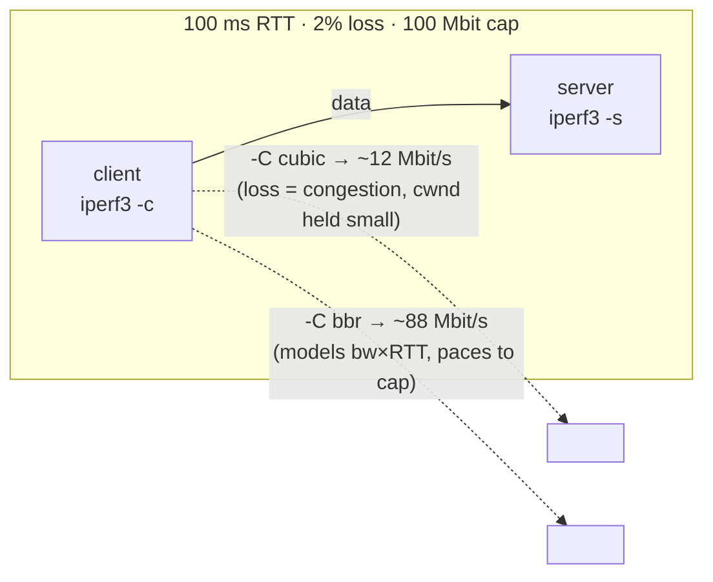

この記事は、ネットワークプロトコルを手を動かして学ぶフリー教材シリーズ **Protocol Lab** の一編です。教材本体・他の Lab・実行スクリプトはすべて GitHub で公開しています。

https://github.com/pathvector-studio/protocol-lab

前提の Lab として、TCP が loss と delay にどう反応するかを扱った [TCP Lab 08: Loss, Retransmission, and the Window](https://github.com/pathvector-studio/protocol-lab/blob/main/examples/tcp-08-retransmission-windowing-loss.md) を先に触れておくと理解が早いです。RFC の読みどころは [tcp-congestion-control.md](https://github.com/pathvector-studio/protocol-lab/blob/main/rfc-notes/tcp-congestion-control.md) にまとめてあります。

想定所要時間は 40〜55 分です。

## ゴール

Lab 08 では、TCP が loss と delay に反応する様子を眺めました。この Lab で見たいのは、その反応の *仕方* が実は **選択** であるということです。TCP には「どう反応するか」を決める **輻輳制御アルゴリズム(congestion control algorithm)** があり、lossy で RTT の長い path では、その選択ひとつで throughput がほぼ一桁変わります。

やることはシンプルです。1 本の path を `tc netem` で障害化し(RTT 100ms、ランダム loss 2%、100 Mbit/s の上限)、その同じ path 上で `iperf3` を 2 回流します。

- **CUBIC**(Linux 既定、**loss-based**): すべてのドロップを輻輳の合図とみなし、cwnd を小さく抑え込む。結果、throughput は上限を大きく下回って **崩壊** する。
- **BBR**(**model-based**): bottleneck 帯域と RTT を推定してその値に合わせて pacing する。ランダム loss を概ね無視するので、throughput は **上限付近** を保つ。

最終的に、次の表を自分の言葉で説明できるようになるのがゴールです。

| アルゴリズム | 「速すぎる」の合図 | 100ms / 2% loss / 100Mbit path での throughput |
|---|---|---|
| CUBIC (loss-based) | パケットドロップ | 約 12 Mbit/s(崩壊する) |
| BBR (model-based) | 帯域 / RTT のモデル | 約 88 Mbit/s(上限付近) |

## この Lab で学べること

- **congestion window (cwnd)** とは何か、そして throughput ≈ cwnd / RTT である理由。
- **loss-based**(Reno, CUBIC)と **model-based**(BBR)の輻輳制御の違い。
- なぜ **ランダムな(輻輳由来でない)loss** が loss-based アルゴリズムを壊し、BBR は壊さないのか。
- **`ss -ti`** から輻輳状態(cwnd, ssthresh, pacing_rate, アルゴリズム固有の統計)を読む方法。
- 接続ごと(`iperf3 -C`)/システム全体(`sysctl`)でアルゴリズムを選択する方法。

一方で、この Lab では次は扱いません。

- 競合するフロー間の公平性(BBR と CUBIC が 1 つの bottleneck を共有する場合)。
- BBRv2/v3 の詳細や、ECN ベースの制御(DCTCP)。
- buffer / bufferbloat の踏み込んだチューニング(Lab 28 で触れます)。

## RFC で読む場所

| 資料 | 読むポイント |
|---|---|
| RFC 5681 | TCP 輻輳制御の中核(slow start, congestion avoidance, cwnd/ssthresh) |
| RFC 8312 | CUBIC(loss-based、高 BDP 向け、Linux 既定) |
| BBR 論文 (Cardwell et al.) | model-based(bottleneck bandwidth × RTT の推定と pacing) |
| RFC 5737 | Lab で使うアドレスがローカル閉域であること(補足) |

## 実験の全体像

構成は client と server の 2 ノードだけです。両者をつなぐ path に netem で障害を入れ、同じ障害 path 上で CUBIC と BBR を切り替えながら `iperf3` の throughput を測ります。

```text
client (10.0.0.1) --- eth1/eth1 --- server (10.0.0.2, iperf3 -s)
  netem: 50ms delay,                 netem: 50ms delay (return path)
         2% loss, 100mbit rate cap
  → RTT ~100ms, lossy, capped at 100 Mbit/s
```



:::message
`10.0.0.0/24` はローカル閉域のアドレスです。この Lab はホスト内で完結し、外部ネットワークには一切トラフィックを出しません。
:::

## 必要なもの

推奨環境は次のとおりです。

- Linux / WSL2 / Linux VM(BBR が使えるモダンな kernel)
- Docker
- containerlab

使用イメージ:

- `nicolaka/netshoot:latest`(`tc`、`iperf3`、`ss` を同梱)

:::message
輻輳制御はホストの TCP スタックで動作するため、ホストの kernel に BBR があることが前提です。`sysctl net.ipv4.tcp_available_congestion_control` の出力に `bbr` が含まれることを確認してください。含まれていなければ `modprobe tcp_bbr` でロードします。コンテナ側に追加設定は要りません。
:::

## 実行手順

一括で回すなら、次の 1 行で deploy → verify → destroy まで実行できます。

```bash
./scripts/labctl.sh run cc-30
```

手動でひとつずつ確認したい場合は以下です。

### 1. 作業ディレクトリへ移動する

```bash
cd protocol-lab/examples/cc-30
```

### 2. 起動して iperf3 サーバを立てる

```bash
sudo containerlab deploy -t cc-30.clab.yml
docker exec -d clab-cc-30-server iperf3 -s
```

### 3. path を障害化する(100ms RTT・2% loss・100mbit 上限)

```bash
docker exec clab-cc-30-client tc qdisc add dev eth1 root netem delay 50ms loss 2% rate 100mbit
docker exec clab-cc-30-server tc qdisc add dev eth1 root netem delay 50ms
docker exec clab-cc-30-client ping -c3 10.0.0.2   # RTT ~100ms
```

### 4. CUBIC で測る(loss-based)

```bash
docker exec clab-cc-30-client iperf3 -c 10.0.0.2 -C cubic -t 10
# 転送中に別ターミナルで cwnd を覗く:
docker exec clab-cc-30-client sh -c "ss -tin dst 10.0.0.2 | tr ',' '\n' | grep -E 'cubic|cwnd|ssthresh|retrans'"
```

throughput は上限 100 Mbit を大きく下回ります(loss によって cwnd が抑えられるため)。

### 5. BBR で測る(model-based)

```bash
docker exec clab-cc-30-client iperf3 -c 10.0.0.2 -C bbr -t 10
docker exec clab-cc-30-client sh -c "ss -tin dst 10.0.0.2 | tr ',' '\n' | grep -E 'bbr|cwnd|pacing_rate'"
```

throughput は上限付近まで戻ります(BBR が帯域を推定して pacing するため)。

### 6. 障害を外して戻す

```bash
docker exec clab-cc-30-client tc qdisc del dev eth1 root
docker exec clab-cc-30-server tc qdisc del dev eth1 root
```

## 期待される出力

- ping の RTT は約 100ms。
- **CUBIC**: throughput は上限 100 Mbit を大きく下回る(この環境では約 12 Mbit/s)。`ss` の cwnd/ssthresh は小さい。
- **BBR**: throughput は上限付近(この環境では約 88 Mbit/s)。`ss` の cwnd は大きく、`pacing_rate` が約 99 Mbit、`bbr:(bw:...)` が約 100 Mbit を示す。

## なぜそう動くのか

TCP には「このリンクは 100 Mbit/s だ」と教えてくれるダイヤルがありません。送信側は使える速度を **推測** するしかなく、その推測を **congestion window (cwnd)**(同時に in-flight にできるバイト数)として持ち、送信量を制御します。実効速度はおおよそ **cwnd / RTT** です。そして「何を『速すぎる』の合図とみなすか」こそが、アルゴリズムごとの違いになります。

### CUBIC(loss-based)

CUBIC はパケットドロップを輻輳の合図とみなし、それを見るたびに cwnd を大きく削ります(その後の回復は cubic 曲線で速めますが、前提はあくまで loss = 輻輳です)。ところが、この Lab の path で起きている loss は netem による **ランダムな** ドロップであり、輻輳とは無関係です。それでも CUBIC は cwnd を折り続けるので、cwnd が小さいまま張り付き、`cwnd / RTT` が上限より遥かに小さくなります。RTT 100ms・loss 2% では、Mathis 近似 `MSS / (RTT·√p)` が示す水準まで落ち込みます。

### BBR(model-based)

BBR は loss を輻輳の合図に使いません。代わりに **bottleneck bandwidth** と **RTprop**(最小 RTT)を継続的に推定し、その帯域に合わせて送信を **pace** します。ランダム loss は「帯域が減った」証拠にはならないので、BBR は速度を落としません。結果、cwnd を大きく保ったまま上限付近を維持します。BBR も再送はします(`retrans` は出ます)が、**cwnd を折らない** のが要点です。

### だから 7 倍以上変わる

同じ path でも、CUBIC の 12 Mbit と BBR の 88 Mbit のように **7 倍以上** の差が生まれます。「遅い」の原因が必ずしも帯域不足とは限らず、**loss × RTT × 輻輳制御の相互作用** であることがあるわけです。

要点はこうです。**リンク帯域と RTT は path が決めるが、それをどれだけ使えるかは送信側の輻輳制御が決める**。loss をどう解釈するかで、lossy path での結果は大きく変わります。

## 詰まりやすい点

- **loss をすべて輻輳とみなしてしまう**。無線・ビットエラー・軽い netem の loss は輻輳ではありません。loss-based はそれでも cwnd を折ります。ここが CUBIC 崩れの核心です。
- **BBR が loss を無視する = 信頼性を捨てる、と誤解する**。BBR も再送はします(信頼性は TCP が担保)。折らないのは cwnd だけです。
- **速度は帯域だけで決まると思う**。実際は cwnd/RTT が縛ります。RTT が大きいほど、同じ cwnd でも遅くなります。
- **輻輳制御はコンテナ内の設定だと思う**。実際はホストの TCP スタックで動きます。ホストに BBR が無ければ `bbr` は選べません。
- **測定はばらつく**。netem のランダム loss で結果は揺れます。桁で見てください(CUBIC は上限の何分の一か、BBR は上限付近か)。
- **MSS が大きい**。コンテナの MTU は 9500(jumbo)です。`ss` の mss が 9448 でも、挙動の本質は変わりません。

## 後片付け

```bash
sudo containerlab destroy -t cc-30.clab.yml --cleanup
```

`labctl.sh run cc-30` を使った場合は、スクリプトが最後に自動で destroy します。

## 確認問題

1. congestion window(cwnd)とは何か。throughput が cwnd/RTT に比例するのはなぜか。
2. loss-based(CUBIC)と model-based(BBR)は、それぞれ何を「速すぎる」の合図にするか。
3. ランダムな(輻輳でない)loss が、CUBIC の throughput を大きく下げるのはなぜか。
4. BBR は loss をどう扱うか。BBR も再送するのに throughput が高いのはなぜか。
5. `ss -ti` の cwnd / ssthresh / pacing_rate から、CUBIC と BBR の状態をどう読み分けるか。
6. 「回線は速いのに遅い」とき、輻輳制御が原因になりうるのはどんな path か。

## 検証済み実行ログ(2026-07-07)

この Lab は実機で再現性を確認済みです。

実行環境:

- Ubuntu 26.04 LTS (kernel 7.0.0-27-generic, x86_64)
- Docker 29.1.3
- containerlab 0.77.0
- client / server: `nicolaka/netshoot:latest`(tc、iperf3、ss 同梱)
- host kernel の `tcp_available_congestion_control`: `reno cubic bbr`

`PATH="/tmp/pl-shim:$PATH" ./scripts/labctl.sh run cc-30` で deploy → verify → destroy を実行し、`verification.json` は `"status": "verified"` を返しました。

### 同じ lossy path で CUBIC と BBR を比較

path は RTT 約 100ms、ランダム loss 2%、100 Mbit/s 上限(`tc netem`)です。

```text
[protocol-lab][cc-30] impairing the path: 50ms each way (RTT ~100ms), 2% loss, 100mbit cap
rtt min/avg/max/mdev = 100.043/100.058/100.075/0.013 ms
[protocol-lab][cc-30] cubic: 12 Mbit/s
[protocol-lab][cc-30] bbr: 88 Mbit/s
```

同一の障害 path 上で、**CUBIC は 12 Mbit/s**(上限 100 の約 1/8 まで崩れる)、**BBR は 88 Mbit/s**(上限付近を維持)。アルゴリズムの選択だけで **7 倍以上** の差が出ました。

### `ss -ti` が語る cwnd の違い

転送中の `ss -tin` スナップショット(要点抜粋):

```text
# CUBIC — loss で cwnd/ssthresh が小さく張り付く
cubic ... cwnd:15 ssthresh:9 bytes_retrans:141720 delivery_rate:9601152 ...

# BBR — 帯域を約100 Mbit と推定し、大きな cwnd を許して pacing
bbr ... cwnd:276 ssthresh:142 bbr:(bw:100181184bps cwnd_gain:2)
       pacing_rate:99179368bps delivery_rate:94801776 ...
```

- CUBIC は `cwnd:15`(`throughput ≈ cwnd/RTT` が小さい)。ランダム loss を輻輳とみなして折り続けています。
- BBR は `bbr:(bw:100181184bps)` = 約 100 Mbit の帯域を推定し、`pacing_rate` 約 99 Mbit で送出、`cwnd:276` と大きい。
- 興味深いのは、BBR の絶対再送量(`bytes_retrans` 992040)が CUBIC(141720)より **多い** 点です。BBR は loss があっても送り続ける(=再送も増える)一方で、**cwnd を折らない** ので throughput は高い。「loss を速度を落とす合図に使わない」という設計が、そのまま数値に現れています。

### Cleanup

```bash
containerlab destroy -t cc-30.clab.yml --cleanup
```

## 参考文献

- [RFC 5681: TCP Congestion Control](https://www.rfc-editor.org/rfc/rfc5681)
- [RFC 8312: CUBIC for Fast and Long-Distance Networks](https://www.rfc-editor.org/rfc/rfc8312)
- [BBR: Congestion-Based Congestion Control (Cardwell et al., 2016)](https://research.google/pubs/pub45646/)
- [tc-netem(8) manual page](https://man7.org/linux/man-pages/man8/tc-netem.8.html)
- [RFC 5737: IPv4 Address Blocks Reserved for Documentation](https://www.rfc-editor.org/rfc/rfc5737)

---

この記事は **Protocol Lab** シリーズの一編です。他の Lab(BGP、TLS、DNS、QUIC など)も含めた一覧はこちらから辿れます。

https://github.com/pathvector-studio/protocol-lab

役に立ったら、リポジトリに ⭐ を付けてもらえると励みになります。

次回は、この Lab で軽く触れた **buffer / bufferbloat** を掘り下げ、キューが遅延に与える影響を実際に測ってみる予定です。
