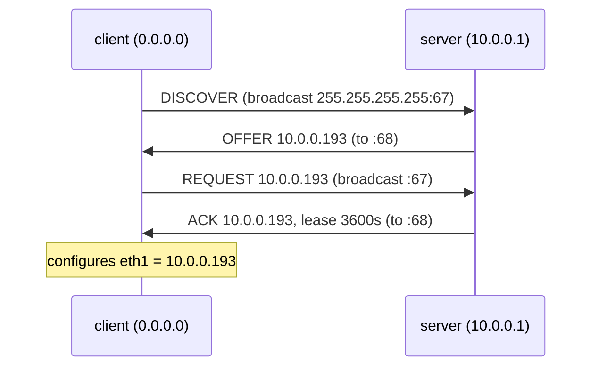

この記事は、ネットワークプロトコルを手を動かしながら学ぶフリー教材シリーズ **Protocol Lab** の一部です。実際にコンテナでルータやホストを組み、パケットをキャプチャしながら、プロトコルの動きを「自分の言葉で説明できる」ところまで持っていくことを狙っています。

- リポジトリ: https://github.com/pathvector-studio/protocol-lab

今回は **Lab #22: DHCP — アドレスを得るための4つのメッセージ** を扱います。想定所要時間は 40〜55分です。

- 読み物ガイド: [rfc-notes/dhcp-dora.md](https://github.com/pathvector-studio/protocol-lab/blob/main/rfc-notes/dhcp-dora.md)
- 前提: [TCP Lab 07](https://github.com/pathvector-studio/protocol-lab/blob/main/examples/tcp-07-handshake-teardown.md)（キャプチャの読み方）

## ゴール

これまでのLabに登場したホストは、すべてアドレスを「設定してもらって」いました。では、起動した直後で **IP をまったく持っていない** マシンは、どうやってアドレスを手に入れるのでしょうか。

その答えが **DHCP** です。そしてその手続きは、ちょうど4つのメッセージ、頭文字をとって **DORA** と呼ばれる流れで進みます。

- **D**iscover — クライアントが「DHCP サーバはいますか?」と叫ぶ（送信元 `0.0.0.0` からのブロードキャスト）
- **O**ffer — サーバが「`10.0.0.193` を使っていいですよ」と返す
- **R**equest — クライアントが「では `10.0.0.193` をもらいます」と言う
- **A**ck — サーバが「あなたのものです、3600秒間」と確定する

このLabでは、アドレスの付いていないリンクを持つクライアントを起動し、DHCP クライアントを走らせて、この DORA のやり取りを丸ごとワイヤ上でキャプチャします。

終わったときには、次の表のようにやり取りを自分でラベル付けできるようになっているはずです。

| ステップ | From → To | 意味 |
|---|---|---|
| Discover | `0.0.0.0:68` → `255.255.255.255:67` | どこかにサーバいる? |
| Offer | server:67 → client:68 | このアドレスを使っていいよ |
| Request | `0.0.0.0:68` → `255.255.255.255:67` | 提示されたそのアドレスを要求します |
| Ack | server:67 → client:68 | 確定。リース時間つきで |

## このLabで学べること

- アドレスを持たないホストが、まだ知らないサーバに届くために、なぜ **broadcast** を使わなければならないのか。
- DHCP の4つのメッセージ（DORA）と、それぞれが何を運んでいるのか。
- **lease（貸与）** とは何か、なぜアドレスは一時的なのか。
- アドレス以外に DHCP が配るもの（router、DNS、lease time）。
- DHCP のポートがなぜ 67（サーバ）と 68（クライアント）なのか。

一方、このLabでは次は扱いません。

- DHCP relay（サブネットをまたぐ中継）、予約（reservation）、フェイルオーバー。
- DHCPv6 や IPv6 SLAAC（これらは別の仕組みです）。
- 更新・再バインドのタイマー（T1/T2）の詳細。

## RFCで読む場所

| RFC | 章 | 読むポイント |
|---|---|---|
| RFC 2131 | 3.1 | クライアントがアドレスを得る流れ（DORA） |
| RFC 2131 | 2 | DHCP メッセージ形式（BOOTP をベースに） |
| RFC 2131 | 4.1 | broadcast の使い方、ポート 67/68 |
| RFC 2132 | 3, 9 | DHCP options（subnet, router, DNS, lease time, message type 53） |

## 実験の全体像

クライアント（アドレスなし）と、サーバ（`10.0.0.1`、`udhcpd`）を1本のリンクで繋ぎます。

```text
client (no IP) ==== eth1/eth1 ==== server (10.0.0.1)
   udhcpc                             udhcpd, pool 10.0.0.100-.200
```

クライアントの `eth1` はリンクだけ up の状態で、IP はまだ付いていません。これを DHCP で得ます。



`10.0.0.0/24` はローカルの閉域として使います。

:::message
このLabのアドレス空間は外に広告しないローカル閉域です。実際のインターネットには一切影響しません。
:::

## 必要なもの

推奨環境:

- Linux / WSL2 / Linux VM
- Docker
- containerlab

使用イメージ:

- `nicolaka/netshoot:latest`（`udhcpd`（サーバ）、`udhcpc`（クライアント）、`tcpdump` を同梱）

追加イメージは不要です。DHCP サーバの設定は [`examples/dhcp-22/udhcpd.conf`](https://github.com/pathvector-studio/protocol-lab/blob/main/examples/dhcp-22/udhcpd.conf) にあります。

## 実行手順

一括で回すなら次の1コマンドで deploy → verify → destroy まで実行できます。

```bash
./scripts/labctl.sh run dhcp-22
```

以下は手動で1ステップずつ確認する手順です。

### 1. 作業ディレクトリへ移動する

```bash
cd protocol-lab/examples/dhcp-22
```

### 2. 起動して DHCP サーバを立てる

```bash
sudo containerlab deploy -t dhcp-22.clab.yml
docker exec clab-dhcp-22-server sh -c ": > /tmp/udhcpd.leases; udhcpd -f /etc/udhcpd.conf &"
```

`udhcpd.conf` は `10.0.0.100-.200` の範囲を配り、router / DNS / lease を option で渡します。

### 3. capture を仕込んで、client にアドレスを取らせる

```bash
docker exec -d clab-dhcp-22-client tcpdump -i eth1 -n "udp port 67 or udp port 68"
docker exec clab-dhcp-22-client udhcpc -i eth1 -q -f -n
docker exec clab-dhcp-22-client ip -4 addr show eth1
```

`udhcpc` の出力に `lease of 10.0.0.193 obtained from 10.0.0.1` のような行が出ます。`ip addr` で `eth1` にアドレスが付いているのが確認できます。

### 4. DORA を capture で読む

```bash
docker exec clab-dhcp-22-client tcpdump -n -vv -r /tmp/dhcp.pcap
```

```text
0.0.0.0.68 > 255.255.255.255.67: BOOTP/DHCP ... DHCP-Message: Discover
... > ...68: DHCP-Message: Offer
0.0.0.0.68 > 255.255.255.255.67: DHCP-Message: Request, Requested-IP 10.0.0.193
... > ...68: DHCP-Message: ACK
```

## 期待される出力

- `udhcpc`: `lease of 10.0.0.1xx obtained from 10.0.0.1`
- `ip addr show eth1`: `inet 10.0.0.1xx`
- capture: `Discover` → `Offer` → `Request`（Requested-IP つき）→ `ACK` の4つ

## なぜそう動くのか

DHCP は「アドレスを持たないホストに、アドレスと必要な設定を配る」仕組みです。難しいのは、**相手（サーバ）をまだ知らず、自分のアドレスも無い** という状態から始めなければならない点にあります。

### なぜ broadcast なのか

クライアントはサーバの IP も、自分の IP も知りません。だから宛先を `255.255.255.255`（broadcast）、送信元を `0.0.0.0` にして、同じリンク上の全員に届けます。そのなかでサーバだけが応答する、という形をとります。

### DORA の4段

- **Discover**: 「DHCP サーバはいますか?」。broadcast で投げます。
- **Offer**: サーバが「この住所はどうですか?」と候補を提示します。サーバが複数いれば、複数の Offer が返ってくることもあります。
- **Request**: クライアントが「その住所をください」と要求します（どのサーバの Offer を受けるかも含みます）。これも broadcast で、選ばれなかったサーバにも「あなたの Offer は断りました」と伝わります。
- **Ack**: サーバが確定し、lease time やオプションを付けて返します。

### lease（貸与）

アドレスは買い切りではなく、期限付きの貸与です。期限が来る前にクライアントが更新（renew）します。こうすることで、いなくなったホストのアドレスを再利用でき、限りあるアドレス空間を回していけます。

### アドレス以外も配る

DHCP は subnet mask、default router、DNS サーバ、lease time などを **option**（RFC 2132）として一緒に渡します。だから DHCP でつながると、ゲートウェイや DNS まで自動で設定されるわけです。

### ポート 67/68

サーバは 67、クライアントは 68 を使います。どちらも UDP です。固定ポートなので、IP がまだ確定していない状態でもやり取りが成立します。

要点は、**「相手も自分のアドレスも分からない」状態を、broadcast と4つのメッセージで解決して、アドレス一式を借りる** ということです。

## 詰まりやすい点

- **DORA の R をサーバからだと思ってしまう**：Request を出すのはクライアントです（offered address を要求する）。
- **Offer で確定だと思ってしまう**：確定は Ack です。Offer はあくまで候補で、サーバが複数いれば複数来ます。
- **broadcast の理由**：クライアントは自分の IP もサーバの IP も知らないからです。
- **アドレスが恒久だと思ってしまう**：lease は期限付きです。更新しなければ失います。
- **DHCP はアドレスだけを配ると思ってしまう**：router / DNS / lease などの option も配ります。
- **ポート**：サーバ 67、クライアント 68。取り違えるとフィルタが噛み合いません。

## 後片付け

```bash
sudo containerlab destroy -t dhcp-22.clab.yml --cleanup
```

`labctl.sh run dhcp-22` を使った場合は、スクリプトが最後に destroy まで実行します。

## 確認問題

1. DORA の4つのメッセージは何か。それぞれ誰が出すか。
2. アドレスを持たない client が broadcast を使うのはなぜか。送信元アドレスは何か。
3. Offer と Ack の違いは何か。どちらで住所が確定するか。
4. lease（貸与）とは何か。なぜアドレスは期限付きか。
5. DHCP はアドレス以外に何を配るか（3つ挙げよ）。
6. DHCP のサーバ/クライアントのポート番号は何か。

## 検証済み実行ログ (2026-07-07)

このLabは実機で再現性を確認済みです。

実行環境:

- Ubuntu 26.04 LTS (kernel 7.0.0-27-generic, x86_64)
- Docker 29.1.3
- containerlab 0.77.0
- client / server: `nicolaka/netshoot:latest`（udhcpd 1.38.0 / udhcpc、tcpdump 同梱）

`PATH="/tmp/pl-shim:$PATH" ./scripts/labctl.sh run dhcp-22` で deploy → verify → destroy を実行し、`verification.json` は `"status": "verified"` を返しました。

### client がアドレスを得る

```text
$ docker exec clab-dhcp-22-client udhcpc -i eth1 -q -f -n
udhcpc: lease of 10.0.0.193 obtained from 10.0.0.1, lease time 3600

$ docker exec clab-dhcp-22-client ip -4 addr show eth1
    inet 10.0.0.193/24 ... scope global eth1
```

### DORA が wire に見える

```text
$ docker exec clab-dhcp-22-client tcpdump -n -vv -r dhcp.pcap
0.0.0.0.68 > 255.255.255.255.67: BOOTP/DHCP, Request ... DHCP-Message: Discover
        ... > ...68: DHCP-Message: Offer
0.0.0.0.68 > 255.255.255.255.67: BOOTP/DHCP, Request ... DHCP-Message: Request
        Requested-IP: 10.0.0.193
        ... > ...68: DHCP-Message: ACK
```

**D**iscover（送信元 `0.0.0.0`、宛先 broadcast `255.255.255.255:67`）→ **O**ffer → **R**equest（`Requested-IP 10.0.0.193`）→ **A**ck。アドレスも相手も知らない状態から、broadcast と4つのメッセージで、アドレス一式（ここでは router / DNS / lease も含めて）を借りているのが読み取れます。

## References

- [RFC 2131: Dynamic Host Configuration Protocol](https://www.rfc-editor.org/rfc/rfc2131)
- [RFC 2132: DHCP Options and BOOTP Vendor Extensions](https://www.rfc-editor.org/rfc/rfc2132)
- [RFC 5737: IPv4 Address Blocks Reserved for Documentation](https://www.rfc-editor.org/rfc/rfc5737)
- [udhcpd / udhcpc (BusyBox) documentation](https://busybox.net/downloads/BusyBox.html)

---

## Protocol Lab について

**Protocol Lab** は、BGP・TCP・TLS・DHCP など、ネットワークプロトコルを実際に手を動かしながら学ぶフリー教材シリーズです。全Labの一覧はこちらから確認できます。

- 📚 シリーズ一覧: https://github.com/pathvector-studio/protocol-lab

役に立ったら、ぜひ GitHub リポジトリに ⭐ スターをいただけると励みになります。

次回は DHCP の続きとして、**サブネットをまたいでアドレスを配る DHCP relay** を扱う予定です。今回「クライアントは broadcast でしか届かない」ことを見ましたが、ではその broadcast が届かない別サブネットのサーバから、どうやってアドレスをもらうのか——次のLabでその橋渡しの仕組みを追いかけていきます。