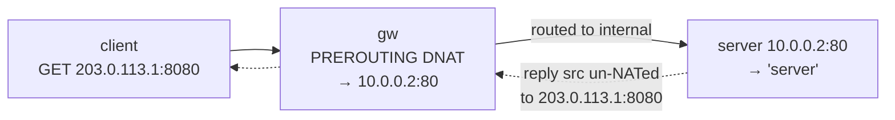

この記事は、ネットワークプロトコルを手を動かして学ぶフリー教材シリーズ **Protocol Lab** の一編です。各 Lab は containerlab で小さなトポロジを立て、コマンドを叩きながら「なぜそう動くのか」を自分の言葉で説明できるようになることを目指しています。

- リポジトリ: https://github.com/pathvector-studio/protocol-lab

今回のテーマは **DNAT（destination NAT / ポートフォワード）**。前提となる [Lab 20: NAT — Source Address Translation](https://github.com/pathvector-studio/protocol-lab/blob/main/examples/nat-20-source-nat.md) を先に済ませておくと理解がスムーズです。より詳しい読み物として [DNAT / ポートフォワードの解説ノート](https://github.com/pathvector-studio/protocol-lab/blob/main/rfc-notes/dnat-port-forwarding.md) も用意しています。

想定時間は 35〜50 分です。

## ゴール

Lab 20 では **source NAT**（masquerade）を使い、多数の内側ホストが1つの公開アドレス経由で外へ出られるようにしました。この Lab はその**入り方向の対**にあたります。**destination NAT**（ポートフォワード）を使って、外側が公開 `アドレス:ポート` 経由で*選ばれた*内側サービスに届くようにします。

内部サーバは、クライアントが直接アドレスできない private 網にいます。gw（ゲートウェイ）が公開アドレスを持っています。

- **規則を入れる前**は、クライアントの公開 `203.0.113.1:8080` への要求は何も返りません（そこにサービスが無いため）。
- **DNAT** 規則が `203.0.113.1:8080` → 内部 `10.0.0.2:80` に写すと、
- クライアントは**公開アドレス経由**でサーバに到達します（内部 IP は一切知りません）。conntrack が応答を un-NAT して、`203.0.113.1:8080` から返ってきたように見せます。

最終的に、次の対比を自分の言葉で説明できるようになるのがゴールです。

| | client → 203.0.113.1:8080 |
|---|---|
| DNAT 前 | 何も返らない（公開サービスが無い） |
| DNAT 後（→ 10.0.0.2:80） | 内部サーバに到達する |

## この Lab で学べること

- **DNAT**（destination NAT / ポートフォワード）とは何か、SNAT（Lab 20）とどう違うか。
- なぜ DNAT は **PREROUTING**（ルーティング前）で起き、SNAT は POSTROUTING で起きるのか。
- **conntrack** が応答をどう un-NAT して、クライアントに公開アドレスを見せるのか。
- なぜ内部ホストは**ゲートウェイ経由で応答を返す**必要があるのか。
- これが L4 ロードバランシング（Lab 33: DNAT を複数 backend に広げたもの）や firewall（Lab 36）とどう関係するのか。

一方で、次の内容は扱いません。

- hairpin NAT / NAT reflection（内側クライアントが公開 IP を使うケース）
- 1:1 NAT（netmap）や full cone / restricted cone の挙動
- DNAT と firewall ポリシーの併用（言及はするが構築はしない）

## RFC で読む場所

| 資料 | 読むポイント |
|---|---|
| RFC 3022 | basic NAT / NAPT（ポート変換）。DNAT の位置づけ |
| RFC 2663 | NAT の用語（inside / outside） |
| RFC 7857 | conntrack のタイムアウト / 状態 |
| RFC 5737 | Lab で使う 203.0.113.0/24 が documentation 用であること |

## 実験の全体像

登場するのは client（外側）、gw（公開 203.0.113.1 / 内部 10.0.0.1）、server（内部 private 10.0.0.2）の3台です。

```text
 client (203.0.113.2) --- eth1 [ gw ] eth2 --- server (10.0.0.2, private, :80)
                              公開 203.0.113.1
   client → 203.0.113.1:8080  --DNAT-->  10.0.0.2:80
```



公開側に `203.0.113.0/24`、内部に `10.0.0.0/24` を使います。

:::message
`203.0.113.0/24` は RFC 5737 で documentation 用に予約されたアドレス帯です。実際のインターネットには広告しない、ローカル閉域での実験だからこそ安全に使えます。
:::

## 必要なもの

推奨環境:

- Linux / WSL2 / Linux VM
- Docker
- containerlab

使用イメージ:

- `nicolaka/netshoot:latest`（`iptables`、`conntrack`、`curl`、`python3` 同梱）

追加イメージは不要です。

## 実行手順

まとめて実行するなら、次の1コマンドで deploy → verify → destroy まで走ります。

```bash
./scripts/labctl.sh run dnat-40
```

以下は手動で1ステップずつ確認する手順です。

### 1. 作業ディレクトリへ移動する

```bash
cd protocol-lab/examples/dnat-40
```

### 2. 起動して内部サーバを立てる

```bash
sudo containerlab deploy -t dnat-40.clab.yml
docker exec -d clab-dnat-40-server python3 /responder.py server
```

### 3. DNAT 前に公開ポートを叩く（届かない）

```bash
docker exec clab-dnat-40-client curl -s --max-time 4 http://203.0.113.1:8080/ || echo "(nothing published)"
```

### 4. DNAT でサービスを公開する

```bash
docker exec clab-dnat-40-gw iptables -t nat -A PREROUTING -d 203.0.113.1 -p tcp --dport 8080 -j DNAT --to-destination 10.0.0.2:80
docker exec clab-dnat-40-gw iptables -t nat -L PREROUTING -n -v
```

### 5. もう一度叩く（内部サーバに届く）

```bash
docker exec clab-dnat-40-client curl -s http://203.0.113.1:8080/   # server
```

### 6. 変換を conntrack で確認する

```bash
docker exec clab-dnat-40-gw conntrack -L | grep dport=8080
```

`dst=203.0.113.1 dport=8080` の flow が、戻りで `src=10.0.0.2 sport=80` になっているのが確認できます。

## 期待される出力

- DNAT 前: 公開 `203.0.113.1:8080` は無応答。
- `iptables -t nat -L PREROUTING`: `DNAT tcp dpt:8080 to:10.0.0.2:80`。
- DNAT 後: client が `server` を取得（公開アドレス経由）。
- conntrack: 宛先が `10.0.0.2:80` に書き換わっている。

## なぜそう動くのか

**DNAT**（destination NAT / ポートフォワード）を一言で言えば、「外側が、公開アドレス:ポート経由で、選ばれた内側サービスに届く」仕組みです。

### SNAT との対比

SNAT（Lab 20）は outbound の**送信元**を書き換えます（多数の内側 → 1つの公開 IP）。処理は POSTROUTING で行われます。対して DNAT は inbound の**宛先**を書き換えます（公開 → 特定の内部サービス）。処理は **PREROUTING** で行われます。**方向も目的もチェインも、ちょうど対**になっています。

### PREROUTING（ルーティング前）で書き換える理由

入ってきたパケットの宛先を、**ルーティング判断の前**に `10.0.0.2:80` へ書き換えます。その後 gw は書き換わった宛先へ普通にルーティングし、内部インターフェースへ転送します。だから公開アドレス宛のパケットが内部ホストに届くのです。クライアントは内部 IP を一切知りません。

### conntrack が応答を元に戻す

DNAT した flow は、conntrack に「行き / 戻り」で1エントリとして記録されます。内部サーバの応答（src=10.0.0.2:80）が gw を通るとき、conntrack が **src を公開 203.0.113.1:8080 に戻します**（un-NAT）。だからクライアントには、公開アドレスから返ってきたように見えます。

### 戻り経路が要件になる

内部サーバの default route が gw を指していないと、応答が gw を通らず un-NAT されません。この Lab ではサーバの default gw を gw に設定してあります。

### 用途

1つの公開 IP の裏に、複数の内部サービスをポート違いで公開できます（80→web、8080→別 web、など）。誰に見せるかは firewall（Lab 36）で絞ります。L4 ロードバランサ（Lab 33）は、この DNAT を複数 backend に広げたものだと考えると理解しやすいでしょう。

要点は、**入口（PREROUTING）で宛先を内部サービスに書き換え、conntrack で応答を公開アドレスに戻す**こと。SNAT の入り方向の対、というのが核心です。

## 詰まりやすい点

:::message
DNAT と SNAT の混同がいちばん多い落とし穴です。DNAT は宛先（入り・PREROUTING）、SNAT は送信元（出・POSTROUTING）と覚えておきましょう。
:::

- **戻り経路を忘れる**。内部サーバは gw 経由で返さないと un-NAT されず、通信が壊れます。
- **firewall が不要と思う**。DNAT は届けるだけです。公開範囲は別途 firewall で制御します。
- **ポート番号が同じだと思い込む**。公開 8080 → 内部 80 のように付け替え可能です（NAPT）。
- **hairpin を仮定する**。内側から公開 IP でアクセスするには、追加の NAT（reflection）が必要です。
- **conntrack モジュール**。nat / conntrack が必要です（netshoot なら利用可能）。

## 後片付け

```bash
sudo containerlab destroy -t dnat-40.clab.yml --cleanup
```

`labctl.sh run dnat-40` を使った場合は、スクリプトが最後に destroy まで行います。

## 確認問題

1. DNAT とは何か。SNAT（Lab 20）と方向・目的・チェインの点でどう違うか。
2. DNAT が PREROUTING で起きるのはなぜか。
3. クライアントは内部サーバの応答を、どのアドレスから来たものとして見るか。なぜか。
4. 内部サーバの戻り経路が gw を通らないと何が起きるか。
5. 1つの公開 IP で複数サービスを公開するにはどうするか。
6. DNAT と L4 ロードバランサ（Lab 33）の関係は何か。

## 参考文献

- [RFC 3022: Traditional IP Network Address Translator (Traditional NAT)](https://www.rfc-editor.org/rfc/rfc3022)
- [RFC 2663: IP Network Address Translator (NAT) Terminology and Considerations](https://www.rfc-editor.org/rfc/rfc2663)
- [RFC 7857: Updates to Network Address Translation (NAT) Behavioral Requirements](https://www.rfc-editor.org/rfc/rfc7857)
- [RFC 5737: IPv4 Address Blocks Reserved for Documentation](https://www.rfc-editor.org/rfc/rfc5737)

## 検証済み実行ログ（2026-07-08）

この Lab は実機で再現性を確認済みです。

実行環境:

- Ubuntu 26.04 LTS (kernel 7.0.0-27-generic, x86_64)
- Docker 29.1.3
- containerlab 0.77.0
- client / gw / server: `nicolaka/netshoot:latest`（iptables、conntrack、curl、python3）

`PATH="/tmp/pl-shim:$PATH" ./scripts/labctl.sh run dnat-40` で deploy → verify → destroy を実行し、`verification.json` は `"status": "verified"` を返しました。

### DNAT 前は無応答、後は内部サーバに到達

```text
before: '<unreachable>'
after:  'server'
```

DNAT 規則の前は、公開 `203.0.113.1:8080` に何も公開されておらず client は届きません。規則追加後は、同じ公開アドレス:ポートで内部サーバ（private `10.0.0.2:80`）に到達し、`server` を取得しました。client は内部 IP を一切使っていません。

### ポートフォワード規則と conntrack の変換

```text
# iptables -t nat -L PREROUTING
DNAT  tcp  --  0.0.0.0/0  203.0.113.1  tcp dpt:8080 to:10.0.0.2:80

# conntrack
src=203.0.113.2 dst=203.0.113.1 sport=33104 dport=8080
src=10.0.0.2    dst=203.0.113.2 sport=80    dport=33104 [ASSURED]
```

- 規則は公開 `203.0.113.1:8080` 宛を内部 `10.0.0.2:80` に写します（ポート 8080→80 の付け替えも同時）。
- conntrack の1行目が「行き」（client → 公開）、2行目が「戻り」（内部サーバ → client）です。応答は gw で src を公開 `203.0.113.1:8080` に戻して（un-NAT）client へ返ります。だから client には公開アドレスから返ったように見えます。SNAT（Lab 20）の入り方向の対であることが、ここで確認できます。

### Cleanup

```bash
containerlab destroy -t dnat-40.clab.yml --cleanup
```

---

## おわりに

この記事は、ネットワークプロトコルを手を動かして学ぶフリー教材シリーズ **Protocol Lab** の一編でした。全 Lab の一覧はこちらから辿れます。

- Protocol Lab シリーズ一覧: https://github.com/pathvector-studio/protocol-lab

役に立ったら、ぜひ GitHub リポジトリに ⭐ を付けて応援してもらえると励みになります。

次回は、今回 DNAT を1つの内部サービスに向けたのを一歩進めて、**DNAT を複数 backend に広げる L4 ロードバランシング（Lab 33）**を扱う予定です。firewall（Lab 36）と組み合わせて「誰に、どのサービスを見せるか」を制御する話にもつなげていきます。