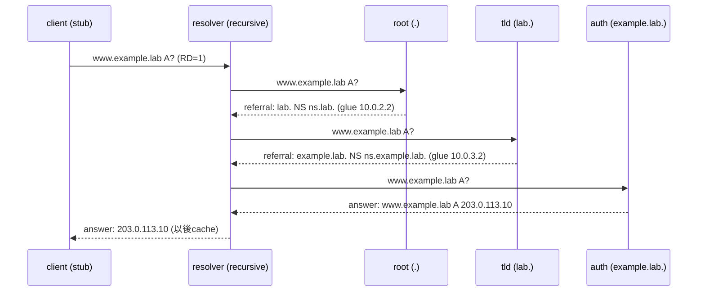

この記事は、ネットワークプロトコルを手を動かして学ぶフリー教材シリーズ **Protocol Lab** の一部です。教材本体（実行スクリプト・サンプル設定・RFCノート）はGitHubで公開しています。

- リポジトリ: https://github.com/pathvector-studio/protocol-lab

ここまでのBGP/RPKI編からレイヤを変えて、今回は **DNS の再帰解決**を扱います。自分専用の小さな DNS 階層（root / TLD / authoritative）を作り、1つの名前が上から下へ解決される様子を観察します。

テーマはシンプルです。**client の `dig`（stub resolver）は1回聞くだけ。その裏で recursive resolver が `. → lab. → example.lab.` という委任の連鎖をたどり、答えを持つ authoritative server まで到達する。**

最終的に、`www.example.lab` について次の表を自分で埋められる状態を目指します。

| Step | 聞く相手 | 返ってくるもの |
|---|---|---|
| 1 | root (`a.root.`) | referral: `lab.` は `ns.lab.` に聞け |
| 2 | TLD (`ns.lab.`) | referral: `example.lab.` は `ns.example.lab.` に聞け |
| 3 | authoritative (`ns.example.lab.`) | answer: `www.example.lab. A 203.0.113.10` |

想定時間は50〜65分です。

## このLabで学べること

- stub resolver / recursive resolver / authoritative server の違い。
- **referral**（NS レコードと glue による委任）の見え方。
- recursive resolver が **root hints** でどこから始めるかを知る仕組み。
- `dig +trace` が階層1段ごとに1行を見せる理由。
- cache された答えと解決したての答えの違い（query time と TTL）。

今回は扱いません: DNSSEC 検証（この階層は意図的に未署名）、cache / TTL / negative answer の詳細（Lab 06）、実 root/TLD 運用や zone transfer、逆引き（PTR）や AAAA。

## RFCで読む場所

| RFC | 読むポイント |
|---|---|
| RFC 1034 §2.3, §3.1 | domain name space、ラベル、ゾーンと委任 |
| RFC 1034 §4.3 | recursive と iterative の違い、解決アルゴリズム |
| RFC 1034 §5.3.3 | resolver が referral をたどる流れ |
| RFC 1035 §3.7, §4.1 | question / answer / authority / additional セクション |
| RFC 8499 | stub / recursive / authoritative / glue の用語 |

## 実験の全体像

client 1台、recursive resolver 1台、そして root / TLD / authoritative の3台を作ります。

```text
client ── resolver ──┬── root  (serves ".",           delegates lab.)
       (recursive)   ├── tld   (serves "lab.",         delegates example.lab.)
                     └── auth  (serves "example.lab.",  holds the A record)

答え: www.example.lab.  A  203.0.113.10   (TTL 60)
```

resolver がハブで、すべての authoritative server に直接届きます。root / tld / auth は互いに通信しません。



`203.0.113.0/24` は RFC 5737 の documentation prefix です。

## 手順

```bash
./scripts/labctl.sh run dns-05   # build → deploy → 解決確認 → +trace 収集 → cache確認 → destroy
```

以下は手動手順です。

### 1. ゾーンと委任を読む

```bash
cd protocol-lab/examples/dns-05
cat root/db.root tld/db.lab auth/db.example.lab resolver/root.hints
```

- `root/db.root`: `.` を持ち `lab.` を `ns.lab.`(10.0.2.2) に委任。
- `tld/db.lab`: `lab.` を持ち `example.lab.` を `ns.example.lab.`(10.0.3.2) に委任。
- `auth/db.example.lab`: `www.example.lab. A 203.0.113.10` を答える。
- `resolver/root.hints`: resolver に「まず `a.root.`(10.0.1.2) から始めよ」と教える。

各委任は「NS レコード + glue の A レコード」の組です。glue がないと、resolver は `ns.lab.` の住所を知るために別の解決が必要になってしまいます。

### 2. 起動する

上流の ISC BIND イメージには `ip` が無いため、`iproute2` を足したイメージをローカルビルドしてから deploy します。

```bash
docker build -t protocol-lab/bind9:9.20 .
sudo containerlab deploy -t dns-05.clab.yml
```

### 3. client から1回だけ聞く（stub の視点）

```bash
docker exec -it clab-dns-05-client dig @10.0.0.1 www.example.lab A
```

```text
;; ANSWER SECTION:
www.example.lab.  60  IN  A  203.0.113.10

;; Query time: 3 msec
;; SERVER: 10.0.0.1#53(10.0.0.1)
```

client は1回聞くだけ。`RD`（recursion desired）が立っており、残りは resolver がやります。

### 4. 委任の連鎖をたどる（iterative の視点）

`dig +trace` は resolver に丸投げせず、自分で referral を1段ずつたどります。

```bash
docker exec -it clab-dns-05-client dig +trace @10.0.0.1 www.example.lab A
```

```text
lab.              NS  ns.lab.
ns.lab.           A   10.0.2.2
;; Received ... from 10.0.1.2 ...    <- root が答えた

example.lab.      NS  ns.example.lab.
ns.example.lab.   A   10.0.3.2
;; Received ... from 10.0.2.2 ...    <- tld が答えた

www.example.lab.  60  IN  A  203.0.113.10
;; Received ... from 10.0.3.2 ...    <- auth が答えた
```

`;; Received ... from <IP>` に注目します。答えた相手が root(10.0.1.2) → tld(10.0.2.2) → auth(10.0.3.2) と下りていく——これが iterative resolution です。

### 5. cache を観察する

同じ名前をもう一度聞きます。

```bash
docker exec -it clab-dns-05-client dig @10.0.0.1 www.example.lab A
```

- `Query time` が1回目より小さい（多くの場合 0 msec）。
- `A` の TTL が `60` より小さい（例: `54`）。resolver が cache に入れてから経過した秒数だけ減ります。

cache にあることは、recursion を切っても確かめられます。

```bash
docker exec -it clab-dns-05-client dig +norecurse @10.0.0.1 www.example.lab A
```

`RD` を落としても cache から `203.0.113.10` が返ります。cache が空のときに `+norecurse` で聞くと、resolver は新しく解決しに行かないので答えは返りません。

## なぜそう動くのか

DNS の名前空間は木構造で、各ゾーンは子ゾーンを **委任 (delegation)** で切り出します。委任は「子ゾーンの NS レコード」と、その NS の住所を教える **glue** の A レコードで表されます。

client の stub resolver は木を歩きません。`RD=1` を立てて recursive resolver に丸投げします。recursive resolver は **root hints** で最初の一歩を知り、そこから:

1. root に `www.example.lab A?` → root は答えを持たず、`lab.` の referral を返す。
2. `lab.` の NS(tld)に同じ質問 → `example.lab.` の referral を返す。
3. `example.lab.` の NS(auth)に同じ質問 → authoritative な答え（`AA` フラグ付き）を返す。

resolver はこの答えを client に返しつつ、TTL の間だけ cache します。だから2回目は速く、TTL がカウントダウンして見えます。`dig +trace` は、この resolver の仕事を client 側で1段ずつ再現して見せてくれます。

## よくある誤解

- **stub と recursive を混同する**。client の `dig` は stub。実際に木を歩くのは resolver。
- **referral を answer と読み違える**。root や tld が返すのは「次に聞く相手」。`ANSWER` ではなく `AUTHORITY` / `ADDITIONAL` に NS と glue が入る。
- **glue を忘れる**。NS 名だけで A(glue)が無いと、閉じた lab では詰まる。
- **`+trace` に `@10.0.0.1` を付け忘れる**。付けないと本物の root を探しに行く。

## 確認問題

1. client の `dig` は stub か recursive か。どちらが実際に木を歩くか。
2. root が返すのは答えか referral か。referral には何が入っているか。
3. glue レコードとは何か。なぜ委任に必要か。
4. `;; Received ... from <IP>` から何が読めるか。
5. 2回目が速く、TTL が `60` より小さく見えるのはなぜか。
6. `+norecurse` で答えが返るのはどんな場合か。

## 後片付け

```bash
sudo containerlab destroy -t dns-05.clab.yml --cleanup
```

---

**Protocol Lab について**

この記事は、ネットワークプロトコルを手を動かして学ぶフリー教材シリーズ Protocol Lab の一部です。全Labの一覧・実行スクリプト・RFCノートはこちらにあります。

- シリーズ一覧 / リポジトリ: https://github.com/pathvector-studio/protocol-lab

役に立ったら、リポジトリに ⭐️ をいただけると励みになります。

次回は、この cache をさらに掘り下げ、TTL の失効と negative caching（存在しない名前のキャッシュ）を扱います（DNS Lab 06）。
