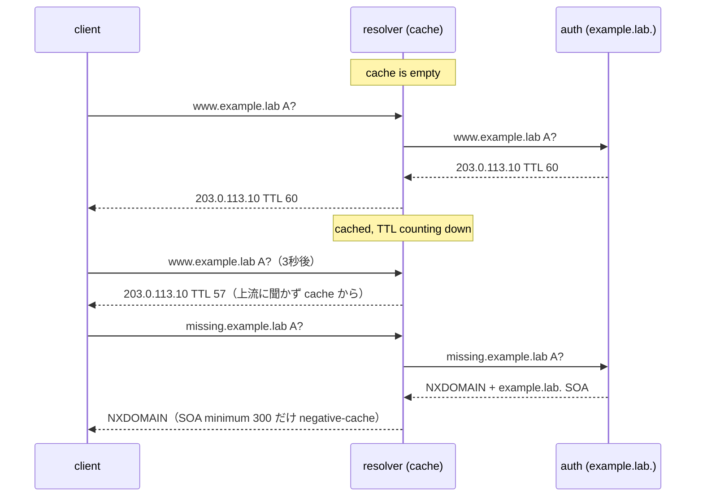

この記事は、ネットワークプロトコルを手を動かして学ぶフリー教材シリーズ **Protocol Lab** の一部です。教材本体（実行スクリプト・サンプル設定・RFCノート）はGitHubで公開しています。

- リポジトリ: https://github.com/pathvector-studio/protocol-lab

前回の [DNS Lab 05](https://zenn.dev/nkchan/articles/protocol-lab-dns-05) では、1つの名前を木の下へたどりました。今回は同じ階層を使い、別の問いを立てます。**resolver は答えをどれだけの間持ち続けるのか。そして、答えが存在しないときは何が返るのか。**

観察するのは次の3つです。

- **positive answer** の TTL が、cache に居る間カウントダウンする様子。
- **長いTTL** の名前が、短いTTLよりずっと長く cache に残る様子。
- **negative answer**（`NXDOMAIN`）が SOA を添えて返り、それ自体が cache される様子。

最終的に、次の表を説明できる状態を目指します。

| Query | 結果 | cache される時間 |
|---|---|---|
| `www.example.lab` A | `203.0.113.10`, TTL 60 | 60秒（短い） |
| `stable.example.lab` A | `203.0.113.20`, TTL 3600 | 3600秒（長い） |
| `missing.example.lab` A | `NXDOMAIN` + `example.lab.` SOA | 300秒（SOA minimum） |

想定時間は50〜65分です。

## このLabで学べること

- TTL とは何か、誰が決めるのか（authoritative zone であって resolver ではない）。
- 2回目の同じ query が速く、TTL が小さく見える理由。
- TTL が違うレコードが、違うタイミングで cache から消える理由。
- negative answer（`NXDOMAIN`）の見え方と、なぜ SOA を運ぶのか。
- SOA minimum が negative answer の cache 時間を決める仕組み（RFC 2308）。

今回は扱いません: DNSSEC の否定応答証明（NSEC/NSEC3）、cache poisoning、serve-stale / prefetch、zone transfer。

## RFCで読む場所

| RFC | 読むポイント |
|---|---|
| RFC 1035 §3.2.1, §4.1.3 | resource record と TTL フィールドの意味 |
| RFC 1035 §7.4 | resolver が答えを cache し、TTL で捨てる仕組み |
| RFC 2308 | negative answer、NXDOMAIN と NODATA、SOA による negative caching |
| RFC 2308 §5 | SOA minimum が negative cache の TTL を決めること |

## 実験の全体像

Lab 05 と同じ5ノード構成を使います。今回は委任より **resolver の cache** に注目します。

```text
example.lab. の中身:
  www.example.lab.     A  203.0.113.10   TTL 60     (short)
  stable.example.lab.  A  203.0.113.20   TTL 3600   (long)
  missing.example.lab.  -> なし  => NXDOMAIN + SOA (negative TTL 300)
```



`203.0.113.0/24` は RFC 5737 の documentation prefix です。

## 手順

```bash
./scripts/labctl.sh run dns-06   # build → deploy → TTLカウントダウン確認 → NXDOMAIN/SOA確認 → destroy
```

以下は手動手順です。

### 1. ゾーンの TTL を読む

```bash
cd protocol-lab/examples/dns-06
cat auth/db.example.lab
```

- `www.example.lab.` は TTL `60`（短い）。
- `stable.example.lab.` は TTL `3600`（長い）。
- `missing.example.lab.` のレコードは **無い**（だから NXDOMAIN）。
- SOA の最後の数字 `300` が negative cache の TTL（RFC 2308）。

### 2. 起動する

```bash
docker build -t protocol-lab/bind9:9.20 .
sudo containerlab deploy -t dns-06.clab.yml
```

### 3. TTL のカウントダウンを見る

同じ名前を、少し間を空けて2回聞きます。

```bash
docker exec -it clab-dns-06-client dig @10.0.0.1 www.example.lab A
sleep 3
docker exec -it clab-dns-06-client dig @10.0.0.1 www.example.lab A
```

- 1回目: `www.example.lab. 60 IN A 203.0.113.10`、`Query time` はやや大きい。
- 2回目: TTL が `57` 前後に減り、`Query time` は 0 msec に近い。

TTL は authoritative が付けた「この答えを最大この秒数キャッシュしてよい」という値です。resolver は cache に入れた瞬間からカウントダウンし、client には残り秒数を見せます。TTL が `0` になるまで待って（このLabなら60秒）聞き直すと、TTL は `60` に戻ります——resolver が cache を捨てて auth に問い直したからです。

### 4. 長いTTLと短いTTLを比べる

```bash
docker exec -it clab-dns-06-client dig @10.0.0.1 stable.example.lab A
```

`stable.example.lab. 3600 IN A 203.0.113.20`。3秒後に聞き直しても TTL はまだ大きい（例 `3597`）。同じ resolver・同じゾーンでも、レコードごとに cache の寿命が違います。決めるのは authoritative の TTL です。

### 5. 存在しない名前を聞く（negative answer）

```bash
docker exec -it clab-dns-06-client dig @10.0.0.1 missing.example.lab A
```

```text
;; ->>HEADER<<- opcode: QUERY, status: NXDOMAIN, id: ...

;; AUTHORITY SECTION:
example.lab.  300  IN  SOA  ns.example.lab. admin.example.lab. 1 3600 900 604800 300
```

- `status: NXDOMAIN` は「この名前は存在しない」。
- `ANSWER SECTION` は空。代わりに `AUTHORITY SECTION` にゾーンの SOA。
- SOA の最後の数字 `300` が、この negative answer をキャッシュしてよい秒数。

すぐもう一度聞くと、resolver は auth に問い直さず negative cache から NXDOMAIN を返します（`Query time` が下がる）。

## なぜそう動くのか

TTL（time to live）は、authoritative zone が各レコードに付ける「キャッシュ可能な最大秒数」です。resolver は cache に入れた瞬間から TTL を減らし、`0` で捨てます。だから2回目は速く、見える TTL は経過時間ぶん減り、`stable`（TTL 3600）は長く残ります。

答えが「ない」場合も、resolver は毎回問い直したくありません。RFC 2308 は negative answer（NXDOMAIN や NODATA）を cache する仕組みを定めています。authoritative は否定応答に **SOA レコード**を添え、その **minimum フィールド**（と SOA 自身の TTL の小さい方）が negative cache の寿命になります。このLabでは SOA minimum が `300` なので、NXDOMAIN は最大300秒キャッシュされます。

つまり cache は positive でも negative でも働きます。違うのは寿命を決める値の出所です（通常レコードは各 RR の TTL、否定応答は SOA）。

## よくある誤解

- **TTL を resolver が決めると思う**。決めるのは authoritative zone。resolver は減らして捨てるだけ。
- **NXDOMAIN と NODATA を混同する**。NXDOMAIN は「名前そのものが無い」。NODATA は「名前はあるが、その型のレコードが無い」（例: A は無いが MX はある）。どちらも SOA を添えて negative cache される。
- **negative answer に SOA が付く理由**。SOA が無いと resolver は「どれだけキャッシュしてよいか」を決められない。
- **short TTL は速く更新できるが負荷が高い**。TTL は鮮度とキャッシュ効率のトレードオフ。

## 確認問題

1. TTL を決めるのは authoritative server か resolver か。resolver は TTL に対して何をするか。
2. 2回目の query が速く、TTL が小さく見えるのはなぜか。
3. `www`(TTL 60)と `stable`(TTL 3600)で cache の寿命が違うのはなぜか。
4. `missing.example.lab` の `status` は何か。`ANSWER` と `AUTHORITY` には何が入るか。
5. negative answer に SOA が付くのはなぜか。negative cache の寿命は何で決まるか。
6. NXDOMAIN と NODATA の違いを、例を挙げて説明せよ。

## 後片付け

```bash
sudo containerlab destroy -t dns-06.clab.yml --cleanup
```

---

**Protocol Lab について**

この記事は、ネットワークプロトコルを手を動かして学ぶフリー教材シリーズ Protocol Lab の一部です。全Labの一覧・実行スクリプト・RFCノートはこちらにあります。

- シリーズ一覧 / リポジトリ: https://github.com/pathvector-studio/protocol-lab

役に立ったら、リポジトリに ⭐️ をいただけると励みになります。

次回はさらにレイヤを下げて、TCP の3-way handshake と接続の終わり方（teardown）を観察します（TCP Lab 07）。
