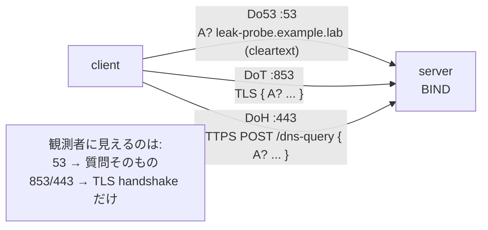

この記事は、ネットワークプロトコルを手を動かして学ぶフリー教材シリーズ **Protocol Lab** の一部です。すべてのLabのソース（containerlabのトポロジ、設定ファイル、実行スクリプト）は以下のリポジトリで公開しています。

https://github.com/pathvector-studio/protocol-lab

今回は **DNS Lab #14: Encrypted DNS — DoT and DoH** を扱います。想定時間は45〜60分です。

- 読み物ガイド: [dns-encrypted-dot-doh.md](https://github.com/pathvector-studio/protocol-lab/blob/main/rfc-notes/dns-encrypted-dot-doh.md)
- 前提Lab: [DNS Lab 05: Recursive Resolution You Can Trace](https://github.com/pathvector-studio/protocol-lab/blob/main/labs/dns-05-recursive-resolution.md) / [TLS Lab 09: What Is Visible Before Encryption](https://github.com/pathvector-studio/protocol-lab/blob/main/labs/tls-09-handshake-certificates.md)

## ゴール

前回のLab 13では、DNSSECによってDNSの**答えを「改ざん検出できる」**ようにしました。今回のLabが扱うのは、その次の問題です。答えが正しいことを確認できても、**「誰が何を引いたか」は経路上の誰にでも読めてしまう**。ここを塞ぐのが暗号化DNSです。

同じ名前を3通りの transport で解決し、経路上の観測者に何が読めるかを比べます。

- **Do53** — 53番ポートの古典的なDNS。query名は**平文**。
- **DoT** — DNS over TLS（RFC 7858）、853番。DNSメッセージが**TLSの中**を通る。
- **DoH** — DNS over HTTPS（RFC 8484）、443番の `/dns-query`。これもTLSの中で、しかも**見た目は普通のHTTPS**。

このLabを終えたとき、次の表を自分の言葉で埋められる状態を目指します。

| Transport | ポート | 観測者に query 名が見えるか | 代わりに観測者が見るもの |
|---|---|---|---|
| Do53 | 53 | 見える（平文） | 質問そのもの。例: `A? leak-probe.example.lab` |
| DoT | 853 | 見えない | TLS handshake と、その後の暗号化レコード |
| DoH | 443 | 見えない | HTTPSにしか見えないTLS handshake |

## 学べること

- DNSSEC（Lab 13）と暗号化DNSが**別の問題**を解いていること。すなわち完全性 vs 秘匿性。
- DoTとDoHとは何か、それぞれどのポートを使い、Lab 09で扱ったTLSとどう関係するか。
- なぜDo53は経路上の全員にquery名を漏らし、DoT/DoHは漏らさないのか。
- 暗号化DNSでも**隠れないもの**は何か（通信相手のサーバ、そしてSNI経由で宛先名が見えることが多いという事実）。

一方、このLabでは次は扱いません。

- SNIまで隠す Encrypted Client Hello（ECH）
- Oblivious DoH（ODoH）や DNS over QUIC（DoQ）
- パブリックリゾルバの選定・設定。ここでは自前のサーバを立てます。

## RFCで読む場所

| RFC | 章 | 読むポイント |
|---|---|---|
| RFC 7858 | 3 | DNS over TLS(DoT)、ポート 853、TLS の張り方 |
| RFC 8484 | 4, 5 | DNS over HTTPS(DoH)、`/dns-query`、GET/POST と `application/dns-message` |
| RFC 9499 | 6 | Do53 / DoT / DoH の用語 |
| RFC 8446 | 2 | 下地となる TLS 1.3 handshake(Lab 09 の復習) |
| RFC 5737 | 3 | `203.0.113.0/24` が documentation prefix であること |

## 実験の全体像

client 1台、server 1台。serverはBINDで、同じ `example.lab` ゾーンを Do53(53)・DoT(853)・DoH(443) の3つの transport で配信します。

```text
client (10.0.0.1) ------ eth1 ------ server (10.0.0.2)
  dig            @server :53         BIND
  dig +tls       @server :853        Do53 / DoT / DoH
  dig +https     @server :443        cert: dns.example.lab
```

clientは同じ名前を `dig`(Do53)、`dig +tls`(DoT)、`dig +https`(DoH) で引きます。その間client側でパケットをcaptureし、query名が平文で見えるかどうかを比べます。DoT/DoHのTLS証明書は `dns.example.lab` の自己署名で、`run.sh` が生成します。



:::message
`203.0.113.0/24` はRFC 5737のdocumentation prefixです。外部へは出さず、Lab内だけで使います。
:::

## 必要なもの

推奨環境:

- Linux / WSL2 / Linux VM
- Docker
- containerlab
- BIND9 container image
- netshoot container image（dig 9.18+ で `+tls` / `+https`、tshark、openssl）

使用イメージ:

- `protocol-lab/bind9:9.20`（`examples/dns-14/Dockerfile` からローカルビルド）
- `nicolaka/netshoot:latest`

DoT/DoHの観察には、clientの `dig` が `+tls`(DoT) と `+https`(DoH) に対応している必要があります。netshootのdig 9.20は両対応です。証明書は `run.sh` がdeploy前に自己署名で生成します（リポジトリにはコミットしません）。

## 実行手順

一発で通すならこれだけです。

```bash
./scripts/labctl.sh run dns-14
```

`labctl.sh run dns-14` は、証明書生成、deploy、3 transportで同じ答えが返ることの確認、各transportのcaptureと「query名が平文で見えるか」の比較、後片付けまでを行います。

以下は手で追う場合の手順です。

### 1. 作業ディレクトリへ移動する

```bash
cd protocol-lab/examples/dns-14
```

### 2. 起動する

`run.sh` は証明書を作ってからdeployします。手動なら:

```bash
# self-signed cert for dns.example.lab -> ./server/tls/
mkdir -p server/tls
docker run --rm -v "$PWD/server/tls:/w" -w /w --entrypoint sh nicolaka/netshoot:latest -c \
  'openssl req -x509 -newkey rsa:2048 -nodes -keyout server.key -out server.crt \
     -subj "/CN=dns.example.lab" -addext "subjectAltName=DNS:dns.example.lab" -days 3650; \
   chmod 644 server.key server.crt'
docker build -t protocol-lab/bind9:9.20 .
sudo containerlab deploy -t dns-14.clab.yml
```

### 3. 同じ名前を3通りで引く

```bash
docker exec clab-dns-14-client dig +short        @10.0.0.2 www.example.lab A   # Do53
docker exec clab-dns-14-client dig +tls +short   @10.0.0.2 www.example.lab A   # DoT (853)
docker exec clab-dns-14-client dig +https +short  @10.0.0.2 www.example.lab A   # DoH (443)
```

どれも `203.0.113.10` を返します。答えは同じで、違うのは**運び方**だけです。

:::message
自己署名証明書なので、`dig +tls` は既定では証明書検証をしません。実運用ではresolverの証明書を検証し、`dig +tls-hostname=...` で名前も確認してください。
:::

### 4. 平文かどうかを capture で比べる

client側で、transportごとにcaptureしながら目印になる名前（`leak-probe.example.lab`）を引きます。

```bash
# Do53: 53番を capture して、query 名が平文で見えるか
docker exec -d clab-dns-14-client sh -c "tcpdump -i eth1 -A -s0 -w /tmp/do53.pcap 'port 53'"
docker exec clab-dns-14-client dig @10.0.0.2 leak-probe.example.lab A >/dev/null
docker exec clab-dns-14-client pkill -INT tcpdump
docker exec clab-dns-14-client sh -c "tcpdump -A -r /tmp/do53.pcap | grep leak-probe"
```

Do53では `A? leak-probe.example.lab.` がそのまま読めます。同じことを853(`+tls`)と443(`+https`)でやると、`leak-probe` は**出てきません**（TLSの中だからです）。

### 5. DoT/DoH には TLS handshake が見える

```bash
docker exec clab-dns-14-client tshark -r /tmp/dot.pcap -Y "tls.handshake" -T fields -e tls.handshake.type
```

`1`(ClientHello)、`2`(ServerHello)…とTLSのhandshakeが並びます。つまり観測者には「TLSを張った」ことは分かるが、**中の質問は読めない**、ということです。

## 期待される結果

- Do53 / DoT / DoH の3通りとも `www.example.lab` → `203.0.113.10`。
- Do53のcaptureには `leak-probe.example.lab` が平文で出る。
- DoT(853)・DoH(443)のcaptureには `leak-probe` が出ない。
- DoT/DoHのcaptureにはTLS handshake（ClientHello=1, ServerHello=2）が見える。

## なぜそう動くのか

DNSはもともと平文（Do53）で設計されており、経路上の誰でも「誰が何を引いたか」を読めました。DoTとDoHは、そのDNSメッセージを **TLS（Lab 09）で包む**ことでqueryを秘匿します。

- **DoT（RFC 7858）**: 専用ポート853でTLSを張り、その中で普通のDNSメッセージをやり取りします。DNS専用なので構造が分かりやすい一方、853番が塞がれると使えません。
- **DoH（RFC 8484）**: 443番のHTTPSの上に載せ、`/dns-query` へ `application/dns-message` をPOST（またはGET）します。見た目が普通のWebトラフィックと区別しにくいので、ブロックされにくいのが特徴です。
- **どちらも中身は暗号化**され、query名・答えは経路から読めません。ただし **TLS handshakeは見える**ので、「暗号化されたDNSを使っている」ことや、接続先サーバのIPは分かります。

:::message alert
暗号化DNSを使っても、通信相手のresolverのIPは隠れません。さらにTLSの **SNIは既定で平文**なので、DoHで公開resolverに対して特定の仮想ホストを指定する場合など、宛先名が漏れることがあります（それを隠すのがECHです）。「暗号化DNS＝すべてが隠れる」ではありません。
:::

要点は、**DNSSEC（Lab 13）は「答えの真正性」、DoT/DoH は「問い合わせの秘匿」** という、別々の目的を別々の仕組みで満たしていることです。両方を組み合わせて初めて「正しくて、かつ覗かれないDNS」になります。

## 詰まりやすい点

- **DNSSECと暗号化DNSを混同する**。DNSSECは改ざん検出（署名）、DoT/DoHは盗聴防止（暗号化）。守る対象が違います。
- **暗号化DNSですべてが隠れると思う**。相手サーバのIP、TLS handshake、しばしばSNIは見えます。
- **`dig +tls` が証明書を検証していると思う**。既定では検証しないことが多いです。実運用はCA/anchorで検証します。
- **DoHをただのHTTPSと侮る**。中身はDNSですが、443に相乗りするので運用上ブロックしにくい、という性質が要点です。
- **ポートの取り違え**。DoT=853、DoH=443。53は平文。
- **captureのportフィルタ**。853/443はTCPです。53はUDPとTCP両方あり得るので、フィルタを合わせてください。

## 後片付け

```bash
sudo containerlab destroy -t dns-14.clab.yml --cleanup
```

`labctl.sh run dns-14` を使った場合は、スクリプトが最後にdestroyします。

## 確認問題

1. Do53・DoT・DoHはそれぞれどのポートを使うか。
2. DoTとDoHの違いは何か。DoHが443に載る利点は何か。
3. 暗号化DNSを使うと、経路上の観測者から何が隠れ、何は隠れないか。
4. DNSSEC（Lab 13）とDoT/DoHは、それぞれ何を守るための仕組みか。
5. `dig +tls` が自己署名証明書でもエラーにならなかったのはなぜか。実運用ではどうすべきか。
6. captureで、DoTの通信が「DNSだ」と外から断定しにくいのはなぜか。

## 検証済み実行ログ（2026-07-07）

このLabは実機で再現性を確認済みです。

実行環境:

- Ubuntu 26.04 LTS (kernel 7.0.0-27-generic, x86_64)
- Docker 29.1.3
- containerlab 0.77.0
- server: `internetsystemsconsortium/bind9:9.20` (BIND 9.20.24) を薄くラップした `protocol-lab/bind9:9.20`
- client: `nicolaka/netshoot:latest` (dig 9.20.23, tshark, openssl)

`PATH="/tmp/pl-shim:$PATH" ./scripts/labctl.sh run dns-14` で deploy → verify → destroy を実行し、`verification.json` は `"status": "verified"` を返しました。

### 3 transport とも同じ答え

```text
$ dig +short       @10.0.0.2 www.example.lab A   # Do53
203.0.113.10
$ dig +tls +short  @10.0.0.2 www.example.lab A   # DoT (853)
203.0.113.10
$ dig +https +short @10.0.0.2 www.example.lab A  # DoH (443)
203.0.113.10
```

### Do53 は query 名が平文（port 53 の capture）

```text
$ tcpdump -A -r do53.pcap | grep leak-probe
09:28:21.443917 IP 10.0.0.1.40349 > 10.0.0.2.53: 10833+ [1au] A? leak-probe.example.lab. (63)
```

`leak-probe.example.lab` が3回、平文で現れます。経路上の観測者に丸見えです。

### DoT / DoH は query 名が見えない

```text
$ tcpdump -A -r dot.pcap | grep -c leak-probe
0
$ tcpdump -A -r doh.pcap | grep -c leak-probe
0
```

DoT(853)・DoH(443)のcaptureには `leak-probe` が一度も出てきません（TLSの中だからです）。

### DoT / DoH には TLS handshake だけが見える

```text
$ tshark -r dot.pcap -Y "tls.handshake" -T fields -e tls.handshake.type
1 2      # 1=ClientHello, 2=ServerHello
$ tshark -r doh.pcap -Y "tls.handshake" -T fields -e tls.handshake.type
1 2
```

観測者には「TLSを張った」ことは分かりますが、質問の中身は読めません。DNSSEC（Lab 13）が答えの真正性を守るのに対し、DoT/DoHは問い合わせの秘匿を担う——別々の目的を、別々の層で満たしているわけです。

## References

- [RFC 7858: Specification for DNS over Transport Layer Security (TLS)](https://www.rfc-editor.org/rfc/rfc7858)
- [RFC 8484: DNS Queries over HTTPS (DoH)](https://www.rfc-editor.org/rfc/rfc8484)
- [RFC 9499: DNS Terminology](https://www.rfc-editor.org/rfc/rfc9499)
- [RFC 8446: TLS 1.3](https://www.rfc-editor.org/rfc/rfc8446)
- [RFC 5737: IPv4 Address Blocks Reserved for Documentation](https://www.rfc-editor.org/rfc/rfc5737)
- [BIND 9 Administrator Reference Manual](https://bind9.readthedocs.io/en/latest/)

---

## おわりに

Protocol Lab は、BGP・DNS・TLS・TCP などのプロトコルを、containerlab上で実際に動かしながら理解するためのフリー教材シリーズです。全Labの一覧とソースはこちらにあります。

https://github.com/pathvector-studio/protocol-lab

役に立ったと感じたら、GitHubで ⭐ スターを付けてもらえると励みになります。

次回は、このLabで「隠れないもの」として残った **SNI** に踏み込みます。TLS handshakeのどこまでが平文で見えるのか、Encrypted Client Hello（ECH）は何を変えるのかを、同じようにcaptureで確かめる予定です。
