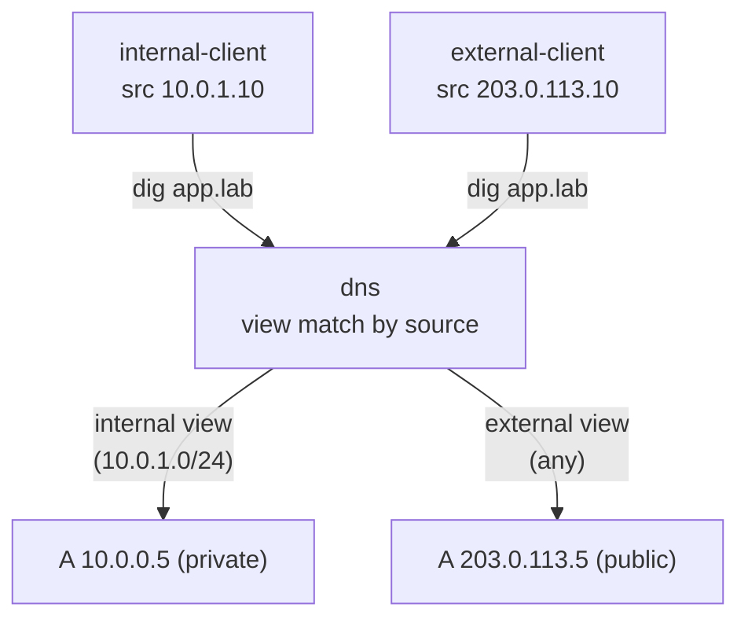

この記事は、ネットワークプロトコルを手を動かして学ぶフリー教材シリーズ **Protocol Lab** の一部です。すべてのLab（構成ファイル・スクリプト・RFCノート）は以下のリポジトリで公開しています。

https://github.com/pathvector-studio/protocol-lab

今回は **Lab #42: Split-Horizon DNS** を扱います。想定時間は35〜50分です。

- 参考ノート: [rfc-notes/split-horizon-dns.md](https://github.com/pathvector-studio/protocol-lab/blob/main/rfc-notes/split-horizon-dns.md)
- 前提Lab: [DNS Lab 05: 階層をたどって名前を解決する](https://github.com/pathvector-studio/protocol-lab/blob/main/examples/dns-05-recursive-resolution.md)

## ゴール

前回のLab 41で扱ったround-robinは、1つの名前が持つレコードの **順序** を回すものでした。今回のsplit-horizon DNSは、**誰が聞いたか** によって **答えそのもの** を変えます。authoritativeサーバが同じゾーンの複数の **view** を保持し、クライアントの送信元アドレスでどのviewを使うかを選ぶ、という仕組みです。

このLabでは、1つの名前 `app.lab.` を2つのviewで提供します。

- **internal** view（`match-clients { 10.0.1.0/24; }`）は **private** アドレス `10.0.0.5` を返す
- **external** view（`match-clients { any; }`）は **public** アドレス `203.0.113.5` を返す

別々のネットワークにいる2つのクライアントが *同じ* `app.lab.` を解決して、*違う* アドレスを受け取ります。これが、内部の人には社内経路を、外部の人には公開経路を渡す split-brain DNS の基礎です。

読み終わったあと、次の表を自分の言葉で説明できるようになるのが目標です。

| クライアント（送信元） | app.lab. の解決結果 |
|---|---|
| internal（10.0.1.0/24） | 10.0.0.5（private） |
| external（それ以外すべて） | 203.0.113.5（public） |

## このLabで学べること

- BINDの **view** とは何か、`match-clients` が送信元アドレスでどうviewを選ぶか
- viewの記述順序がなぜ重要か（具体的なものを先に、`any` を最後に）
- 同じ名前がviewごとに別のレコードへ解決される様子
- split-horizonが実際に使われる場面（内部/公開の経路分け、トポロジの隠蔽）
- 運用上の注意点（境界をまたぐキャッシュ、2つのゾーンコピーの一貫性）

一方、このLabでは次は扱いません。

- 再帰resolverとキャッシュ分離の詳細
- TSIG鍵ベースのview選択やEDNS Client Subnet
- 複数view向けのゾーンデータ自動生成

## RFCで読む場所

| 資料 | 読むポイント |
|---|---|
| RFC 8499 | "view" / split DNS の用語 |
| RFC 1034 | authoritative / zone の基本 |
| RFC 6950 | スコープ付き応答の注意点 |
| RFC 5737 / RFC 1918 | Labのアドレスがローカル/documentation用であること |

## 実験の全体像

DNSサーバがinternal / externalの2つの面に接続され、それぞれの面にいるクライアントが同じ名前を引きます。

```text
 internal-client (10.0.1.10) --- eth1 [ dns (views) ] eth2 --- external-client (203.0.113.10)
                             10.0.1.2                203.0.113.2
   internal: app.lab -> 10.0.0.5     external: app.lab -> 203.0.113.5
```



内部リンクに `10.0.1.0/24`、外部リンクに `203.0.113.0/24` を使います。

:::message
`203.0.113.0/24` は RFC 5737 の documentation 用アドレス、`10.0.0.0/8` は RFC 1918 のプライベートアドレスです。どちらもLab内で閉じたアドレスで、実際のインターネットには一切影響しません。
:::

## 必要なもの

推奨環境:

- Linux / WSL2 / Linux VM
- Docker
- containerlab

使用イメージ:

- `protocol-lab/bind9:9.20`（run.sh が Dockerfile からビルド）
- `nicolaka/netshoot:latest`（`dig` 用）

## 実行手順

一撃で試したい場合は、次のコマンドだけでbuild → deploy → verify → destroyまで走ります。

```bash
./scripts/labctl.sh run dns-views-42
```

以下は手動で1ステップずつ進める場合の手順です。

### 1. 作業ディレクトリへ移動する

```bash
cd protocol-lab/examples/dns-views-42
```

### 2. イメージをビルドして起動する

```bash
docker build -t protocol-lab/bind9:9.20 .
sudo containerlab deploy -t dns-views-42.clab.yml
```

### 3. 内部と外部で同じ名前を引く

```bash
docker exec clab-dns-views-42-internal-client dig +short app.lab @10.0.1.2      # 10.0.0.5
docker exec clab-dns-views-42-external-client dig +short app.lab @203.0.113.2   # 203.0.113.5
```

同じ `app.lab` が、送信元によって別のアドレスに解決されます。

## 期待される出力

- internal-client: `app.lab` → `10.0.0.5`（private）
- external-client: `app.lab` → `203.0.113.5`（public）
- この2つが異なっていれば split-horizon が成立しています

## なぜそう動くのか

split-horizon DNS の要点は「1つのauthoritativeな名前、複数の答えの組、問い合わせ元で選ぶ」です。

**view とは**
独自のゾーン定義（ファイル）を持つ、名前付きのコンテナです。サーバは同じゾーンを、複数のviewで別々の内容として保持できます。

**match-clients で選ぶ**
受け取ったクエリの **送信元アドレス** を、各viewの `match-clients` に **上から順に** 照合し、最初に一致したviewのゾーンで応答します。このLabでは internal（`10.0.1.0/24`）→ external（`any`）の順です。内部クライアント（10.0.1.10）は internal に一致するので `10.0.0.5`、外部クライアント（203.0.113.10）は internal に一致せず external（`any`）に落ちるので `203.0.113.5` になります。

**順序が肝**
具体的なviewを先に、`any` を最後に置きます。逆にすると全員が最初のviewに吸い込まれます。

:::message alert
`match-clients { any; }` のviewを先頭に書くと、内部クライアントも含めた *すべて* のクエリがそのviewで応答されます。split-horizonが機能しなくなるだけでなく、内部専用のはずのレコードが外部に漏れる設定ミスにもつながります。
:::

**なぜ便利か**
内部ユーザにはprivate IP（社内直結）、外部にはpublic IP（公開経路）を返せます。外部にprivateアドレスや内部専用ホストを見せずに済むため、トポロジの隠蔽にもなります。それでいてユーザは同じ名前（URL）を使い続けられます。

**注意点**
応答はresolverにキャッシュされます。内外のresolverを分けないと、viewの答えが混ざる可能性があります。また、viewごとにゾーンのコピーを保つことになるので、更新漏れで内外の内容がずれます。さらに、判定は送信元アドレスベースなので、NATやVPNで送信元が変わると意図と違うviewに落ちることがあります。

まとめると、**送信元でviewを選び、同じ名前を場所に応じて正しい面へ解決させる** のがsplit-horizonです。順序を変えるround-robinとは違い、答えそのものを相手によって変えます。

## 詰まりやすい点

- **round-robinと混同する**: RR（Lab 41）は順序を変えるもの、viewsは答えそのものを変えるもの。
- **viewの順序**: 上から照合して最初の一致が勝つ。`any` を先に置くと全員そこへ行く。
- **1ゾーンで済むと思う**: 各viewは自分のゾーンコピーを持つ。同期の運用が必要。
- **キャッシュ**: 内外のresolverを分けないと答えが混ざる。
- **送信元を信頼しすぎる**: NAT / VPN / spoof で送信元は変わりうる。ACLは慎重に。
- **recursion**: このLabはauthoritativeへの直接問い合わせ。再帰resolverを挟むと、view判定はresolverの送信元アドレスで決まる。

## 後片付け

```bash
sudo containerlab destroy -t dns-views-42.clab.yml --cleanup
```

`labctl.sh run dns-views-42` を使った場合は、スクリプトが最後にdestroyまで実行します。

## 確認問題

1. BINDのviewとは何か。`match-clients` は何を見てviewを選ぶか。
2. viewの照合順序はどう効くか。`any` を先に置くと何が起きるか。
3. このLabで内部と外部が同じ名前に別アドレスを得るのはなぜか。
4. split-horizonとround-robin（Lab 41）の違いは何か。
5. split-horizonの運用上の注意を2つ挙げよ（キャッシュ / 一貫性）。
6. NATやVPNがあると、view判定はどう影響を受けるか。

## 検証済み実行ログ（2026-07-08）

このLabは実機で再現性を確認済みです。

実行環境:

- Ubuntu 26.04 LTS (kernel 7.0.0-27-generic, x86_64)
- Docker 29.1.3
- containerlab 0.77.0
- dns: `protocol-lab/bind9:9.20`（run.sh が Dockerfile からビルド）
- internal-client / external-client: `nicolaka/netshoot:latest`（dig）

`PATH="/tmp/pl-shim:$PATH" ./scripts/labctl.sh run dns-views-42` で build → deploy → verify → destroy を実行し、`verification.json` は `"status": "verified"` を返しました。

### 同じ名前が送信元で別の答えに

```text
internal: 10.0.0.5
external: 203.0.113.5
```

- **internal-client**（送信元 `10.0.1.10`、`10.0.1.0/24` に一致）は internal view に落ち、`app.lab` → **`10.0.0.5`**（privateアドレス）。
- **external-client**（送信元 `203.0.113.10`）は internal に一致せず external（`any`）view で応答され、同じ `app.lab` → **`203.0.113.5`**（publicアドレス）。
- 同一のauthoritativeな名前が、`match-clients` によるview選択で送信元ごとに別レコードへ解決されました。内部にprivate、外部にpublicを渡すsplit-horizonが成立しています。

### Cleanup

```bash
containerlab destroy -t dns-views-42.clab.yml --cleanup
```

## References

- [RFC 1034: Domain Names — Concepts and Facilities](https://www.rfc-editor.org/rfc/rfc1034)
- [RFC 8499: DNS Terminology](https://www.rfc-editor.org/rfc/rfc8499)
- [RFC 6950: Architectural Considerations on Application Features in the DNS](https://www.rfc-editor.org/rfc/rfc6950)
- [RFC 5737: IPv4 Address Blocks Reserved for Documentation](https://www.rfc-editor.org/rfc/rfc5737)

---

## Protocol Lab について

Protocol Labは、BGP・DNS・TCP・TLSなどのネットワークプロトコルを、containerlabで実際に動かしながら学ぶフリー教材シリーズです。全Labの一覧はこちらから。

https://github.com/pathvector-studio/protocol-lab

役に立ったら、リポジトリに ⭐ をいただけると励みになります。

次回は、split-horizonの先にあるDNSの挙動として、再帰resolverとキャッシュの扱いを掘り下げる予定です。今回「resolverを挟むとview判定がresolverの送信元で決まる」と書いた部分が、そのまま次のLabの入口になります。
