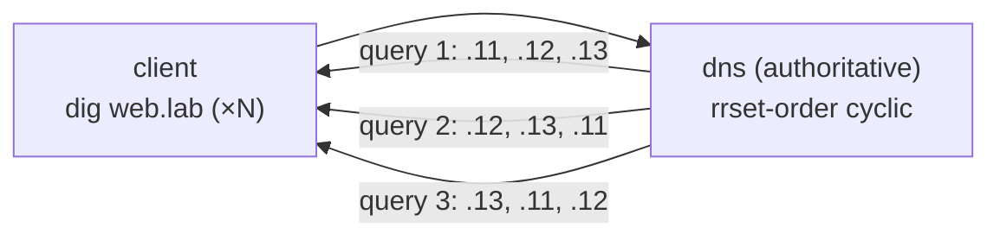

この記事は、ネットワークプロトコルを手を動かしながら学ぶフリー教材シリーズ **Protocol Lab** の一部です。実際にコンテナでラボ環境を立ち上げ、プロトコルの挙動を自分の目で確認しながら進めます。

リポジトリはこちら: https://github.com/pathvector-studio/protocol-lab

今回は **Lab #41: DNS Round-Robin** を扱います。想定所要時間は30〜45分です。

- 読み物ガイド: [rfc-notes/dns-round-robin.md](https://github.com/pathvector-studio/protocol-lab/blob/main/rfc-notes/dns-round-robin.md)
- 前提Lab: [DNS Lab 05: 名前解決を階層でたどる](https://github.com/pathvector-studio/protocol-lab/blob/main/examples/dns-05-recursive-resolution.md)

## ゴール

これまでの負荷分散Labは、すべて**ネットワークの中**で働いていました。

- anycast（Lab 31）は routing がインスタンスを選ぶ
- ECMP（Lab 32）は flow をハッシュしてリンクに振り分ける
- IPVS（Lab 33）は director が接続を分配する

このLabでは、それらより**もう1つ手前の層** — **名前解決** — でクライアントを散らします。

1つの名前（`web.lab.`）が **3つの A レコード**を持ち、**`rrset-order cyclic`** を設定すると、authoritative サーバは応答のたびにレコードの順序を回転させます。

- `web.lab.` を再解決し続けるクライアントは、毎回**異なる先頭アドレス**（`.11 → .12 → .13 → …`）を受け取る
- クライアントはふつう先頭のアドレスに接続するので、次々にやってくるクライアントが別々の backend に落ちる
- 最も手軽で安価な分散手法。ただし最も粗い（健全性チェックが無く、キャッシュで効きが鈍る）

このLabを終えたとき、次の表を自分の言葉で説明できるようになっているはずです。

| クエリ | 返る先頭のAレコード |
|---|---|
| 1 | 203.0.113.11 |
| 2 | 203.0.113.12 |
| 3 | 203.0.113.13 |
| 4 | 203.0.113.11 … |

:::message
Aレコードが指す `203.0.113.0/24` は RFC 5737 の documentation prefix です。実インターネット上のホストではないので、ラボ内で安全に使えます。
:::

## 学べること

- 1つの名前が複数の **A レコード**（RRset）を持てること
- クライアントが**先頭**のレコードを使う慣習があるため、順序が意味を持つこと
- **`rrset-order cyclic`** が応答ごとに RRset を回転させる仕組み（ラウンドロビン）
- anycast / ECMP / IPVS の中での DNS ラウンドロビンの位置づけとトレードオフ
- **TTL** とキャッシュが分散の効きを制限する理由

このLabで扱わないこと:

- 健全性チェック付きのDNS負荷分散（GSLB）や weighted レコード
- GeoDNS / EDNS Client Subnet
- DNSと実L4/L7ロードバランサの併用（言及のみ）

## RFCで読む場所

| 資料 | 読むポイント |
|---|---|
| RFC 1035 §3.4.1 | A レコード、RRset |
| RFC 1794 | round-robin による負荷分散 |
| RFC 8499 | RRset / authoritative / resolver |
| RFC 5737 | Labの 203.0.113.0/24 が documentation 用であること |

## 実験の全体像

client と、`web.lab.` を持つ authoritative DNS の2ノード構成です。

```text
 client (10.0.0.1) --- dns (10.0.0.2, authoritative for web.lab.)
    dig web.lab @10.0.0.2   →  A .11 / .12 / .13  (順序は毎回回転)
```



`10.0.0.0/24` はラボリンク、`203.0.113.0/24`（RFC 5737）は A レコードが指す documentation 空間です。

## 必要なもの

推奨環境:

- Linux / WSL2 / Linux VM
- Docker
- containerlab

使用イメージ:

- `protocol-lab/bind9:9.20`（run.sh が Dockerfile からビルド）
- `nicolaka/netshoot:latest`（`dig`）

## 実行手順

一発で回すなら、次のスクリプトで build → deploy → verify → destroy まで完了します。

```bash
./scripts/labctl.sh run dnsrr-41
```

以下は手動で1ステップずつ確認する手順です。

### 1. 作業ディレクトリへ移動する

```bash
cd protocol-lab/examples/dnsrr-41
```

### 2. イメージをビルドして起動する

```bash
docker build -t protocol-lab/bind9:9.20 .
sudo containerlab deploy -t dnsrr-41.clab.yml
```

### 3. 3つの A レコードを確認する

```bash
docker exec clab-dnsrr-41-client dig +noall +answer web.lab @10.0.0.2
```

`web.lab.` に `A 203.0.113.11 / .12 / .13` の3レコードが返ります。

### 4. 繰り返して先頭の回転を見る

```bash
for i in $(seq 1 6); do
  docker exec clab-dnsrr-41-client sh -c 'dig +short web.lab @10.0.0.2 | head -1'
done
```

先頭が `.11 → .12 → .13 → .11 → …` と巡回します。

## 期待される出力

- `dig +noall +answer`: `web.lab.` に3つの A レコード
- 連続クエリの先頭アドレス: `.11 → .12 → .13` を巡回（cyclic）
- 6クエリで先頭に3種類すべてが現れる

## なぜそう動くのか

**DNSラウンドロビン**の本質は「1つの名前、複数のアドレス、応答ごとに順序を回す」ことです。

### RRset

同じ名前・同じ型の複数レコードは、1つの集合（RRset）として扱われます。`web.lab. A .11/.12/.13` は3レコードからなる1つのRRsetで、応答ではふつう**全部**が返ります。

### 先頭を使う慣習

多くのクライアントや stub resolver は、返ってきたアドレスのうち**先頭**に接続します。だからこそ**順序**が「誰にどの backend が当たるか」を決めることになります。

### cyclic で回す

サーバが応答のたびに RRset の順序を回転させます（BIND の `rrset-order cyclic`）。連続クエリで先頭が `.11 → .12 → .13` と巡回し、次々のクライアントが別の backend に落ちます。分散が起きているのは **名前解決の層**であり、routing / 転送層で働く anycast・ECMP・IPVS とは層が違います。

### 粗さとキャッシュ

DNSラウンドロビンは最も手軽ですが、最も粗い手法でもあります。

- **健全性チェックが無い**。死んだ backend の A レコードも返し続けます。
- 応答は **TTL** の間キャッシュされ、その間は同じ順序が使い回されるため回転が効きません。

だからラウンドロビン用の A レコードには**短いTTL**を設定します（このLabでは30秒）。分散はあくまでベストエフォートです。

:::message
実運用でDNSラウンドロビン単体を使うのは簡易分散の範囲まで。まじめにやるなら健全性チェック付きのGSLBを使うか、DNSラウンドロビンと実LB（Lab 33）/ anycast（Lab 31）を組み合わせます。
:::

要点は、**1つの名前に複数アドレスを持たせ、順序を回すことで、名前解決の段階でクライアントを backend 群に散らす**こと。手軽さと引き換えに粗い、というトレードオフです。

## 詰まりやすい点

- **真のロードバランスだと思ってしまう**。あくまで粗い分散で、実負荷や接続数は一切見ていません。
- **健全性を見ていると思ってしまう**。素のラウンドロビンは死んだ backend も返します。監視 + 低TTL + レコード撤去、あるいは実LBが必要です。
- **必ず均等になると思ってしまう**。キャッシュ・resolver実装・クライアント側の選択でばらつきます。
- **TTLを無視する**。長いTTLはキャッシュによって回転を殺します。ラウンドロビンには短いTTLを。
- **先頭以外も使われると思ってしまう**。多くのクライアントは先頭のみを使います。だから順序が効くのです。
- **再帰resolverを挟んだ場合**。resolverがキャッシュや並べ替えを行うため、authoritativeへ直接問い合わせるより回転が見えにくいことがあります。

## 後片付け

```bash
sudo containerlab destroy -t dnsrr-41.clab.yml --cleanup
```

`labctl.sh run dnsrr-41` を使った場合は、スクリプトが最後に destroy してくれます。

## 確認問題

1. RRset とは何か。1つの名前が複数の A レコードを持てるのはなぜか。
2. クライアントが先頭を使う慣習は、ラウンドロビンにどう効くか。
3. `rrset-order cyclic` は何をするか。Labで先頭が巡回するのはなぜか。
4. DNSラウンドロビンを anycast（31）/ ECMP（32）/ IPVS（33）と、分散する層の観点で対比せよ。
5. DNSラウンドロビンの弱点を2つ挙げよ（健全性 / キャッシュ）。
6. ラウンドロビン用の A レコードのTTLを短くするのはなぜか。短すぎることの欠点は何か。

## 検証済み実行ログ（2026-07-08）

このLabは実機で再現性を確認済みです。

実行環境:

- Ubuntu 26.04 LTS (kernel 7.0.0-27-generic, x86_64)
- Docker 29.1.3
- containerlab 0.77.0
- dns: `protocol-lab/bind9:9.20`（run.sh が Dockerfile からビルド）
- client: `nicolaka/netshoot:latest`（dig）

`PATH="/tmp/pl-shim:$PATH" ./scripts/labctl.sh run dnsrr-41` で build → deploy → verify → destroy を実行し、`verification.json` は `"status": "verified"` を返しました。

### 1名前・3アドレスの RRset

```text
web.lab.  30  IN  A  203.0.113.11
web.lab.  30  IN  A  203.0.113.12
web.lab.  30  IN  A  203.0.113.13
```

`web.lab.` は3つの A レコード（RRset）を持ち、TTLは30秒です（キャッシュを短くして、再解決・再分散を促す狙い）。

### 応答ごとに先頭が巡回する

6回の `dig +short web.lab @10.0.0.2 | head -1`（先頭アドレスのみ）:

```text
203.0.113.12 → 203.0.113.13 → 203.0.113.11 → 203.0.113.12 → 203.0.113.13 → 203.0.113.11
```

`rrset-order cyclic` により、authoritative サーバが応答のたびに RRset の順序を回転させています。6クエリで先頭に**3種類すべて**（distinct = 3）が現れ、クライアントを3つの backend におおまかに分散できていることが確認できます。ネットワーク層（anycast / ECMP / IPVS）ではなく、**名前解決層**での分散です。

### Cleanup

```bash
containerlab destroy -t dnsrr-41.clab.yml --cleanup
```

## References

- [RFC 1035: Domain Names — Implementation and Specification](https://www.rfc-editor.org/rfc/rfc1035)
- [RFC 1794: DNS Support for Load Balancing](https://www.rfc-editor.org/rfc/rfc1794)
- [RFC 8499: DNS Terminology](https://www.rfc-editor.org/rfc/rfc8499)
- [RFC 5737: IPv4 Address Blocks Reserved for Documentation](https://www.rfc-editor.org/rfc/rfc5737)

---

## Protocol Lab について

Protocol Lab は、BGP・DNS・TCP・TLS などのネットワークプロトコルを、containerlab で実際に動かしながら学ぶフリー教材シリーズです。Lab一覧はこちらから:

https://github.com/pathvector-studio/protocol-lab

役に立ったと感じたら、GitHubで ⭐ をいただけると励みになります。

次回は、DNSの分散をもう一歩進めて、健全性チェックやキャッシュとの付き合い方を含む、より実運用寄りの名前解決まわりを扱う予定です。
