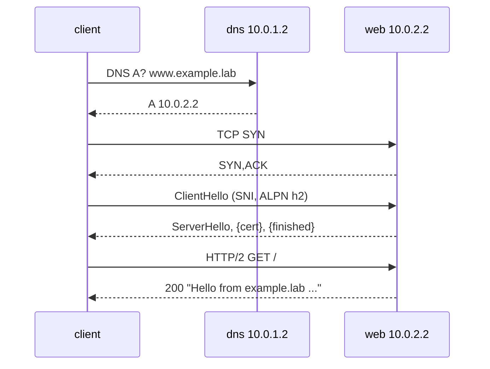

この記事は、ネットワークプロトコルを手を動かして学ぶフリー教材シリーズ **Protocol Lab** の一部です。教材本体（実行スクリプト・サンプル設定・RFCノート）はGitHubで公開しています。

- リポジトリ: https://github.com/pathvector-studio/protocol-lab

これはシリーズの総まとめ（capstone）です。ここまでの各Labは1つの層だけを見てきました。今回は1つのコマンド `curl https://www.example.lab/` を実行し、それが**すべての層**を順にまたぐ様子を観察します。

1. **DNS**: `www.example.lab` をアドレスに解決する（[Lab 05](https://zenn.dev/nkchan/articles/protocol-lab-dns-05)-[06](https://zenn.dev/nkchan/articles/protocol-lab-dns-06)）。
2. **TCP**: そのアドレスへ 3-way handshake（[Lab 07](https://zenn.dev/nkchan/articles/protocol-lab-tcp-07)）。
3. **TLS**: SNI・ALPN 付きで handshake（[Lab 09](https://zenn.dev/nkchan/articles/protocol-lab-tls-09)）。
4. **HTTP**: リクエストと `200` レスポンス（[Lab 10](https://zenn.dev/nkchan/articles/protocol-lab-http-10)-[11](https://zenn.dev/nkchan/articles/protocol-lab-quic-11)）。

最終的に、この全経路を自分の言葉で語れる状態を目指します。

```text
www.example.lab
  │  DNS  A? ─────────────► resolver (10.0.1.2)
  │       ◄──────── A 10.0.2.2
  │  TCP  SYN ─────────────► web (10.0.2.2:443)
  │       ◄──────── SYN,ACK
  │  TLS  ClientHello (SNI=www.example.lab, ALPN=h2) ─►
  │       ◄──────── ServerHello, {cert, finished}
  │  HTTP GET / (HTTP/2) ──►
  │       ◄──────── 200, "Hello from example.lab ..."
  ▼
```

想定時間は60〜80分です。

## このLabで学べること

- 1つの web request で、層が走る順番。
- 各層がどのノードと話すか（resolver か web server か）。
- ある層の出力（アドレス）が、次の層の入力になる仕組み。
- 2つの capture で各層を指す方法（DNS は一方のリンク、TCP/TLS/HTTP はもう一方）。

今回は扱いません: 実 public DNS / CA / インターネット、性能・接続再利用・HTTP/3 migration（Lab 11）、ロードバランサ / proxy / CDN。

## RFCで読む場所

新しい RFC は増やしません。今までの Lab の RFC を「順番」という視点で読み返します。

| 層 | RFC | 見直すポイント |
|---|---|---|
| DNS | RFC 1034 / 1035 | 名前 → アドレスの解決 |
| TCP | RFC 9293 | handshake で接続を確立 |
| TLS | RFC 8446 / 6066 / 7301 | SNI と ALPN、暗号化の境界 |
| HTTP | RFC 9110 / 9113 | request/response と version |

## 実験の全体像

client を中心に、DNS server と web server を左右に置きます。client の `/etc/resolv.conf` は dns(10.0.1.2)を指し、`curl https://www.example.lab/` はまず eth1 で DNS を引き、返ってきた 10.0.2.2 へ eth2 で TCP/TLS/HTTP します。

```text
client ---- eth1 ---- dns   (resolver + authoritative for example.lab)
  |                    www.example.lab. A 10.0.2.2
  +------- eth2 ---- web   (Caddy: TLS + HTTP/2 over TCP)
```



## 手順

```bash
./scripts/labctl.sh run e2e-12   # build → deploy → resolver設定 → 各層capture → 1リクエスト → 確認 → 後片付け
```

以下は手動手順です。

### 1. ビルドして起動し、resolver を設定する

```bash
cd protocol-lab/examples/e2e-12
docker build -t protocol-lab/bind9:9.20 ./dns
docker build -t protocol-lab/caddy:2 ./web
sudo containerlab deploy -t e2e-12.clab.yml
docker exec clab-e2e-12-client sh -c "printf 'nameserver 10.0.1.2\n' > /etc/resolv.conf"
```

### 2. 層1（DNS）: 名前を解決する

```bash
docker exec clab-e2e-12-client dig www.example.lab A
```

`ANSWER SECTION` の `www.example.lab. ... A 10.0.2.2` が、次の層の宛先になります。

### 3. 層2-4（TCP/TLS/HTTP）: 1リクエストで全層をまたぐ

2つの capture を仕込みます（片方は DNS、片方は web）。

```bash
docker exec -d clab-e2e-12-client tcpdump -i eth1 -n -w /tmp/e2e-dns.pcap "udp port 53"
docker exec -d clab-e2e-12-client tcpdump -i eth2 -n -s0 -w /tmp/e2e-web.pcap "tcp port 443"
docker exec clab-e2e-12-client curl -k --http2 -v https://www.example.lab/
```

`curl -v` を上から読むと、層の順番がそのまま見えます。

```text
* Host www.example.lab:443 was resolved.       <- DNS の結果
*   Trying 10.0.2.2:443...
* Connected to www.example.lab (10.0.2.2)      <- TCP 確立
* ALPN: offers h2
* SSL connection using TLSv1.3 ...             <- TLS
* ALPN: server accepted h2
> GET / HTTP/2                                 <- HTTP
< HTTP/2 200
Hello from example.lab, served over HTTP/2.0
```

### 4. capture で層を指す

```bash
docker exec clab-e2e-12-client tcpdump -n -r /tmp/e2e-dns.pcap   # DNS の query/response
docker exec clab-e2e-12-client tcpdump -n -r /tmp/e2e-web.pcap   # SYN, TLS records, ...
```

- `e2e-dns.pcap`: eth1 に DNS の A query と応答。
- `e2e-web.pcap`: eth2 に TCP handshake、そして TLS レコード（ClientHello は平文、以降は暗号化）。

## なぜそう動くのか

1つの web request は、独立した層の連鎖として動きます。各層の出力が次の層の入力になります。

1. **DNS**: 名前だけでは接続できない。resolver に聞いてアドレス `10.0.2.2` を得る（Lab 05-06）。この結果が次の宛先。
2. **TCP**: そのアドレスの 443 へ 3-way handshake で接続を確立する（Lab 07）。信頼できるバイトストリームができる。
3. **TLS**: その上で handshake。ClientHello の SNI に `www.example.lab`、ALPN で `h2` を選ぶ。鍵が決まると以降は暗号化（Lab 09）。
4. **HTTP**: 暗号化ストリームの中で `GET /` を送り、`200` と本文を受け取る（Lab 10-11）。

大事なのは、各層が**関心事を分けている**ことです。DNS は名前解決だけ、TCP は届けることだけ、TLS は暗号化と認証だけ、HTTP は意味だけを担当する。だから1つ1つは単純なまま、積み重ねて1つの安全な web request になります。このLabは、その積み重ねを1つのコマンドと2つの capture で「順番に」見えるようにしたものです。

## よくある誤解

- **層の順番**。DNS → TCP → TLS → HTTP。TLS は TCP の後、HTTP の前。
- **どのノードと話すか**。DNS は resolver(10.0.1.2)、それ以外は web(10.0.2.2)。capture を2つに分けるのはこのため。
- **resolv.conf**。client がどの resolver を使うか設定しないと、名前解決が別へ行ってしまう。
- **暗号化の境界**。web の capture では TLS の ClientHello までは読めるが、HTTP の中身は暗号化されている（Lab 09 の復習）。
- **1コマンド、複数層**。`curl` は内部で DNS→TCP→TLS→HTTP を順にやっている。`-v` はそれを上から下へ見せてくれる。

## 確認問題

1. `curl https://www.example.lab/` が使う4つの層を、順番に挙げよ。
2. 各層は client 以外のどのノードと話すか（DNS と web）。
3. DNS の出力（アドレス）は、次のどの層の入力になるか。
4. TLS は TCP と HTTP のどちらの後・前に来るか。なぜその順か。
5. web の capture で、暗号化されていて読めないのはどの層か。読めるのはどこまでか。
6. 「関心の分離」という観点で、各層が何を担当しているかを説明せよ。

## 後片付け

```bash
sudo containerlab destroy -t e2e-12.clab.yml --cleanup
```

---

**Protocol Lab について**

この記事は、ネットワークプロトコルを手を動かして学ぶフリー教材シリーズ Protocol Lab の一部です。全Labの一覧・実行スクリプト・RFCノートはこちらにあります。

- シリーズ一覧 / リポジトリ: https://github.com/pathvector-studio/protocol-lab

役に立ったら、リポジトリに ⭐️ をいただけると励みになります。

これで Protocol Lab シリーズ（BGP → RPKI → DNS → TCP → TLS → HTTP → QUIC → E2E）は一周です。手を動かして各層を「自分の言葉で説明できる」状態を、ぜひ持ち帰ってください。
