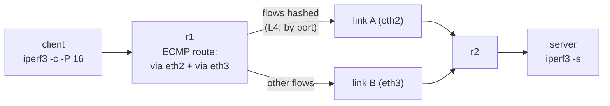

この記事は、ネットワークプロトコルを手を動かして学ぶフリー教材シリーズ **Protocol Lab** の一部です。全Labのソース（containerlabのトポロジ定義、設定ファイル、検証スクリプト）は以下のリポジトリで公開しています。

https://github.com/pathvector-studio/protocol-lab

今回は **Lab #32: ECMP** を扱います。想定時間は40〜55分です。

事前に読んでおくとよい資料:

- [rfc-notes/ecmp.md](https://github.com/pathvector-studio/protocol-lab/blob/main/rfc-notes/ecmp.md)
- 前提Lab: [Lab 31: Anycast — 1つのアドレス、多数のサーバ、決めるのはrouting](https://github.com/pathvector-studio/protocol-lab/blob/main/examples/anycast-31-bgp.md)

## ゴール

Anycast（Lab 31）では、多数の候補からroutingが **1本** のbestを選びました。**ECMP**（equal-cost multipath）はその逆です。複数の経路が同点なら、routingは **全部** をFIBに保持し、トラフィックをそれらに分散します——各 *フロー* をhashで1本のリンクに載せる形で。

このLabでは2台のルータを **2本の並行リンク** でつなぎます。r1は両方のeBGPセッションでサーバのsubnetを学び、`maximum-paths 2` によって **2 next-hopの経路** をFIBに入れます。クライアントが多数のTCP flowをサーバに向けて開いたとき、何が起きるか:

- **L4 hashing**（`fib_multipath_hash_policy=1`）では、flowが両リンクにほぼ均等に分かれる
- 既定の **L3 hashing**（`=0`）では、全flowが同じsrc/dst IPを持つため **同じ** リンクにhashされ、もう1本は遊ぶ——ECMPの典型的な落とし穴

このLabを終えたとき、次の表を自分の言葉で説明できるようになっているはずです。

| hash policy | hashの対象 | 同一クライアント→サーバの16 flow |
|---|---|---|
| `0`（L3、既定） | src/dst IP | 全部が片方のリンクに集中（他方はほぼ0） |
| `1`（L4） | IP + ポート | 各リンクにほぼ半分ずつ |

## 学べること

- **ECMP** とは何か。`maximum-paths` が複数のequal pathをFIBに入れる仕組み。
- なぜルータは **per-packet** ではなく **per-flow**（5-tuple）でhashするのか（reordering回避）。
- Linuxの **`fib_multipath_hash_policy`** がL3 hashingとL4 hashingをどう切り替えるか。
- 落とし穴: 同一のsrc/dst IPペア + L3 hashing → 片方のリンクが全部の仕事をする。
- ECMPとanycast（Lab 31）の違い: 複数経路を保持する vs 1本を選ぶ。

このLabで扱わないこと:

- Weighted / unequal-cost multipath（UCMP）
- LAG / bonding（L2のリンクアグリゲーション）——hashingは似ていますが層が違います
- Per-packet spraying と flowlet switching

## RFCで読む場所

| 資料 | 読むポイント |
|---|---|
| RFC 2992 | per-flow（hash-threshold）方式 |
| RFC 4271 §9.1 + `maximum-paths` | 複数のequal-cost pathがRIBに載る条件 |
| RFC 7424 | 実トラフィックの偏り（flow entropy） |
| RFC 5737 / RFC 1918 | Labのアドレスがローカル用であること |

## 実験の全体像

clientの後ろにr1、r2の後ろにserverを置きます。r1↔r2は **2本の並行リンク** でeBGPを張ります。

```text
 client            r1 (AS 65001)      link A: 10.0.12.0/30      r2 (AS 65002)         server
 10.0.9.2 -- eth1 --+-- eth2 =========================== eth1 --+-- eth3 -- 10.0.8.2
                    +-- eth3 =========================== eth2 --+
                            link B: 10.0.13.0/30
```

r1は `10.0.8.0/24` を両リンク経由で学び、`maximum-paths 2` によって2 next-hopのECMP経路をFIBに入れます。そこに多数のflowを流すと、それぞれが両リンクにhashされます。



:::message
このLabで使う `10.0.0.0/8` はローカル閉域用のアドレス（RFC 1918）です。実際のインターネットには一切広告しません。
:::

## 必要なもの

推奨環境:

- Linux / WSL2 / Linux VM
- Docker
- containerlab

使用イメージ:

- `frrouting/frr:latest`（r1・r2のBGP multipath）
- `nicolaka/netshoot:latest`（client・server。`iperf3` 用）

追加イメージは不要です。

## 実行手順

一括で実行したい場合は、リポジトリ同梱のスクリプトを使います。

```bash
./scripts/labctl.sh run ecmp-32
```

以下は手動で1ステップずつ追う手順です。

### 1. 作業ディレクトリへ移動する

```bash
cd protocol-lab/examples/ecmp-32
```

### 2. 起動する

```bash
sudo containerlab deploy -t ecmp-32.clab.yml
```

r1/r2は `maximum-paths 2`、`fib_multipath_hash_policy=1`（L4）の状態で起動します。

### 3. ECMP経路を確認する

```bash
docker exec clab-ecmp-32-r1 ip route show 10.0.8.0/24
```

2つの `nexthop`（via 10.0.12.2 / via 10.0.13.2）が見えれば成功です。

### 4. 多数のflowを流し、両リンクの使用量を見る

```bash
docker exec -d clab-ecmp-32-server iperf3 -s
# before
docker exec clab-ecmp-32-r1 cat /sys/class/net/eth2/statistics/tx_bytes
docker exec clab-ecmp-32-r1 cat /sys/class/net/eth3/statistics/tx_bytes
# 16 parallel flows
docker exec clab-ecmp-32-client iperf3 -c 10.0.8.2 -P 16 -t 6
# after — both counters moved
docker exec clab-ecmp-32-r1 cat /sys/class/net/eth2/statistics/tx_bytes
docker exec clab-ecmp-32-r1 cat /sys/class/net/eth3/statistics/tx_bytes
```

両リンクの `tx_bytes` がほぼ半々に増えます。

### 5. 落とし穴を見る: L3 hashingに戻す

```bash
docker exec clab-ecmp-32-r1 sysctl -w net.ipv4.fib_multipath_hash_policy=0
docker exec clab-ecmp-32-client iperf3 -c 10.0.8.2 -P 16 -t 5
# 片方のリンクだけが増える（全 flow が同じ src/dst IP → 同じ hash）
docker exec clab-ecmp-32-r1 sysctl -w net.ipv4.fib_multipath_hash_policy=1   # 戻す
```

:::message
最後の `sysctl -w ... =1` を忘れないでください。policy=0 のままだと、以降の観察がすべて「片リンク集中」の状態で行われます。
:::

## 期待される結果

- `ip route show 10.0.8.0/24`: nexthopが2つ表示される。
- policy=1: 16 flowでeth2/eth3の `tx_bytes` がほぼ半々（検証環境では約 131 GB / 133 GB）。
- policy=0: ほぼ片方に集中（一方が全体、他方はほぼ0）。

## なぜそう動くのか

**ECMP**（equal-cost multipath）の考え方は「同じ良さの経路が複数あるとき、全部使う」です。

### 複数経路はどこから来るのか

BGPは既定で、prefixごとにbestを1つだけFIBに入れます（Lab 31でやったとおりです）。ここに `maximum-paths 2` を付けると、**同点** の経路を2本までFIBに入れるようになります。

このLabではr1–r2が2本の並行リンクでeBGPを張っており、両方が同じprefixを同じAS_PATH長で広告します。よって同点 → 2 next-hopのECMP経路ができあがります。

### per-flow hashing

ルータはパケットを交互に振り分けたりはしません。同一の接続が別々の経路を通ると、経路間の遅延差によって **並べ替え（reordering）** が起き、TCPがそれをlossと誤認しかねないからです。

代わりに、各パケットの **5-tuple**（src IP / dst IP / protocol / src port / dst port）をhashし、同じflowは常に同じnext-hopに固定します。別々のflowは別々に散ります。

### hashに何を入れるか

これを決めるのがLinuxの `fib_multipath_hash_policy` です。

- `0` = L3（IPのみ）
- `1` = L4（IP + ポート）

このLabは1台のクライアント → 1台のサーバという構成なので、**全flowのsrc/dst IPが同じ** です。したがってL3 hashingでは全flowのhash値が同じになり、**1本のリンクに集中** します。ポートまでhashに含めるL4 hashingにすれば、送信ポートの異なる各flowが別々に散り、両リンクが使われます。

### 均等さについて

flowが多いほど、統計的に均等へ近づきます。数が少ないと偏ります（このLabの16 flowならほぼ半々になります）。

そして重要な点として、**1本のflowは1本のリンクに載ったままです**。ECMPが増やすのは「多数flowの総和」であって、単一接続のスループットではありません。

要点はこうです——**routingが複数のequal pathを保持し、kernelがflowごとにhashして1本に割り当てる**。1本に絞るanycastの双対であり、同じBGP経路選択の別の面を見ていることになります。

## 詰まりやすい点

- **ECMPはパケットを交互に振ると思ってしまう**。実際はflow単位のhashです（reordering回避のため）。
- **同一IPペアなのに両リンクが使われると思ってしまう**。L3 hashing（既定）では1リンクに集中します。**L4 hashing（policy=1）** が必要です。これが最大の落とし穴。
- **常に均等になると思ってしまう**。flow数が少ないと偏ります。均等は多数flowの統計的な性質です。
- **1接続が速くなると思ってしまう**。1 flowは1リンク止まりです。ECMPが増やすのは総スループット。
- **`maximum-paths` を忘れる**。無いとbestが1本しか入らず、ECMPになりません。
- **vethは非常に速い**。このLabの絶対値（数百 Gbit/s）は環境依存です。見るべきは2リンクの **比率** であって絶対値ではありません。

## 後片付け

```bash
sudo containerlab destroy -t ecmp-32.clab.yml --cleanup
```

`labctl.sh run ecmp-32` を使った場合は、スクリプトが最後にdestroyまで行います。

## 確認問題

1. ECMPとは何か。BGPはどうやって複数のequal-cost経路をFIBに入れるか。
2. なぜルータはper-packetではなくper-flowで分散するのか。per-packetだと何が起きるか。
3. `fib_multipath_hash_policy` の `0` と `1` は何が違うか。
4. 1台のクライアント→1台のサーバという構成で、L3 hashingだと片リンクに集中するのはなぜか。
5. ECMPとanycast（Lab 31）の違いを、経路数と目的の観点で述べよ。
6. 1本のTCP接続のスループットはECMPで上がるか。理由は。

## 検証済み実行ログ（2026-07-07）

このLabは実機で再現性を確認済みです。

実行環境:

- Ubuntu 26.04 LTS（kernel 7.0.0-27-generic, x86_64）
- Docker 29.1.3
- containerlab 0.77.0
- r1 / r2: `frrouting/frr:latest`（BGP multipath）
- client / server: `nicolaka/netshoot:latest`（iperf3）

`PATH="/tmp/pl-shim:$PATH" ./scripts/labctl.sh run ecmp-32` でdeploy → verify → destroyを実行し、`verification.json` は `"status": "verified"` を返しました。

### 2 next-hopのECMP経路

```text
10.0.8.0/24 nhid 25 proto bgp metric 20
	nexthop via 10.0.12.2 dev eth2 weight 1
	nexthop via 10.0.13.2 dev eth3 weight 1
```

`maximum-paths 2` により、r1はサーバsubnetへの2本のequal-cost経路をnext-hop groupとしてFIBに入れました。

### L4 hashingで両リンクがほぼ半々

16本の並行TCP flow（`iperf3 -c 10.0.8.2 -P 16`）を流し、r1の2つのegressリンクの `tx_bytes` を測定しました。

```text
policy: 1
eth2 (link A) tx delta: 131801067437 bytes   (49.6%)
eth3 (link B) tx delta: 133902251068 bytes   (50.4%)
total:                  265703318505 bytes
```

`fib_multipath_hash_policy=1`（L4、ポート込み）では、送信ポートの異なる各flowが両リンクにほぼ均等に散りました。

### 落とし穴: L3 hashingは1リンクに集中

同じ16 flowを `fib_multipath_hash_policy=0`（L3、IPのみ）で流すと:

```text
L3 hashing (policy=0):
  eth2 delta: 151 bytes
  eth3 delta: 133854511558 bytes
```

全flowが同じsrc/dst IP（1クライアント→1サーバ）なのでL3 hashが同一値になり、**ほぼ全部が片方のリンク** に載りました（eth2は151 bytes = 実質ゼロ）。

:::message alert
ECMPを効かせるには、hashにポートを含めるL4 policyが必要です。「2本のリンクを張ってBGPでmultipathを組んだのに帯域が倍にならない」というトラブルの多くは、ここが原因です。
:::

### Cleanup

```bash
containerlab destroy -t ecmp-32.clab.yml --cleanup
```

## References

- [RFC 2992: Analysis of an Equal-Cost Multi-Path Algorithm](https://www.rfc-editor.org/rfc/rfc2992)
- [RFC 4271: A Border Gateway Protocol 4 (BGP-4)](https://www.rfc-editor.org/rfc/rfc4271)
- [RFC 7424: Mechanisms for Optimizing LAG/ECMP Component Link Utilization](https://www.rfc-editor.org/rfc/rfc7424)
- [RFC 5737: IPv4 Address Blocks Reserved for Documentation](https://www.rfc-editor.org/rfc/rfc5737)

---

## Protocol Lab について

Protocol Labは、ネットワークプロトコルをcontainerlabで実際に動かしながら学ぶフリー教材シリーズです。全Labの一覧・ソースはこちらから。

https://github.com/pathvector-studio/protocol-lab

役に立ったと感じたら、GitHubで⭐スターをいただけると励みになります。

次回は、今回と同じBGPの経路選択をさらに掘り下げ、経路の優先度を意図的に操作する話題を扱う予定です。ECMPが「同点をすべて使う」話だったのに対し、次は「わざと同点を崩す」側から見ていきます。
