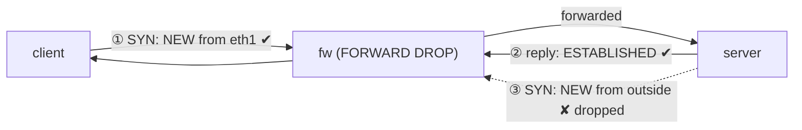

この記事は、ネットワークプロトコルを手を動かして学ぶフリー教材シリーズ **Protocol Lab** の一部です。Lab の元データ、トポロジ定義、実行スクリプトはすべて GitHub で公開しています。

https://github.com/pathvector-studio/protocol-lab

今回は **Lab #36: Stateful Firewall — パケットではなく接続で判断する** を扱います。想定時間は 40〜55分です。

- 読み物ガイド: [rfc-notes/stateful-firewall.md](https://github.com/pathvector-studio/protocol-lab/blob/main/rfc-notes/stateful-firewall.md)
- 前提となる Lab: [Lab 20: NAT — Source Address Translation](https://github.com/pathvector-studio/protocol-lab/blob/main/examples/nat-20-source-nat.md)

## ゴール

NAT(Lab 20)では、カーネルの connection tracker をアドレス変換に使いました。この Lab では **まったく同じ conntrack** を、もう1つの定番用途である **ステートフルファイアウォール** に使います。

ステートフルファイアウォールは、各パケットを単独で判定しません。**flow(会話)を覚えておいて、許可済みの会話に属するパケットだけを通す**という仕組みです。

構成はシンプルで、client と server の間に fw というルータを置き、fw の `FORWARD` を既定 **DROP** にした上で、次の2つだけを許可します。

- **ESTABLISHED** または **RELATED** な flow のパケット
- **client 側から**やってくる **NEW** な接続

この結果、次のように挙動が分かれます。

- **client → server** は成立する。SYN は内側発の NEW なので許可され、server からの応答は ESTABLISHED なので許可される。
- **server → client** は遮断される。server の SYN は外側発の勝手な NEW であり、どの許可規則にも当てはまらず default DROP に落ちる。

注目してほしいのは、**どちらのケースでも「server → client 向き」のパケットは存在している**という点です。違うのは向きではなく **conntrack が持っている状態** です。

この Lab を終えたとき、次の表を自分の言葉で説明できるようになっているのがゴールです。

| 方向 | 最初のパケットの状態 | 結果 |
|---|---|---|
| client → server | 内側(eth1)からの NEW | 許可。応答は ESTABLISHED |
| server → client | 外側からの NEW | 破棄(default DROP) |

## この Lab で学べること

- **stateless** なフィルタと **stateful** なファイアウォールの違い
- **conntrack** が何を記録しているか(1つの flow の双方向を1エントリで持つ)
- **ctstate** の NEW / ESTABLISHED / RELATED / INVALID の意味と、ポリシーがそれをどう照合するか
- **default-drop + ESTABLISHED 許可 + 内側発 NEW 許可** という定石
- 許可した接続の「戻り」に、なぜ個別の許可規則が要らないのか

一方、次の内容は扱いません。

- L7 / アプリケーション認識型のファイアウォール(ディープパケットインスペクション)
- nftables の構文(同じエンジンに対する新しいフロントエンド)
- NAT / ポートフォワード(Lab 20 の範囲)や、本格的な zone ベースのポリシー

## RFC で読む場所

| 資料 | 読むポイント |
|---|---|
| RFC 2979 | firewall の要件、default-deny |
| RFC 9293 §3.3 | TCP 状態機械(conntrack が写し取っているもの) |
| RFC 7857 | conntrack のタイムアウトと状態 |
| RFC 5737 / RFC 1918 | Lab で使うアドレスがローカル用であること |

## 実験の全体像

client と server の間に fw(ルータ)を置きます。fw は FORWARD を DROP 既定にして、state に基づいて許可します。

```text
 client (10.0.9.2) --- eth1 [ fw ] eth2 --- server (10.0.8.2)
                            FORWARD policy DROP
                            + ESTABLISHED,RELATED  ACCEPT
                            + (in eth1) NEW         ACCEPT
```

両ホストに HTTP responder を立てて、双方向の到達性を試します。



:::message
`10.0.0.0/8` はローカル閉域のアドレスです(RFC 1918 / RFC 5737 の考え方に沿ったローカル専用の割り当て)。実際のインターネットには一切出ていきません。
:::

## 必要なもの

推奨環境:

- Linux / WSL2 / Linux VM
- Docker
- containerlab

使用イメージ:

- `nicolaka/netshoot:latest`(`iptables`、`conntrack`、`curl`、`python3` 同梱)

追加のイメージは不要です。

## 実行手順

一発で回したい場合はこれだけです。

```bash
./scripts/labctl.sh run fw-36
```

以下は手順を分解したものです。

### 1. 作業ディレクトリへ移動する

```bash
cd protocol-lab/examples/fw-36
```

### 2. 起動する

```bash
sudo containerlab deploy -t fw-36.clab.yml
```

### 3. ステートフルなポリシーを入れる

```bash
docker exec clab-fw-36-fw sh -c '
  iptables -P FORWARD DROP
  iptables -A FORWARD -m conntrack --ctstate ESTABLISHED,RELATED -j ACCEPT
  iptables -A FORWARD -i eth1 -m conntrack --ctstate NEW -j ACCEPT
'
docker exec clab-fw-36-fw iptables -L FORWARD -n -v
```

3行しかありませんが、これが default-deny のステートフルポリシーの最小形です。1行目で既定を DROP にし、2行目で「既存会話の続き」を通し、3行目で「内側から始まる新規接続」だけを通しています。

### 4. responder を立てて双方向を試す

```bash
docker exec -d clab-fw-36-client python3 /responder.py client
docker exec -d clab-fw-36-server python3 /responder.py server

# client -> server（内側発。通る）
docker exec clab-fw-36-client curl -s --max-time 4 http://10.0.8.2/

# server -> client（外側発の新規。落ちる）
docker exec clab-fw-36-server curl -s --max-time 4 http://10.0.9.2/ || echo "blocked"
```

### 5. conntrack のエントリを見る

```bash
docker exec clab-fw-36-fw conntrack -L | grep 10.0.9.2
```

行き(client→server)と戻り(server→client)が、**1つのエントリ**に両方記録されているのが見えるはずです。

## 期待される出力

- `iptables -L FORWARD`: `policy DROP`、ESTABLISHED,RELATED 許可、eth1 の NEW 許可
- client → server: `server`(到達)
- server → client: `blocked`(遮断)
- conntrack: `src=10.0.9.2 dst=10.0.8.2 ... src=10.0.8.2 dst=10.0.9.2 ... [ASSURED]`(双方向が1エントリ)

## なぜそう動くのか

ステートフルファイアウォールの本質は「**パケット単体ではなく接続で判断する**」ことです。

### stateless と stateful

stateless なフィルタは各パケットを単独で判定します。そのため、戻りのパケットを通すには「戻り用の穴」を明示的に開けなければならず、その穴はどうしても広くなりがちです。

stateful なファイアウォールは **flow を追跡**し、戻りを「既存会話の一部」として自動的に通します。だから inbound に穴を開けることなく、outbound とその応答だけを許可できます。

### conntrack が記録しているもの

conntrack は、box を通過する各 flow を **双方向まとめて1エントリ**として記録します。行き(client→server)を見た瞬間に、戻り(server→client)がどう見えるかも導かれます。だから応答パケットは即座に ESTABLISHED だと判定できるわけです。

### ctstate による判定

ポリシーは各パケットの状態を見て判断します。

- **NEW**: 会話の最初のパケット(= SYN)
- **ESTABLISHED**: 既存の flow に属するパケット
- **RELATED**: 関連する flow(ICMP エラーや FTP のデータコネクションなど)
- **INVALID**: どれにも当てはまらない

### なぜ client は通り、server は通らないのか

- client→server の SYN は、内側(eth1)からの **NEW** なので許可される。server の応答は **ESTABLISHED** なので許可される。会話が成立する。
- server→client の SYN は、外側からの **NEW**。内側限定の NEW 規則にも ESTABLISHED 規則にも当てはまらないので、**default DROP** が適用される。

肝心なのは、**どちらのケースでも「server→client 向き」のパケットは存在している**のに、**conntrack の状態**(応答としての ESTABLISHED なのか、勝手な新規としての NEW なのか)で結果が分かれる、という点です。**向きではなく状態が決めています。**

### default-deny

既定を DROP にして、必要なものだけを開ける。これが RFC 2979 の言う deny-by-default です。許可した接続の戻りは state が通してくれるので、そのための規則を書く必要はありません。

要点をまとめると、**flow を追跡して「許可済み会話の続き」を自動で通し、勝手な新規だけを default-drop で遮断する**。NAT(Lab 20)と同じ conntrack の、別の使い方です。

## 詰まりやすい点

:::message alert
**戻り用の穴を開けようとする** — stateful では不要です。戻りは state で自動的に許可されます。わざわざ開けると、かえって危険な穴になります。
:::

- **向きで許可が決まると思い込む**: 決めるのは **conntrack の状態**です。同じ向きでも ESTABLISHED は通り、NEW は落ちます。
- **default ACCEPT にして個別に塞ぐ**: 逆です。**default DROP** にして必要な分だけ開けます。
- **RELATED を忘れる**: ICMP エラー(PMTUD の frag-needed など)や FTP のデータコネクションは RELATED です。落とすと原因の分かりにくい不具合が出ます。
- **conntrack モジュール**: `--ctstate` は nf_conntrack が必要です(netshoot イメージでは利用可能)。
- **NAT と混同する**: 基盤は同じ conntrack ですが、NAT は変換、firewall は許可判定です。

## 後片付け

```bash
sudo containerlab destroy -t fw-36.clab.yml --cleanup
```

`labctl.sh run fw-36` を使った場合は、スクリプトが最後に destroy まで実行します。

## 確認問題

1. stateless フィルタと stateful firewall の違いは何か。
2. conntrack は1つの flow をどう記録するか(行き/戻り)。
3. ctstate の NEW / ESTABLISHED / RELATED はそれぞれ何か。
4. client→server が通り server→client が落ちるのはなぜか。向きではなく何が効いているか。
5. 許可した接続の戻りに、なぜ個別の許可規則が要らないのか。
6. default を DROP にする(deny-by-default)のはなぜ安全か。

## 検証済み実行ログ (2026-07-07)

この Lab は実機で再現性を確認済みです。

実行環境:

- Ubuntu 26.04 LTS (kernel 7.0.0-27-generic, x86_64)
- Docker 29.1.3
- containerlab 0.77.0
- client / fw / server: `nicolaka/netshoot:latest`(iptables、conntrack、curl、python3)

`PATH="/tmp/pl-shim:$PATH" ./scripts/labctl.sh run fw-36` で deploy → verify → destroy を実行し、`verification.json` は `"status": "verified"` を返しました。

### ステートフルなポリシー(default-drop + state 許可)

```text
Chain FORWARD (policy DROP 0 packets, 0 bytes)
1  ACCEPT  all  --  *     *   ctstate RELATED,ESTABLISHED
2  ACCEPT  all  --  eth1  *   ctstate NEW
```

FORWARD は既定 DROP。ESTABLISHED/RELATED と、内側(eth1)からの NEW のみを許可しています。

### 内側発は通り、外側発の新規は落ちる

```text
client_to_server: ok
server_to_client: blocked
```

- **client → server**: SYN が内側発の NEW(規則2で許可)、応答が ESTABLISHED(規則1で許可)→ 到達(`server` を取得)。
- **server → client**: server の SYN は外側発の勝手な NEW。内側限定の NEW 規則にも ESTABLISHED にも当てはまらず default DROP → 遮断。

### conntrack が双方向を1エントリで追跡する

```text
tcp 6 119 TIME_WAIT src=10.0.9.2 dst=10.0.8.2 sport=38018 dport=80
                     src=10.0.8.2 dst=10.0.9.2 sport=80    dport=38018 [ASSURED]
```

許可した client→server の flow が、行き(1行目)と戻り(2行目)を **1エントリ**で記録しています。だから server→client 向きの**応答**は ESTABLISHED として自動的に通り、一方で server が始める**新規**の server→client は、同じ向きなのに NEW なので落ちる。**向きではなく状態が結果を決めている**ことが、このログにそのまま現れています。

### Cleanup

```bash
containerlab destroy -t fw-36.clab.yml --cleanup
```

## References

- [RFC 2979: Behavior of and Requirements for Internet Firewalls](https://www.rfc-editor.org/rfc/rfc2979)
- [RFC 9293: Transmission Control Protocol](https://www.rfc-editor.org/rfc/rfc9293)
- [RFC 7857: Updates to Network Address Translation (NAT) Behavioral Requirements](https://www.rfc-editor.org/rfc/rfc7857)
- [RFC 5737: IPv4 Address Blocks Reserved for Documentation](https://www.rfc-editor.org/rfc/rfc5737)

---

## Protocol Lab シリーズについて

Protocol Lab は、BGP・TCP・TLS・DNS・NAT・ファイアウォールといったネットワークプロトコルを、containerlab で実際に動かしながら学ぶフリー教材シリーズです。全 Lab の一覧はこちらから。

https://github.com/pathvector-studio/protocol-lab

役に立ったと感じたら、GitHub で ⭐ を付けてもらえると励みになります。新しい Lab を追加していく原動力になります。

次回は、今回と同じ conntrack を土台にしつつ、外から中への通信を意図的に通す側 —— ポートフォワードと DNAT の挙動を扱う予定です。「戻りは state が通す」という今回の理解が、そのまま効いてきます。
