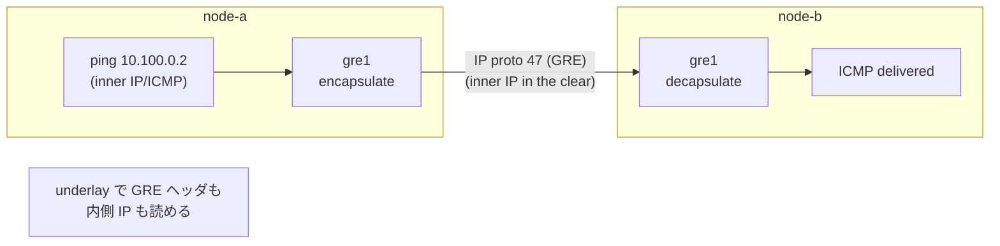

この記事は、ネットワークプロトコルを手を動かして学ぶフリー教材シリーズ **Protocol Lab** の一部です。RFC を読みながら実際にパケットを流し、「なぜそう動くのか」を自分の言葉で説明できるようになることを目指しています。

教材リポジトリはこちら: https://github.com/pathvector-studio/protocol-lab

今回は Lab #21、GRE トンネルを扱います。想定時間は 40〜55 分です。

- 読みものガイド: [rfc-notes/gre-tunnel.md](https://github.com/pathvector-studio/protocol-lab/blob/main/rfc-notes/gre-tunnel.md)
- 前提となる Lab: [Lab 16: WireGuard](https://github.com/pathvector-studio/protocol-lab/blob/main/examples/wg-16-wireguard-tunnel.md) / [Lab 18: VXLAN](https://github.com/pathvector-studio/protocol-lab/blob/main/examples/vxlan-18-l2-overlay.md)

## ゴール

この Lab はトンネル三部作を完成させます。

**GRE**（Generic Routing Encapsulation）は、IP パケットを GRE ヘッダで包み、さらに外側 IP パケットに入れて運ぶ **L3 トンネル**です。そして VXLAN と同様、**暗号化しません**。

3 つを並べてみると、「カプセル化するか」「暗号化するか」「どの層を運ぶか」が、それぞれ独立した選択だということが見えてきます。

| Lab | 運ぶもの | 暗号化 | ワイヤ上での見え方 |
|---|---|---|---|
| 16 WireGuard | IP (L3) | **あり** | UDP 51820、暗号文 |
| 18 VXLAN | Ethernet (L2) | なし | UDP 4789、内側フレームが見える |
| **21 GRE** | **IP (L3)** | **なし** | **IP proto 47、内側 IP が見える** |

この記事では point-to-point の GRE トンネルを張り、overlay 越しに ping し、underlay を capture して `GRE (47)` とその内側の ICMP が平文で見えることを自分の目で確認します。

## 学べること

- GRE とは何か: IP プロトコル番号 **47** として IP に直接載る、汎用の L3 トンネル（UDP/TCP を挟まない）
- GRE はカプセル化するが暗号化しないこと（VXLAN と同じ、WireGuard とは違う）
- overlay と underlay の区別を、今度は L3 トンネルで捉え直すこと
- GRE が VXLAN（L2 か L3 か）と WireGuard（平文か暗号か）とどう違うか
- 機密性が必要なとき、なぜ GRE が IPsec と組み合わせられるのか

この Lab で扱わないこと:

- GRE key、sequence number、checksum といった GRE ヘッダのオプションフィールド
- GRE 上でルーティングプロトコルを流す構成（GRE + OSPF などの実運用でよくあるパターン）
- IPsec で保護された GRE（GRE over IPsec）

## RFC で読む場所

| RFC | 章 | 読むポイント |
|---|---|---|
| RFC 2784 | 2 | GRE パケット構造（delivery header + GRE header + payload） |
| RFC 2784 | 2.3 | Protocol Type、IP プロトコル番号 47 |
| RFC 1701 | 1 | GRE の設計思想（汎用のカプセル化） |
| RFC 5737 | 3 | Lab で使うアドレスが documentation 用であること |

## 実験の全体像

ノードは 2 台。underlay（eth1、10.0.0.0/24）の上に GRE トンネル（gre1、10.100.0.0/24）を張ります。

```text
             overlay:  10.100.0.1  <== gre1 (IP proto 47) ==>  10.100.0.2
                            |                                       |
node-a --------------- eth1 (underlay 10.0.0.0/24) --------------- node-b
       10.0.0.1                                              10.0.0.2
```

overlay の `10.100.0.2` へ ping すると、GRE が内側 IP パケットを包んで、underlay の相手へ IP proto 47 で送ります。GRE は暗号化しないので、underlay を覗くと GRE ヘッダと内側 IP の両方が見えます。



:::message
`10.0.0.0/24`（underlay）も `10.100.0.0/24`（overlay）もローカル閉域です。外に出ていく通信は発生しません。
:::

## 必要なもの

推奨環境:

- Linux / WSL2 / Linux VM（**ホストに ip_gre カーネルモジュールが必要**。最近の Linux なら標準で入っており、トンネル作成時に自動ロードされます）
- Docker
- containerlab

使用イメージ:

- `nicolaka/netshoot:latest`（`ip`、`tcpdump` 同梱）

追加のイメージは不要です。GRE の data path はホストカーネルが担当します。

## 実行手順

一発で流すならこれだけです。

```bash
./scripts/labctl.sh run gre-21
```

以下は手動で進める場合の手順です。

### 1. 作業ディレクトリへ移動する

```bash
cd protocol-lab/examples/gre-21
```

### 2. 起動する

```bash
sudo containerlab deploy -t gre-21.clab.yml
```

### 3. GRE トンネルを張る

```bash
# gre1 という名前を使う（カーネルの既定 gre0 と衝突しないため）
docker exec clab-gre-21-node-a sh -c \
  "ip link add gre1 type gre local 10.0.0.1 remote 10.0.0.2; \
   ip addr add 10.100.0.1/24 dev gre1; ip link set gre1 up"
docker exec clab-gre-21-node-b sh -c \
  "ip link add gre1 type gre local 10.0.0.2 remote 10.0.0.1; \
   ip addr add 10.100.0.2/24 dev gre1; ip link set gre1 up"
```

### 4. overlay 越しに ping する

```bash
docker exec clab-gre-21-node-a ping -c3 10.100.0.2
docker exec clab-gre-21-node-a ip -d link show gre1
```

### 5. underlay を capture して中身が見えることを確認する

```bash
docker exec -d clab-gre-21-node-a tcpdump -i eth1 -n -w /tmp/gre.pcap "proto 47"
docker exec clab-gre-21-node-a ping -c3 10.100.0.2
docker exec clab-gre-21-node-a pkill -INT tcpdump
docker exec clab-gre-21-node-a tcpdump -n -vv -r /tmp/gre.pcap
```

`proto GRE (47)` の外側 IP に続いて、内側の `10.100.0.1 > 10.100.0.2: ICMP echo request` が **そのまま** 見えるはずです。

## 期待される結果

- `ping 10.100.0.2` が成功する
- `ip -d link show gre1` に `gre remote 10.0.0.2 local 10.0.0.1` が出る
- underlay の capture に `proto GRE (47)` / `GREv0` と、その内側の `ICMP echo`（平文）が見える

## なぜそう動くのか

GRE（Generic Routing Encapsulation）は、その名の通り「汎用のカプセル化」です。任意の L3 パケットを GRE ヘッダで包み、外側 IP で運びます。

**IP に直接載る。** VXLAN や WireGuard が UDP を使うのに対し、GRE は **IP プロトコル番号 47** として IP のペイロードに直接入ります。UDP/TCP を挟みません。だから underlay の capture では、transport ポートではなく "proto GRE" として見えます。

**L3 を運ぶ。** GRE が包むのは内側の IP パケット（この Lab なら ICMP を載せた IP）です。VXLAN が Ethernet フレーム（L2）を運ぶのとは対照的で、GRE の overlay に付けるのは IP アドレスであり、L2 の広がりは持ちません。

**暗号化しない。** GRE の仕事はカプセル化だけです。暗号化はしません。だから underlay を capture すると、GRE ヘッダも内側 IP も平文で読めてしまいます。機密性が要るなら **IPsec** と組み合わせる（GRE over IPsec）のが定番です。

:::message alert
GRE は暗号トンネルではありません。GRE 単体では中身は経路上で読めます。機密性が必要な区間には必ず IPsec などを併用してください。
:::

**三部作の位置づけ。** WireGuard（L3・暗号）、VXLAN（L2・平文）、GRE（L3・平文）。「どの層を運ぶか」と「暗号化するか」は独立した 2 軸で、3 つはその組み合わせの別々の点にいます。GRE は「暗号化しない L3 トンネル」です。

要点は、**カプセル化・暗号化・運ぶ層は別々の選択肢**であり、GRE はそのうち「L3 を、暗号化せずに、IP proto 47 で包む」という点にある、ということです。

## 詰まりやすい点

- **GRE を暗号トンネルだと思ってしまう。** GRE は暗号化しません。中身は underlay で読めます。IPsec と組み合わせて初めて秘匿されます。
- **UDP を使うと思ってしまう。** GRE は IP プロトコル 47 であって、UDP/TCP ではありません（capture のフィルタは `proto 47`）。
- **既定の gre0 と衝突する。** カーネルは gre0 を予約しているので、別名（gre1 など）を使います。
- **L2 と L3 を混同する。** GRE は L3（IP を運ぶ）、VXLAN は L2（Ethernet を運ぶ）です。
- **overlay と underlay のアドレスを取り違える。** underlay が 10.0.0.0/24、overlay が 10.100.0.0/24。ping するのは overlay 側です。
- **MTU。** GRE ヘッダのぶん、overlay の実効 MTU は小さくなります（24 バイト程度）。

## 後片付け

```bash
sudo containerlab destroy -t gre-21.clab.yml --cleanup
```

`labctl.sh run gre-21` を使った場合は、スクリプトが最後に destroy まで実行します。

## 確認問題

1. GRE は何を何に包むか。どのプロトコル番号で IP に載るか。
2. GRE は暗号化するか。機密性が必要なとき何と組み合わせるか。
3. GRE（L3）と VXLAN（L2）は、運ぶ対象がどう違うか。
4. GRE と WireGuard は、underlay の capture でどう見え方が違うか。それはなぜか。
5. カプセル化・暗号化・運ぶ層の 3 つは、独立か従属か。3 つのトンネルはそれぞれどこに位置づくか。
6. なぜ `gre0` ではなく別名を使うのか。

## 検証済み実行ログ（2026-07-07）

この Lab は実機で再現性を確認済みです。

実行環境:

- Ubuntu 26.04 LTS（kernel 7.0.0-27-generic, x86_64）。ip_gre カーネルモジュールはトンネル作成時に自動ロードされました。
- Docker 29.1.3
- containerlab 0.77.0
- node-a / node-b: `nicolaka/netshoot:latest`（tcpdump 同梱）

`PATH="/tmp/pl-shim:$PATH" ./scripts/labctl.sh run gre-21` で deploy → verify → destroy を実行し、`verification.json` は `"status": "verified"` を返しました。

### overlay 越しの ping

```text
$ docker exec clab-gre-21-node-a ping -c3 10.100.0.2
3 packets transmitted, 3 received, 0% packet loss
```

### underlay に GRE ヘッダと内側 IP が両方見える

```text
$ docker exec clab-gre-21-node-a tcpdump -n -vv -r underlay.pcap
IP (tos 0x0, ttl 64, ... proto GRE (47), length 108)
    10.0.0.1 > 10.0.0.2: GREv0, Flags [none], length 88
    10.100.0.1 > 10.100.0.2: ICMP echo request, id ..., seq 1, length 64
```

外側は `proto GRE (47)` / `GREv0`（underlay）、その内側の `ICMP echo request`（overlay）が **平文でそのまま** 見えています。GRE はカプセル化はするが暗号化はしない、ということがそのまま出力に表れています。

改めて三部作を並べると:

- WireGuard（Lab 16）= L3・暗号 → underlay は暗号文のみ
- VXLAN（Lab 18）= L2・平文 → 内側 Ethernet が見える
- GRE（この Lab）= L3・平文 → 内側 IP が見える

「カプセル化」「暗号化」「運ぶ層」は独立した選択であり、3 つのトンネルはその別々の点にいます。

## 参考文献

- [RFC 2784: Generic Routing Encapsulation (GRE)](https://www.rfc-editor.org/rfc/rfc2784)
- [RFC 1701: Generic Routing Encapsulation (GRE)](https://www.rfc-editor.org/rfc/rfc1701)
- [RFC 5737: IPv4 Address Blocks Reserved for Documentation](https://www.rfc-editor.org/rfc/rfc5737)
- [ip-link(8) manual page (gre)](https://man7.org/linux/man-pages/man8/ip-link.8.html)

---

## Protocol Lab について

Protocol Lab は、RFC を読みながら実際にパケットを流して学ぶフリー教材シリーズです。全 Lab の一覧はこちらから見られます。

👉 https://github.com/pathvector-studio/protocol-lab

役に立ったと感じたら、GitHub でスターをいただけると励みになります ⭐

次回は、GRE 単体では手に入らなかった「機密性」を足す方向 — トンネルを暗号で保護する仕組みを扱う予定です。三部作で見えた「カプセル化・暗号化・運ぶ層」の 3 軸を、もう一段深く掘っていきます。
