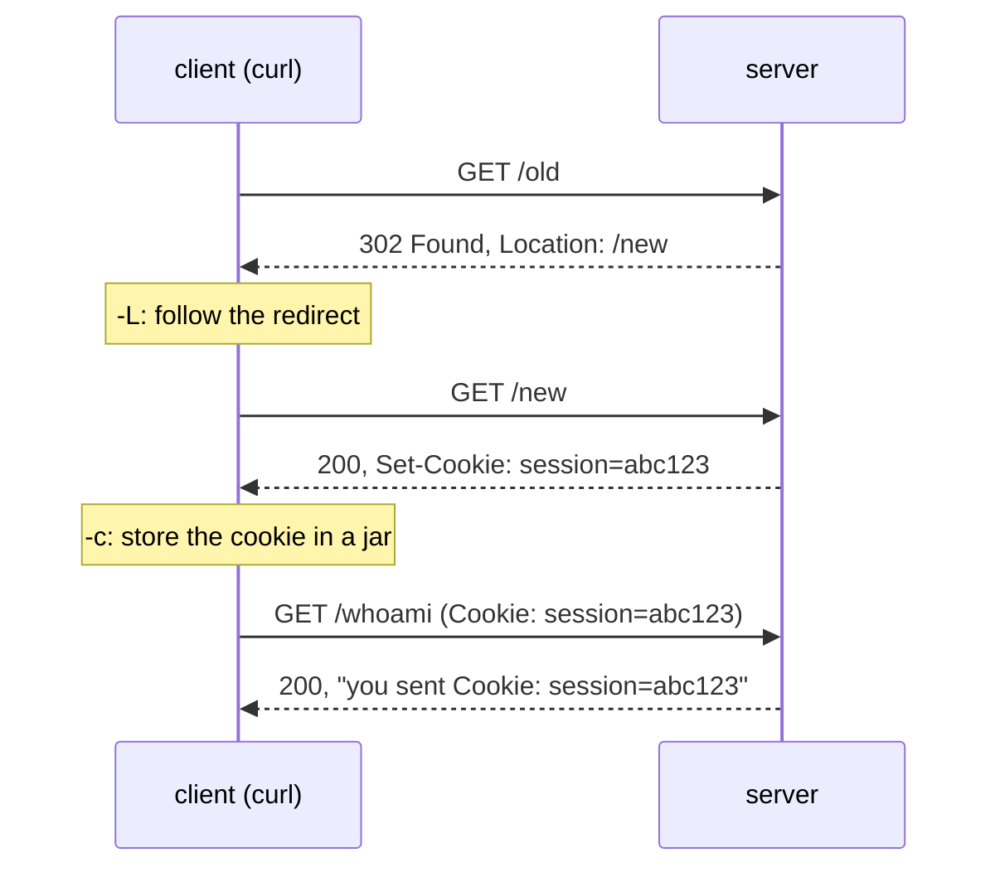

この記事は、ネットワークプロトコルを「手を動かして理解する」ためのフリー教材シリーズ **Protocol Lab** の一部です。教材本体・他のLab・実行スクリプトはすべて以下のリポジトリで公開しています。

https://github.com/pathvector-studio/protocol-lab

今回は **HTTP Lab #27: Redirects and Cookies** を記事として再構成したものです。想定時間は40〜55分。

- 前提Lab: [HTTP Lab 10: One Exchange, Read in the Clear](https://github.com/pathvector-studio/protocol-lab/blob/main/examples/http-10-requests-responses-caching.md)
- 読みものガイド: [rfc-notes/http-redirects-cookies.md](https://github.com/pathvector-studio/protocol-lab/blob/main/rfc-notes/http-redirects-cookies.md)

## ゴール

Lab 10 では、HTTPのrequestとresponseを1往復だけ、平文のまま読みました。この Lab ではそこに2つの仕組みを足します。HTTPは本来 **stateless**（各リクエストは独立していて、サーバは前のリクエストを覚えていない）なのに、webが「状態を持っている」ように見えるのはこの2つのおかげです。

- **redirect**: サーバがclientを別の場所へ送る
- **cookie**: サーバがclientにトークンを渡し、以後のリクエストで送り返させる

両方を `curl` で動かします。

- `GET /old` は **302 Found** と **`Location: /new`** を返す（「こっちへ行け」）
- `curl -L` を付けると、clientがそれに **追従** して `/new` に着く
- `GET /new` は **`Set-Cookie: session=abc123`** を返す（トークンを渡す）
- clientがそれを **保存** して **再送** するので、`GET /whoami` でサーバが **`Cookie: session=abc123`** を受け取ったと確認できる

終わったとき、この表を自分の言葉で説明できる状態を目指します。

| Request | Response | 何が起きるか |
|---|---|---|
| `GET /old` | `302 Found`, `Location: /new` | clientは「`/new` へ行け」と伝えられる |
| `GET /new`（`-L` 追従後） | `200`, `Set-Cookie: session=abc123` | clientがcookieを保存する |
| `GET /whoami`（`-b` 付き） | `200`, 本文に `Cookie: session=abc123` | サーバにcookieが届く |

## この記事で学べること

- **3xx redirect** とは何か、**`Location`** ヘッダの役割
- redirectに追従するclientと、しないclientの違い
- **`Set-Cookie`** と **`Cookie`** が何者で、statelessなHTTPの上にどうやって「セッション」を作るのか
- ログイン・カート・設定がリクエストをまたいで保たれる理由がcookieであること
- サーバは本来 **stateless** で、「送られてきたcookieでしかあなたを識別していない」こと

逆に、この記事が扱わないこと:

- 301 / 302 / 303 / 307 / 308 の違いの深掘り（ここでは302だけ使います）
- cookieのセキュリティ属性（`Secure`, `HttpOnly`, `SameSite`）— 名前を挙げる以上のことはしません
- サーバサイドセッション、JWT、OAuth

## RFCで読む場所

| RFC | 章 | 読むポイント |
|---|---|---|
| RFC 9110 | 15.4 | 3xx (Redirection) の意味、`Location` ヘッダ |
| RFC 9110 | 10.2.2 | `Location` の使われ方 |
| RFC 6265 | 3 | `Set-Cookie` と `Cookie` ヘッダの構文 |
| RFC 6265 | 4.1, 5.2 | cookieの属性（Path, Secure, HttpOnly など） |

## 実験の全体像

client 1台、server 1台。serverは標準ライブラリだけで書かれた小さなPythonアプリです。

```text
client (10.0.0.1) ------ eth1/eth1 ------ server (10.0.0.2:8080)
  curl                                     /old    -> 302 Location: /new
                                           /new    -> 200 Set-Cookie: session=abc123
                                           /whoami -> Cookie を echo
```



:::message
`10.0.0.0/24` はローカル閉域です。外部には一切出ません。
:::

## 必要なもの

推奨環境:

- Linux / WSL2 / Linux VM
- Docker
- containerlab

使用イメージ:

- `nicolaka/netshoot:latest`（`curl`、`python3` 同梱）

追加イメージは不要です。サーバは [`examples/http-27/server/app.py`](https://github.com/pathvector-studio/protocol-lab/blob/main/examples/http-27/server/app.py)（標準ライブラリのみ）を使います。

## 実行手順

一発で流したい場合はこれだけです。

```bash
./scripts/labctl.sh run http-27
```

以下は手動で1ステップずつ動かす手順です。

### 1. 作業ディレクトリへ移動する

```bash
cd protocol-lab/examples/http-27
```

### 2. 起動してサーバを立てる

```bash
sudo containerlab deploy -t http-27.clab.yml
docker exec -d clab-http-27-server python3 /app/app.py
```

### 3. redirect を見る（追従しない / する）

```bash
# 追従しない: 302 と Location をそのまま見る
docker exec clab-http-27-client curl -sD - -o /dev/null http://10.0.0.2:8080/old
# 追従する: -L で /new まで行く
docker exec clab-http-27-client curl -sL -w "\n[final] %{url_effective}\n" http://10.0.0.2:8080/old
```

```text
HTTP/1.1 302 Found
Location: /new
...
[final] http://10.0.0.2:8080/new
```

### 4. cookie の往復を見る

```bash
# /new が Set-Cookie を返す。-c で cookie jar に保存
docker exec clab-http-27-client curl -sD - -o /dev/null -c /tmp/jar.txt http://10.0.0.2:8080/new
# /whoami へ -b で cookie を送る。server が echo する
docker exec clab-http-27-client curl -s -b /tmp/jar.txt http://10.0.0.2:8080/whoami
```

```text
Set-Cookie: session=abc123; Path=/
...
you sent Cookie: session=abc123
```

## 期待される出力

- `GET /old`: `HTTP/1.1 302 Found`、`Location: /new`
- `-L` 追従後の final URL: `.../new`
- `GET /new`: `Set-Cookie: session=abc123`
- `GET /whoami`（cookie 付き）: 本文に `Cookie: session=abc123`

## なぜそう動くのか

HTTPは本来 **stateless** です。各リクエストは独立していて、サーバは前のリクエストを覚えていません。それでもwebで「ログイン状態が続く」「カートが保たれる」のは、redirectとcookieという2つの仕組みがあるからです。

### redirect（3xx + Location）

サーバが「そのURLではなく、こっちを見て」とclientに指示する仕組みです。`302 Found` は「一時的に別の場所にある」という意味。行き先は応答本文ではなく **`Location` ヘッダ** に入ります。client（ブラウザや `curl -L`）はそれを見て、自動で新しいURLへリクエストし直します。ログイン後のページ遷移、http→httpsへの誘導、旧URLの移設などに使われます。

### 追従するのはclientの仕事

サーバは「行き先」を示すだけです。実際にそこへ行くかどうかはclient次第。`curl` は既定では追従せず、302をそのまま見せます。`-L` を付けて初めて追従します。ブラウザは自動で追従します。

### cookie（Set-Cookie / Cookie）

サーバは応答に **`Set-Cookie: name=value`** を付けて、clientに小さなトークンを渡します。clientはそれを保存し、**以後、同じサーバへのリクエストに `Cookie: name=value` を自動で付けます**。サーバはそのvalueを見て「これはさっきのclientだ」と識別する。これが、statelessなHTTPの上に「セッション」を作る方法です。

### サーバはcookieでしか覚えていない

サーバ側に「あなた」の記憶があるわけではありません（このLabのアプリは何も保存していません）。clientが送ってくるcookieが唯一の手がかりです。だからcookieを消せばログアウトになりますし、cookieを盗まれればなりすまされます。

:::message alert
cookieが唯一の身分証明である以上、それが盗まれることは「なりすまし」に直結します。実運用では `Secure` / `HttpOnly` / `SameSite` 属性で守るのが必須です。このLabは仕組みを見せるために最小限の構成にしています。
:::

要点は、**HTTPはstatelessだが、redirectでclientを誘導し、cookieで「送り返させる印」を持たせることで、状態があるように振る舞える**ということです。

## 詰まりやすい点

- **redirect にサーバが連れて行くと思ってしまう** — サーバはLocationを示すだけです。追従するのはclient（`-L` やブラウザ）。
- **302の行き先を本文に探してしまう** — 行き先は `Location` ヘッダです。本文ではありません。
- **cookieをサーバが覚えていると思ってしまう** — 覚えているのはclientです。サーバは送られたcookieを見るだけ。
- **`-c` と `-b` を混同する** — `-c` はcookie jarに**保存**、`-b` はjarから**送信**。ブラウザは両方を自動でやってくれます。
- **cookieの属性を軽視する** — `Secure` / `HttpOnly` / `SameSite` はセキュリティ上重要です。
- **3xxの種類を一緒くたにする** — 301（恒久）/ 302（一時）/ 307・308（メソッド保持）などがあり、用途で使い分けます。

## 後片付け

```bash
sudo containerlab destroy -t http-27.clab.yml --cleanup
```

:::message
`labctl.sh run http-27` を使った場合は、スクリプトが最後に自動でdestroyします。
:::

## 確認問題

1. 3xx redirectでサーバは何を返すか。行き先はどのヘッダに入るか。
2. redirectに追従するのは誰か。`curl` で追従させるには何を付けるか。
3. `Set-Cookie` と `Cookie` は、それぞれ誰が誰に送るか。
4. HTTPはstatelessなのに、なぜ「セッション」が保てるのか。
5. サーバはあなたをどうやって識別しているか。cookieを消すとどうなるか。
6. cookieの `Secure` / `HttpOnly` / `SameSite` は何のためにあるか。

## 検証済み実行ログ（2026-07-07）

このLabは実機で再現性を確認済みです。

実行環境:

- Ubuntu 26.04 LTS (kernel 7.0.0-27-generic, x86_64)
- Docker 29.1.3
- containerlab 0.77.0
- client / server: `nicolaka/netshoot:latest`（curl / python3。serverは `server/app.py`）

`PATH="/tmp/pl-shim:$PATH" ./scripts/labctl.sh run http-27` で deploy → verify → destroy を実行し、`verification.json` は `"status": "verified"` を返しました。

### redirect（302 + Location、そして追従）

```text
$ curl -sD - -o /dev/null http://10.0.0.2:8080/old
HTTP/1.1 302 Found
Location: /new

$ curl -sL -w "[final] %{url_effective}\n" http://10.0.0.2:8080/old
[final] http://10.0.0.2:8080/new
```

`GET /old` は `302 Found` と `Location: /new` を返します。`curl -L` はそれに追従して `/new` に着きます。サーバは行き先を示すだけで、追従するのはclientです。

### cookieの往復（Set-Cookie → Cookie）

```text
$ curl -sD - -o /dev/null -c jar.txt http://10.0.0.2:8080/new
Set-Cookie: session=abc123; Path=/

$ curl -s -b jar.txt http://10.0.0.2:8080/whoami
you sent Cookie: session=abc123
```

`GET /new` が `Set-Cookie: session=abc123` を渡し、client（`-c`）が保存します。次に `GET /whoami` へ `-b` で送ると、サーバは `Cookie: session=abc123` を受け取ったとechoする。**HTTPはstatelessだが、cookieを「送り返させる印」にすることで、リクエストをまたいでclientを識別できる** — これがセッションの正体です。

### Cleanup

```bash
containerlab destroy -t http-27.clab.yml --cleanup
```

## References

- [RFC 9110: HTTP Semantics (Redirection 3xx, Location)](https://www.rfc-editor.org/rfc/rfc9110)
- [RFC 6265: HTTP State Management Mechanism (Cookies)](https://www.rfc-editor.org/rfc/rfc6265)
- [RFC 5737: IPv4 Address Blocks Reserved for Documentation](https://www.rfc-editor.org/rfc/rfc5737)
- [curl manual page](https://curl.se/docs/manpage.html)

---

## Protocol Lab シリーズ

Protocol Labは、BGP・TCP・TLS・DNS・HTTP・QUICなどのネットワークプロトコルを、containerlabで実際に動かしながら学ぶフリー教材シリーズです。全Labの一覧はこちらから。

https://github.com/pathvector-studio/protocol-lab

役に立ったら、リポジトリに ⭐ を付けてもらえると励みになります。新しいLabの公開通知にもなります。

次回は、redirectとcookieの先にあるもの——HTTPが平文である以上、`Set-Cookie` も `Cookie` も途中で丸見えだという事実を、TLSのLabで扱う予定です。
