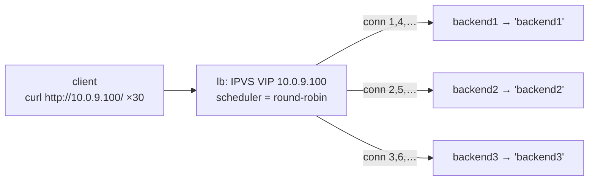

この記事は、ネットワークプロトコルを手を動かして学ぶフリー教材シリーズ **Protocol Lab** の一部です。教材本体・他のLab・実行スクリプトはすべてGitHubで公開しています。

https://github.com/pathvector-studio/protocol-lab

今回は Lab #33「L4 Load Balancing — One VIP, a Pool of Servers」を扱います。想定時間は40〜55分です。

:::message
この Lab のアドレスはすべてローカル閉域用（RFC 5737 / RFC 1918 相当）です。実際のインターネットには一切広告しません。
:::

## ゴール

サーバへ負荷を分散する方法は、これで3つ目になります。

- Anycast（Lab 31）は **routing** が1つのインスタンスを選びました。
- ECMP（Lab 32）は **routing** が flow をリンクに hash して散らしました。
- そして今回、**ロードバランサ** が能動的に **接続** をプールへ分配します。

1つの VIP（`10.0.9.100`）が3台の backend を代表します。Linux **IPVS** の director が各接続を **round-robin** でスケジュールし、実 backend へ NAT で転送します（戻りパケットの送信元も VIP に書き戻す）。だからクライアントは常に VIP としか話しません。

`http://10.0.9.100/` に30回接続すると、

- IPVS は接続を backend1, backend2, backend3, backend1, … と順に送り、
- 応答は3台を一巡して **10 / 10 / 10** に均等分配され、
- クライアントは backend のアドレスを一切見ません。

この Lab を終えたとき、次の表を自分の言葉で説明できるようになっているはずです。

| アプローチ | 分配を決めるもの | 単位 | 状態 |
|---|---|---|---|
| anycast (31) | routing の best-path | client → 1インスタンス | ステートレス |
| ECMP (32) | routing の multipath + hash | flow → 1リンク | ステートレス |
| **LB (33)** | **director の scheduler** | **接続 → 1 backend** | **ステートフル** |

## 学べること

- **VIP + 実サーバプール** とは何か。クライアントにはなぜ VIP しか見えないのか。
- **L4** ロードバランサが（HTTPリクエストではなく）**接続** を **scheduler**（ここでは round-robin）で分配する仕組み。
- **IPVS NAT モード** の動作と、backend が director を default route にしなければならない理由。
- director が **ステートフル**（接続テーブルを持つ）である理由。戻りパケットを VIP に書き戻すために状態が要ること。
- L4 LB が anycast（31）・ECMP（32）、そして L7 reverse proxy とどう違うか。

この Lab で扱わないこと:

- L7（HTTP-aware）ロードバランシング — URL / Cookie / Host による振り分け。
- ヘルスチェックや死んだ backend のフェイルオーバー（keepalived）。
- DR / TUN 転送モード、persistence（セッションアフィニティ）の詳細。

## RFC・資料で読む場所

| 資料 | 読むポイント |
|---|---|
| IPVS HOWTO | director / real server、scheduler、NAT/DR/TUN |
| RFC 2663 | IPVS NAT モードが行う NAT の用語 |
| RFC 7424 | flow 単位の分散（ECMP と共通） |
| RFC 5737 / RFC 1918 | Lab のアドレスがローカル用であること |

## 実験の全体像

構成は client — lb（VIP + IPVS）— sw（bridge）— backend1/2/3 です。

```text
 client            lb (director)              backend1 (10.0.10.11)
 10.0.9.2 --- eth1 --+ VIP 10.0.9.100    +--- backend2 (10.0.10.12)
                     + eth2 10.0.10.1 -- sw --+ backend3 (10.0.10.13)
                       IPVS rr (NAT)          (default gw = lb)
```

client は VIP に接続します。IPVS が接続ごとに backend を round-robin で選んで NAT で転送し、backend からの戻りは default gw（lb）を経由して送信元が VIP に書き戻されます。



`10.0.9.0/24`（client 側）と `10.0.10.0/24`（backend 側）はいずれもローカル閉域です。

## 必要なもの

推奨環境:

- Linux / WSL2 / Linux VM（IPVS カーネルモジュール `ip_vs` が使えること）
- Docker
- containerlab

使用イメージ:

- `nicolaka/netshoot:latest`（`ipvsadm`、`curl`、`python3` 同梱）

追加イメージは不要です。

:::message
`ipvsadm` を実行するとホストの `ip_vs` カーネルモジュールが自動ロードされます。コンテナ内で完結する話ではないので、macOS の Docker Desktop などではなく、IPVS が使える Linux カーネル上で実行してください。
:::

## 実行手順

まとめて実行したい場合は、次の1行で deploy → verify → destroy まで走ります。

```bash
./scripts/labctl.sh run lb-33
```

以下は手動で1ステップずつ確認する手順です。

### 1. 作業ディレクトリへ移動する

```bash
cd protocol-lab/examples/lb-33
```

### 2. 起動して backend の responder を立てる

```bash
sudo containerlab deploy -t lb-33.clab.yml
docker exec -d clab-lb-33-backend1 python3 /responder.py backend1
docker exec -d clab-lb-33-backend2 python3 /responder.py backend2
docker exec -d clab-lb-33-backend3 python3 /responder.py backend3
```

各 backend は `0.0.0.0:80` で待ち受け、自分の名前を返すだけの HTTP サーバです。

### 3. IPVS を設定する（VIP・round-robin・NAT）

```bash
docker exec clab-lb-33-lb ipvsadm -A -t 10.0.9.100:80 -s rr
docker exec clab-lb-33-lb ipvsadm -a -t 10.0.9.100:80 -r 10.0.10.11:80 -m
docker exec clab-lb-33-lb ipvsadm -a -t 10.0.9.100:80 -r 10.0.10.12:80 -m
docker exec clab-lb-33-lb ipvsadm -a -t 10.0.9.100:80 -r 10.0.10.13:80 -m
docker exec clab-lb-33-lb ipvsadm -L -n
```

`-s rr` は round-robin scheduler、`-m` は masq（NAT）転送を指定しています。

### 4. VIP に繰り返しアクセスする

```bash
docker exec clab-lb-33-client sh -c 'for i in $(seq 1 6); do curl -s http://10.0.9.100/; done'
```

応答が backend1 → backend2 → backend3 → … と一巡します。クライアントが指定する宛先は VIP のまま変わりません。

### 5. 分配を数える

```bash
docker exec clab-lb-33-client sh -c 'for i in $(seq 1 30); do curl -s http://10.0.9.100/; done' | sort | uniq -c
```

3台にほぼ均等（10 / 10 / 10）に分配されます。

## 期待する結果

- `ipvsadm -L -n` の出力で、VIP `10.0.9.100:80 rr` の下に3つの real server が Masq で並ぶ。
- 応答の並びが backend1 / 2 / 3 を round-robin で一巡する。
- 30リクエストの分配が 10 / 10 / 10（rr なので均等）。
- クライアントが見る宛先は常に VIP であり、backend のアドレスは見えない。

## なぜそう動くのか

**L4 ロードバランサ**の正体は、「1つの VIP、実サーバのプール、そして各接続を1台へ割り当てる director」です。

**VIP と pool**
クライアントは VIP（`10.0.9.100`）に接続します。director はその接続を real server（`10.0.10.11` など）へ転送します。裏側のサーバはクライアントからは見えません。だからプールの増減をクライアント無変更でできます。

**scheduler**
どの backend を選ぶかの方針です。ここでは **round-robin**（順番に一巡）を使いました。ほかに least-connection、weighted、source-hashing などがあります。**L4** なので HTTP の中身（URL や Cookie）は見ません。見るのは 5-tuple だけです。中身を見て振り分けるのは L7 LB であり、別物です。

**NAT モード**
director は接続の宛先を backend に書き換え（DNAT）、戻りパケットの送信元を VIP に書き戻します。したがって backend からの戻りパケットが必ず director を通る必要があり、そのために backend の default gw を director にしてあります。

**ステートフル**
director は **接続テーブル** を持ちます。同じ接続の全パケットを同じ backend へ、戻りは VIP へと対応づけるためです。ここが anycast / ECMP（ステートレスに routing や hash で散らす）との決定的な違いです。LB は往復の整合性のために状態を持ちます。

**三部作の締めくくり**
anycast（31）は routing が1インスタンスを選び、ECMP（32）は routing が flow をリンクに散らし、LB（33）は director が接続をプールへ **能動的に** 分配します。

要点は、**1つの仮想アドレスの裏で、director が接続ごとに backend を選び、NAT で往復を仲介している** ことです。

## 詰まりやすい点

- **L4 が HTTP を見ていると思う。** 見ません。URL や Cookie で振り分けるのは L7 LB です。L4 は接続を転送するだけです。
- **VIP が backend にあると思う。** NAT モードでは VIP は director 上にあります。backend は自分の実 IP を持ちます。
- **戻り経路を忘れる。** NAT モードでは backend の default gw を director にしないと、戻りパケットが VIP に書き戻されず接続が成立しません。
- **ヘルスチェックが自動だと思う。** 素の IPVS は死んだ backend にも接続を回し続けます。健全性の判断は keepalived などが担います（この Lab の範囲外）。
- **粘着性を仮定する。** round-robin は接続ごとに散ります。同一クライアントを同じ backend に固定したいなら source-hashing や persistence を使います。
- **`ip_vs` モジュールがない。** ホスト側に IPVS カーネルモジュールが必要です（`ipvsadm` 実行時に自動ロードされます）。

## 後片付け

```bash
sudo containerlab destroy -t lb-33.clab.yml --cleanup
```

`labctl.sh run lb-33` を使った場合は、スクリプトが最後に destroy まで行います。

## 確認問題

1. L4 ロードバランサの VIP と real server pool とは何か。クライアントには何が見えるか。
2. L4 LB は接続をどう選んで振り分けるか。HTTP の中身は見るか。
3. IPVS NAT モードで、backend の default gw を director にする必要があるのはなぜか。
4. director が「ステートフル」とはどういう意味か。なぜ状態が要るのか。
5. anycast（31）・ECMP（32）・LB（33）を、「分配を決めるもの」と「状態の有無」で対比せよ。
6. L4 LB と L7 reverse proxy の違いは何か。

## 検証済み実行ログ（2026-07-07）

この Lab は実機で再現性を確認済みです。

実行環境:

- Ubuntu 26.04 LTS (kernel 7.0.0-27-generic, x86_64)
- Docker 29.1.3
- containerlab 0.77.0
- client / lb / backend1-3 / sw: `nicolaka/netshoot:latest`（ipvsadm、curl、python3）

`PATH="/tmp/pl-shim:$PATH" ./scripts/labctl.sh run lb-33` で deploy → verify → destroy を実行し、`verification.json` は `"status": "verified"` を返しました。

### IPVS の設定（VIP・round-robin・NAT）

```text
TCP  10.0.9.100:80 rr
  -> 10.0.10.11:80                Masq    1      0          0
  -> 10.0.10.12:80                Masq    1      0          0
  -> 10.0.10.13:80                Masq    1      0          0
```

VIP `10.0.9.100:80` に round-robin scheduler が設定され、3つの real server が masq（NAT）で登録されています。

### 30リクエストが3 backend に均等分配

client が `http://10.0.9.100/`（同一 VIP）に30回接続した結果です。

```text
最初の6回の並び: backend2 backend1 backend3 backend2 backend1 backend3
30回の分配:
     10 backend1
     10 backend2
     10 backend3
```

接続ごとに backend が round-robin で一巡し、30リクエストが **10 / 10 / 10** ときれいに均等分配されました。クライアントが指定した宛先は終始 VIP `10.0.9.100` のみで、backend のアドレスは一切見えていません。director が接続を NAT で仲介しているからです。

:::message
`ipvsadm -L -n --stats` のパケット / バイトカウンタは、この環境（nsenter 経由）では 0 と表示されることがあります。実際の分配はクライアント側の応答分布 10 / 10 / 10 で確認できます。
:::

### Cleanup

```bash
containerlab destroy -t lb-33.clab.yml --cleanup
```

## 参考資料

- [Linux Virtual Server (IPVS) documentation](http://www.linuxvirtualserver.org/Documents.html)
- [RFC 2663: IP Network Address Translator (NAT) Terminology and Considerations](https://www.rfc-editor.org/rfc/rfc2663)
- [RFC 7424: Mechanisms for Optimizing LAG/ECMP Component Link Utilization](https://www.rfc-editor.org/rfc/rfc7424)
- [RFC 5737: IPv4 Address Blocks Reserved for Documentation](https://www.rfc-editor.org/rfc/rfc5737)
- 読み物ガイド: [rfc-notes/l4-load-balancing.md](https://github.com/pathvector-studio/protocol-lab/blob/main/rfc-notes/l4-load-balancing.md)
- 前提となる Lab: [Lab 20: NAT — Source Address Translation](https://github.com/pathvector-studio/protocol-lab/blob/main/examples/nat-20-source-nat.md)

---

## おわりに

Protocol Lab は、ネットワークプロトコルを実際に動かして学ぶフリー教材シリーズです。全Labの一覧はこちらから見られます。

https://github.com/pathvector-studio/protocol-lab

役に立ったら GitHub で ⭐ をいただけると、続きを書く励みになります。

Anycast（31）→ ECMP（32）→ L4 LB（33）の「負荷分散三部作」はこれで完結です。次回は L4 の先——中身を見て振り分ける L7 の世界を扱う予定です。
