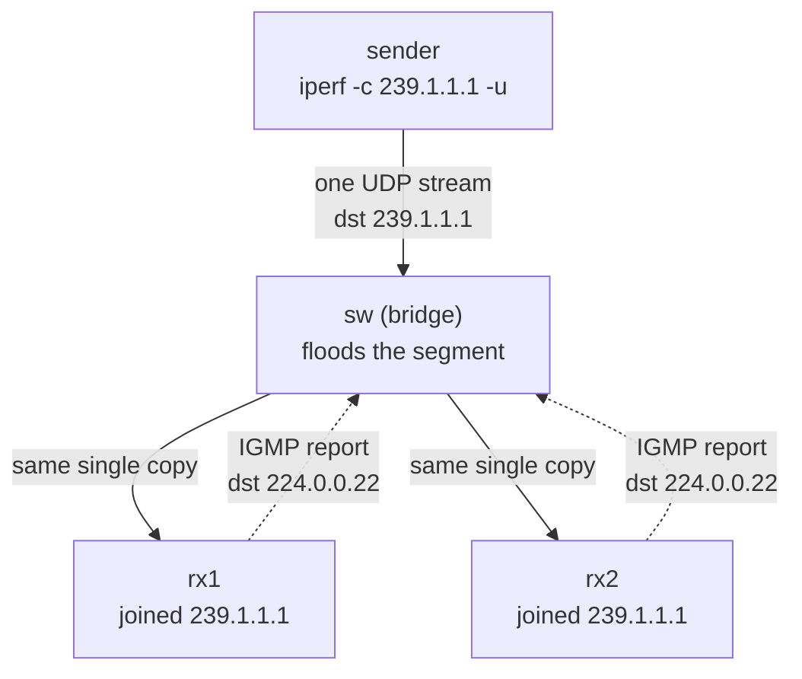

この記事は、ネットワークプロトコルを手を動かして学ぶフリー教材シリーズ **Protocol Lab** の一部です。全Labのソース（トポロジ定義・スクリプト・RFCノート）はGitHubで公開しています。

https://github.com/pathvector-studio/protocol-lab

今回は Lab #29「Multicast and IGMP — One Sender, Many Receivers」を記事として再構成したものです。想定時間は40〜55分。

- 読みものガイド: [rfc-notes/multicast-igmp.md](https://github.com/pathvector-studio/protocol-lab/blob/main/rfc-notes/multicast-igmp.md)
- 前提となるLab: [Lab 24: ARP — IPv4 Neighbor Resolution](https://github.com/pathvector-studio/protocol-lab/blob/main/labs/arp-24-neighbor-resolution.md)

## ゴール

これまでのLabは、1つのhostから1つのhostへパケットを動かすもの（unicast）でした。この Lab で扱うのは **IP multicast** です。1つの sender が **group**（`239.1.1.1`）宛に *1本の* UDP stream をワイヤに置くと、その group に **IGMP** で **join** した **両方**の receiver がそれを受け取ります。sender は receiver ごとのコピーを送りません。

このLabで確認するのは次の4点です。

- 2台の receiver が group `239.1.1.1` に join し（`iperf -s -u -B 239.1.1.1`）、それぞれ **IGMP membership report** を出す
- sender は `239.1.1.1` 宛に UDP stream を1本だけ送る（`iperf -c 239.1.1.1 -u`）
- receiver 双方が `0/513 (0%)` を報告する — 1回の送信で、それぞれが stream 全体を受け取っている
- capture に **IGMP report** と multicast 宛先MAC **`01:00:5e:01:01:01`** が見える

最終的に、この表を自分の言葉で説明できるようになるのがゴールです。

| | 宛先 | 誰が受け取るか | セグメント上のコピー数 |
|---|---|---|---|
| unicast | 1つのhost | そのhost | receiverごとに1つ（N人ならN回送信） |
| multicast | group | joinしたhost | **1つ**（joinした全員で共有） |

## 学べること

- **IP multicast group**（class D, `224.0.0.0/4`）とは何か。`239.0.0.0/8` は link-local な制御用グループとどう違うのか
- host が group に **join** する仕組みと、それを **IGMP**（membership report）がどうやって網に伝えるか
- IPv4 multicast アドレスが **`01:00:5e`** で始まる Ethernet MAC にどう写るか
- なぜ1回の送信が、共有セグメント上の **1コピー**だけで多数の receiver に届くのか
- **IGMP snooping** が何をするのか（そしてこの Lab がなぜ off にして flood させるのか）

一方、このLabで扱わないもの:

- セグメント間の multicast **routing**（PIM, mroute）— ここは単一のL2セグメントです
- Source-specific multicast（SSM）フィルタリングの詳細
- IPv6 multicast / MLD（NDPのLabで触れます）

## RFCで読む場所

| 資料 | 読むポイント |
|---|---|
| RFC 1112 | multicast の host model、class D address、IP→MAC の対応 |
| RFC 2236 | IGMPv2 の membership report / query |
| RFC 3376 | IGMPv3（Linuxが既定で送る） |
| RFC 2365 | `239.0.0.0/8`（administratively scoped）の位置づけ |
| RFC 5737 | Labで使う `10.0.0.0/24` がローカル閉域であること（補足） |

## 実験の全体像

sender・rx1・rx2 の3台と、それらを1本のセグメントに束ねる Linux bridge の sw という構成です。

```text
        sender (10.0.0.1)
             |
          [ sw ]  (Linux bridge: 1つの共有セグメント, snooping off = flood)
          /     \
 rx1 (10.0.0.2)   rx2 (10.0.0.3)
   join 239.1.1.1   join 239.1.1.1
```

sender は `239.1.1.1` 宛に UDP を1本送るだけ。sw はそれをセグメントの全ポートへ流し、group に join した rx1/rx2 が受け取ります。



:::message
`10.0.0.0/24` はローカル閉域、`239.1.1.1` は administratively-scoped の multicast group です。実際のインターネットには一切出ていきません。
:::

### なぜ multicast を eth1 に固定するのか

コンテナには管理用の `eth0`（containerlab の管理bridge）と、ラボ用の `eth1`（swへの線）があります。Linux の既定 multicast route は `eth0` を選びがちで、そのままだと group が管理網を通ってしまい、観察したい sw を通りません。

そこで各ノードで次のルートを入れ、multicast を必ず sw 側（`eth1`）へ出します。

```bash
ip route add 239.0.0.0/8 dev eth1
```

これはトポロジ定義（`mcast-29.clab.yml`）で設定済みなので、手で叩く必要はありません。ただし「なぜ必要か」は後述の「ハマった点」と直結するので、頭に入れておいてください。

## 必要なもの

推奨環境:

- Linux / WSL2 / Linux VM
- Docker
- containerlab

使用イメージ:

- `nicolaka/netshoot:latest`（`iperf`、`tcpdump`、`ip` 同梱）

追加イメージは不要です。

## 実行手順

まとめて実行するだけなら、次の1行で deploy → verify → destroy まで走ります。

```bash
./scripts/labctl.sh run mcast-29
```

以下は、1ステップずつ自分の目で確認したい場合の手順です。

### 1. 作業ディレクトリへ移動する

```bash
cd protocol-lab/examples/mcast-29
```

### 2. 起動する

```bash
sudo containerlab deploy -t mcast-29.clab.yml
```

sw は3つのポートを1つのbridge（`br0`）に束ね、`mcast_snooping 0`（flood）にしてあります。sender/rx1/rx2 は `239.0.0.0/8` を `eth1` へ向けるルートを持っています。

### 3. 受信側で group に join する（IGMP membership）

```bash
docker exec -d clab-mcast-29-rx1 sh -c "iperf -s -u -B 239.1.1.1 -i1 >/tmp/rx1.log 2>&1"
docker exec -d clab-mcast-29-rx2 sh -c "iperf -s -u -B 239.1.1.1 -i1 >/tmp/rx2.log 2>&1"
docker exec clab-mcast-29-rx1 ip maddr show eth1   # 239.1.1.1 が見える
```

`iperf -s -u -B 239.1.1.1` は group にバインドして join します。このとき、カーネルが IGMP membership report を送ります。

### 4. 受信側で IGMP と multicast を capture する

```bash
docker exec -d clab-mcast-29-rx1 tcpdump -i eth1 -n -e -w /tmp/mc.pcap "igmp or (udp and dst 239.1.1.1)"
```

### 5. 送信側から group へ1本だけ送る

```bash
docker exec clab-mcast-29-sender iperf -c 239.1.1.1 -u -T 5 -t 3 -b 2m
```

`-T 5` は multicast TTL です。sender は `239.1.1.1` 宛に **1本**送るだけである点に注目してください。

### 6. 結果を見る

```bash
docker exec clab-mcast-29-rx1 sh -c 'grep Bytes /tmp/rx1.log | tail -1'   # 0/513 (0%)
docker exec clab-mcast-29-rx2 sh -c 'grep Bytes /tmp/rx2.log | tail -1'   # 0/513 (0%)
docker exec clab-mcast-29-rx1 pkill -INT tcpdump
docker exec clab-mcast-29-rx1 tcpdump -n -e -r /tmp/mc.pcap | grep -E "igmp|01:00:5e"
```

両 receiver が同じ1本の stream を受け取り、capture に IGMP report と multicast MAC が見えるはずです。

## 期待される出力

- `ip maddr show eth1` に `239.1.1.1`（両 receiver が join）
- rx1/rx2 の iperf ログが両方とも `0/513 (0%)`（1本の stream を両者が完全受信）
- capture に `10.0.0.x > 224.0.0.22: igmp v3 report`（membership）
- capture に `01:00:5e:01:01:01`（`239.1.1.1` の multicast データMAC）

## なぜそう動くのか

**unicast** は「1つの host へ」送るものです。N人に配るなら、sender は N 回送ります。対して **multicast** は「1つの *group* へ」——sender は group 宛に **1回**送り、その group に **join** した host すべてが受け取ります。sender は receiver の数も身元も知りません。

### group アドレス（class D）

`224.0.0.0/4` が multicast 用のアドレス空間です。これは host ではなく group を表します。`239.0.0.0/8` は組織内ローカル（administratively scoped）で、外に漏らさない前提の範囲です。

### join と IGMP

host が group を欲しくなると、**IGMP membership report**（宛先 `224.0.0.22`、IGMPv3）を送ります。これで router/switch に「この group が要る」と伝わります。

:::message
IGMP は *signalling* のプロトコルであって、データそのものは運びません。データは UDP などで別に流れます。
:::

### IP → MAC

IPv4 multicast アドレスは `01:00:5e` で始まる MAC に写ります（IP の下位23bitを MAC 下位にコピー）。だから `239.1.1.1` は `01:00:5e:01:01:01` になります。receiver の NIC は、この MAC のフレームを拾うよう設定されます。

### 1コピーで届く

共有セグメントでは、sender が出した1フレームがそのまま両 receiver に届きます。broadcast と同様に「セグメントに1コピー」ですが、multicast が関係するのは *join した集合* だけ、という点が違います。

### switch の挙動

素の L2 bridge は multicast を全ポートへ **flood** します。**IGMP snooping** を有効にすると、bridge が report を覗いて、その group を聞いているポートにだけ送るようになります。この Lab では snooping を off にして、membership signalling と flood 配送を素直に観察しています。

要点は、**1回の送信が、receiver ごとのコピー無しに、join した全員へ届く**こと。IGMP はその「join」を網に伝える仕組みです。

## 詰まりやすい点

- **multicast を「unicast を N 回」と混同する**。実際はセグメントに1コピーで、sender は1回だけ送ります。
- **IGMP がデータを運ぶと思う**。IGMP は join の signalling です。データは UDP 等で別に流れます。
- **管理interfaceに漏れる**。既定の multicast route は `eth0`（管理網）を選びがちです。`ip route add 239.0.0.0/8 dev eth1` で sw 側に固定します（このトポロジは設定済み）。これを外すと、iperf は受信できているのに `eth1` の capture が空、という状態になります。
- **switch が賢く配ると思い込む**。snooping 無しの L2 は flood です。賢い転送には IGMP snooping が要ります。
- **TTL**。`-T` を小さくしても L2 の1ホップなら届きますが、`224.0.0.0/24`（link-local control）は TTL 1 で外に出ません。
- **group アドレスを host と思う**。class D が指すのは group です。ping しても応答は返りません。

## 後片付け

```bash
sudo containerlab destroy -t mcast-29.clab.yml --cleanup
```

`labctl.sh run mcast-29` を使った場合は、スクリプトが最後に destroy します。

## 確認問題

1. unicast と multicast の違いは何か。N人の receiver に配るとき、sender は何回送るか。
2. multicast group アドレス（class D）とは何か。`239.0.0.0/8` はどんな範囲か。
3. host はどうやって group に join するか。IGMP は何を運び、何を運ばないか。
4. `239.1.1.1` はどんな Ethernet MAC に写るか。なぜそうなるか。
5. IGMP snooping の有無で、L2 switch の multicast 転送はどう変わるか。
6. このLabで multicast を `eth1` に固定するルートを入れる理由は何か。

## 検証済み実行ログ（2026-07-07）

このLabは実機で再現性を確認済みです。

実行環境:

- Ubuntu 26.04 LTS (kernel 7.0.0-27-generic, x86_64)
- Docker 29.1.3
- containerlab 0.77.0
- sender / rx1 / rx2 / sw: `nicolaka/netshoot:latest`（iperf、tcpdump、ip 同梱）

`PATH="/tmp/pl-shim:$PATH" ./scripts/labctl.sh run mcast-29` で deploy → verify → destroy を実行し、`verification.json` は `"status": "verified"` を返しました。

### 1本の送信が両 receiver へ届く

sender は `239.1.1.1` 宛に UDP を1本送信（514 datagrams）。rx1・rx2 は IGMP で join 済みで、**両方**が同じ stream を完全受信しました。

```text
rx1: [  1] 0.00-3.01 sec   736 KBytes  2.00 Mbits/sec   0.002 ms 0/513 (0%)
rx2: [  1] 0.00-3.01 sec   736 KBytes  2.00 Mbits/sec   0.002 ms 0/513 (0%)
sender: [  1] Sent 514 datagrams
```

receiver ごとにコピーを送ってはいません。sender の送信は1本で、両者が `0/513 (0%)`（損失なし）で受け取っています。

### capture: IGMP membership と multicast MAC

rx1 の `eth1` で `"igmp or (udp and dst 239.1.1.1)"` を capture（合計523パケット）。

```text
12:25:57.041374 aa:c1:ab:40:2d:42 > 01:00:5e:00:00:16, IPv4, length 54: 10.0.0.2 > 224.0.0.22: igmp v3 report, 1 group record(s)
12:25:57.061375 aa:c1:ab:60:17:a6 > 01:00:5e:00:00:16, IPv4, length 54: 10.0.0.3 > 224.0.0.22: igmp v3 report, 1 group record(s)
12:25:59.117790 aa:c1:ab:35:ff:36 > 01:00:5e:01:01:01, IPv4, length 1512: 10.0.0.1.34590 > 239.1.1.1.5001: UDP, length 1470
```

- rx1（`10.0.0.2`）・rx2（`10.0.0.3`）がそれぞれ **IGMPv3 membership report** を `224.0.0.22`（MAC `01:00:5e:00:00:16`）へ送っています。group への join の signalling です。
- sender（`10.0.0.1`）の multicast データは、宛先MAC **`01:00:5e:01:01:01`**（= `239.1.1.1` の写像）で流れています。IP の下位23bit が MAC 下位に写っているのが確認できます。
- `ip maddr show eth1` は両 receiver で `239.1.1.1` を示しました（group membership）。

### ハマった点（記録）

初回は verify が失敗しました。receiver の iperf は multicast を **受信できている**のに、`eth1` の tcpdump が **0パケット**だったのです。

原因は、Linux の既定 multicast route が管理用 `eth0`（containerlab 管理bridge）を選び、group が観察対象の sw を通らず管理網経由で届いていたこと。sender/rx1/rx2 に `ip route add 239.0.0.0/8 dev eth1` を入れて multicast を sw 側（`eth1`）に固定したところ、capture に IGMP report と `01:00:5e` の multicast フレームが現れ、verify が green になりました。このルートはトポロジ（`mcast-29.clab.yml`）に組み込み済みです。

## References

- [RFC 1112: Host Extensions for IP Multicasting](https://www.rfc-editor.org/rfc/rfc1112)
- [RFC 2236: Internet Group Management Protocol, Version 2](https://www.rfc-editor.org/rfc/rfc2236)
- [RFC 3376: Internet Group Management Protocol, Version 3](https://www.rfc-editor.org/rfc/rfc3376)
- [RFC 2365: Administratively Scoped IP Multicast](https://www.rfc-editor.org/rfc/rfc2365)
- [RFC 5737: IPv4 Address Blocks Reserved for Documentation](https://www.rfc-editor.org/rfc/rfc5737)

---

## Protocol Lab について

Protocol Lab は、BGP・TCP・TLS・DNS などのネットワークプロトコルを、containerlab で実際に動かしながら学ぶフリー教材シリーズです。全Labの一覧・トポロジ定義・検証スクリプトはこちらにあります。

https://github.com/pathvector-studio/protocol-lab

役に立ったら、リポジトリに ⭐️ をいただけると励みになります。

次回は、単一セグメントを越えた multicast — セグメント間で group をどう届けるか（multicast routing）を扱う予定です。
