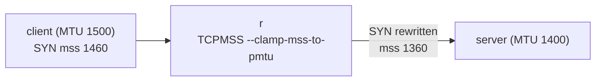

この記事は、ネットワークプロトコルを「動かして理解する」フリー教材シリーズ **Protocol Lab** の一部です。教材本体・他のLab・検証用の構成ファイルはすべて以下のリポジトリで公開しています。

https://github.com/pathvector-studio/protocol-lab

想定時間は 35〜50分です。

- 参考ノート: [`rfc-notes/mss-clamping.md`](https://github.com/pathvector-studio/protocol-lab/blob/main/rfc-notes/mss-clamping.md)
- 前提Lab: [Lab 25: MTU and Path MTU Discovery](https://github.com/pathvector-studio/protocol-lab/blob/main/examples/mtu-25-path-mtu-discovery.md)

## ゴール

Lab 25 では、PMTUD が ICMP を頼りに path 上の細いリンクを見つける様子と、その ICMP がフィルタされると通信が blackhole する様子を観察しました。この Lab で扱うのは、その運用的な対処である **MSS clamping** です。

path 上のルータが、通過する TCP SYN の **MSS** を書き換えます。これによって両端は接続の最初の時点で「最も細いリンクに収まる segment サイズ」に合意します。PMTUD が正しく動くことに頼らずに済む、というのがポイントです。

このLabでは、client 側のリンクは MTU 1500、r–server 間のリンクだけ MTU **1400** という構成を作ります。

- **clamping 無し**: client の SYN は **MSS 1460**（ローカル MTU 1500 − 40）を広告する。フルサイズの segment は 1400 のリンクには大きすぎるので、PMTUD が効くかどうかに運命を委ねることになる。
- **clamping 有り**: r が SYN の MSS を **1360**（1400 − 40）に書き換える。両端は常に収まるサイズの segment しか送らない。

最終的に、この表を自分の言葉で説明できるようになるのがゴールです。

| | server が見る SYN の MSS | 理由 |
|---|---|---|
| clamping 無し | 1460 | client のローカル MTU 1500 − 40 |
| clamping 有り | 1360 | r が MTU 1400 のリンクに合わせて clamp（− 40） |

## 学べること

- TCP の **MSS** option とは何か、endpoint がローカル MTU からどう導出するか
- SYN の MSS が、path の奥にある細いリンクに対して **盲目** である理由
- ICMP がフィルタされたとき **PMTUD** が **blackhole** すること（Lab 25 の復習）
- ルータ上の **MSS clamping** が SYN の MSS をどう書き換えて path に合わせるか
- 実効 MTU を下げるトンネル（WireGuard / VXLAN / GRE）でなぜこれが重要になるか

一方、このLabでは次は扱いません。

- PMTUD の内部動作の詳細（Lab 25 で扱っています）
- IPv6 における MSS の詳細（MSS = MTU − 60、最小値も異なる）
- 経路単位の MTU 固定や PLPMTUD（RFC 8899）

## RFCで読む場所

| 資料 | 読むポイント |
|---|---|
| RFC 9293 §3.7.1 | MSS option と segment サイズの決定 |
| RFC 1191 | PMTUD（clamping が補う仕組み） |
| RFC 2923 | PMTUD の blackhole 問題 |
| RFC 5737 / RFC 1918 | Lab のアドレスがローカル用であること |

## 実験の全体像

client と server の間にルータ r を置きます。r–server リンクだけ MTU 1400 です。

```text
 client ---- eth1/eth1 ---- r ---- eth2/eth1 ---- server
 MTU 1500                       MTU 1400 (narrow)   MTU 1400
   SYN: mss 1460  --->  r clamps --->  mss 1360 at server
```

r の FORWARD チェイン（mangle テーブル）で、SYN の MSS を PMTU に clamp します。



:::message
アドレスには `10.0.0.0/8`（RFC 1918）を使います。ローカル閉域で完結するので、実際のインターネットには一切影響しません。
:::

## 必要なもの

推奨環境:

- Linux / WSL2 / Linux VM
- Docker
- containerlab

使用イメージ:

- `nicolaka/netshoot:latest`（`iptables`、`tcpdump`、`curl`、`python3` 同梱）

追加イメージは不要です。

## 実行手順

一括で実行したい場合は、リポジトリ同梱のスクリプトが deploy → verify → destroy まで面倒を見てくれます。

```bash
./scripts/labctl.sh run mss-37
```

以下は手動で1ステップずつ追う手順です。

### 1. 作業ディレクトリへ移動する

```bash
cd protocol-lab/examples/mss-37
```

### 2. 起動して HTTP サーバを立てる

```bash
sudo containerlab deploy -t mss-37.clab.yml
docker exec -d clab-mss-37-server python3 -m http.server 80
docker exec clab-mss-37-r ip -br link show eth2   # mtu 1400
```

r の eth2 が `mtu 1400` になっていることを確認しておきます。これが「path の中で一番細いリンク」です。

### 3. clamping 無しで SYN の MSS を見る

server 側で SYN だけを1パケット capture し、client から HTTP リクエストを投げます。

```bash
docker exec -d clab-mss-37-server sh -c 'tcpdump -i eth1 -n -c1 "tcp[tcpflags] & tcp-syn != 0 and tcp[tcpflags] & tcp-ack == 0" > /tmp/syn.txt 2>&1'
docker exec clab-mss-37-client curl -s --max-time 4 http://10.0.8.2/ >/dev/null
docker exec clab-mss-37-server grep -oE 'mss [0-9]+' /tmp/syn.txt
```

`mss 1460` が出ます。client のローカル MTU 1500 − 40 です。1400 のリンクの存在は、この値にまったく反映されていません。

### 4. r で MSS clamping を有効化する

```bash
docker exec clab-mss-37-r iptables -t mangle -A FORWARD -p tcp --tcp-flags SYN,RST SYN -j TCPMSS --clamp-mss-to-pmtu
```

`--tcp-flags SYN,RST SYN` で「SYN が立っていて RST が立っていないパケット」だけを対象にしています。MSS は SYN でしか交渉されないので、これで十分です。

### 5. もう一度 SYN の MSS を見る

```bash
docker exec -d clab-mss-37-server sh -c 'tcpdump -i eth1 -n -c1 "tcp[tcpflags] & tcp-syn != 0 and tcp[tcpflags] & tcp-ack == 0" > /tmp/syn2.txt 2>&1'
docker exec clab-mss-37-client curl -s --max-time 4 http://10.0.8.2/ >/dev/null
docker exec clab-mss-37-server grep -oE 'mss [0-9]+' /tmp/syn2.txt
```

今度は `mss 1360`。r が 1400 − 40 に clamp した結果です。

## 期待出力

- r の eth2 が `mtu 1400`
- clamping 無し: server が見る SYN は `mss 1460`
- clamping 有り: server が見る SYN は `mss 1360`
- mangle テーブルの FORWARD チェインに `TCPMSS clamp to PMTU` 規則が入っている

## なぜそう動くのか

**MSS clamping** の考え方は一言でいえば「安全な segment サイズを最初に両端へ伝えてしまい、PMTUD 頼みにしない」です。

### MSS とは

TCP が1 segment で受け取れる最大ペイロードサイズです。**SYN でのみ** 広告され、値は **ローカル MTU − 40**（IPv4。IP ヘッダ20 + TCP ヘッダ20）。MTU 1500 なら 1460 になります。送信側は相手が広告した MSS を上限として segment を切ります。

### 盲点

各 endpoint は自分のインターフェース MTU しか知りません。path の奥に細いリンク（ここでは r–server の 1400）があっても、SYN に載る MSS はそれを反映しません。これが構造的な盲点です。

### PMTUD と blackhole（Lab 25 の復習）

大きすぎる segment が DF ビット付きで細いリンクに到達すると、ルータは ICMP "fragmentation needed" を返し、送信側がそれを受けて segment を縮めます。

:::message alert
ICMP がフィルタされている環境では、送信側は縮めるべきだと気づけません。大きい segment が黙って捨てられ続け、接続はハングします。これが **blackhole** です。「TCP handshake は通るのに、大きいデータを送ると固まる」という厄介な症状の典型的な原因のひとつです。
:::

### clamping

path 上のルータが、通過する **SYN の MSS option** を、送出リンクの MTU − 40 に（それより大きければ）書き換えます。このLabでは r が 1460 → 1360 に下げています。両端はこれ以降 1360 以下の segment しか送らないので、1400 のリンクでも常に収まり、PMTUD が効かなくても blackhole しません。書き換えるのは SYN だけで十分です（MSS は SYN でしか交渉されないため）。

要点は、**endpoint からは見えない path 上の最小 MTU を、path 上のルータが SYN の MSS に反映させ、最初から収まるサイズで送らせる** ことです。トンネルによって実効 MTU が下がる実運用環境では、非常に頻繁に使われるテクニックです。

## 詰まりやすい点

- **MSS と MTU の混同**。MTU は IP パケット全体のサイズ、MSS は TCP ペイロードのサイズ。IPv4 では MSS = MTU − 40。
- **交渉は SYN でのみ**。データ送信のたびに再交渉されるわけではない。だから書き換える対象も SYN の MSS option だけでよい。
- **「PMTUD があるから十分」と思ってしまう**。ICMP フィルタで blackhole し得る。clamping はその保険。
- **「端末側で MTU を下げれば良い」と思ってしまう**。path の奥の細いリンクは端末からは見えない。書き換えるのは **path 上のルータ**。
- **UDP にも効くと思ってしまう**。MSS は TCP の概念。UDP には別の対処が必要。
- **clamp 値の決まり方**。`--clamp-mss-to-pmtu` は送出インターフェースの MTU 由来で決まる。固定値にしたいなら `--set-mss` を使う。

## 後片付け

```bash
sudo containerlab destroy -t mss-37.clab.yml --cleanup
```

`labctl.sh run mss-37` を使った場合は、スクリプトが最後に destroy まで実行します。

## 確認問題

1. TCP MSS とは何か。MTU とどう違うか（IPv4 での関係式は？）
2. MSS はいつ交渉されるか。SYN 以外でも変わるか。
3. SYN の MSS が path の奥の細いリンクを反映できないのはなぜか。
4. PMTUD が blackhole するのはどんなときか。
5. MSS clamping は何を、どこで書き換えるか。このLabで 1460 が 1360 になるのはなぜか。
6. トンネル（WireGuard / VXLAN / GRE）で clamping が重宝されるのはなぜか。

## 検証済み実行ログ（2026-07-07）

このLabは実機で再現性を確認済みです。

実行環境:

- Ubuntu 26.04 LTS (kernel 7.0.0-27-generic, x86_64)
- Docker 29.1.3
- containerlab 0.77.0
- client / r / server: `nicolaka/netshoot:latest`（iptables、tcpdump、curl、python3）

`PATH="/tmp/pl-shim:$PATH" ./scripts/labctl.sh run mss-37` で deploy → verify → destroy を実行し、`verification.json` は `"status": "verified"` を返しました。

### clamping 無し → SYN は MSS 1460

server の eth1 で client の SYN を capture:

```text
Flags [S], seq ..., options [mss 1460, ...]
```

client のリンク MTU 1500 に由来する **MSS 1460** です。r–server リンク（MTU 1400）には大きすぎるので、PMTUD 頼みになります。

### r で clamping → SYN は MSS 1360

```text
mangle FORWARD: TCPMSS  tcp  flags:0x06/0x02  TCPMSS clamp to PMTU
```

`iptables -t mangle -A FORWARD -p tcp --tcp-flags SYN,RST SYN -j TCPMSS --clamp-mss-to-pmtu` を入れた後、同じ client の SYN を server 側で capture:

```text
mss 1360
```

r が送出リンク（eth2, MTU 1400）に合わせ、SYN の MSS option を **1460 → 1360**（1400 − 40）に書き換えました。両端はこれ以降 1360 以下の segment を送るので、細いリンクでも常に収まり、ICMP がフィルタされていても blackhole しません。

| | server が見る SYN の MSS |
|---|---|
| clamping 無し | 1460 |
| clamping 有り | 1360 |

### Cleanup

```bash
containerlab destroy -t mss-37.clab.yml --cleanup
```

## References

- [RFC 9293: Transmission Control Protocol](https://www.rfc-editor.org/rfc/rfc9293)
- [RFC 1191: Path MTU Discovery](https://www.rfc-editor.org/rfc/rfc1191)
- [RFC 2923: TCP Problems with Path MTU Discovery](https://www.rfc-editor.org/rfc/rfc2923)
- [RFC 5737: IPv4 Address Blocks Reserved for Documentation](https://www.rfc-editor.org/rfc/rfc5737)

---

## Protocol Lab シリーズ

このLabを含む全シリーズは、以下のリポジトリで公開しています。ネットワークプロトコルを containerlab で実際に動かしながら学べる教材を、順次追加しています。

https://github.com/pathvector-studio/protocol-lab

役に立ったと感じたら、GitHub で ⭐ スターをいただけると励みになります。新しいLabの公開通知にもなります。

次回は、MTU / MSS まわりで残された話題 — UDP や QUIC のように MSS 交渉を持たないプロトコルが、どうやって path の細いリンクに対処しているか（PLPMTUD / RFC 8899）を扱う予定です。
