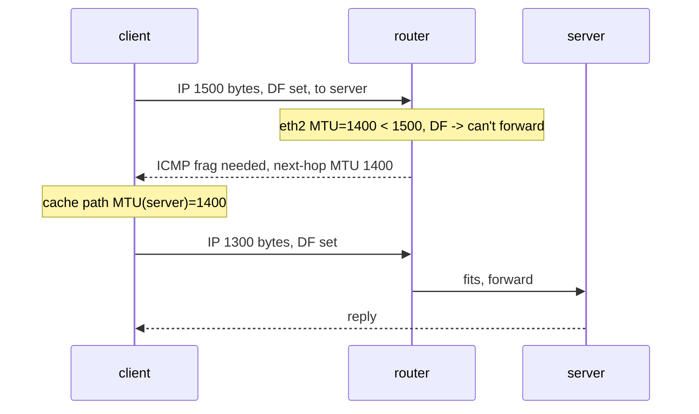

この記事は、ネットワークプロトコルを手を動かして学ぶフリー教材シリーズ **Protocol Lab** の一部です。教材本体・他のLab・スクリプトはすべてGitHubで公開しています。

https://github.com/pathvector-studio/protocol-lab

今回は **Lab #25: MTU and Path MTU Discovery**。想定時間は45〜60分です。

- 読み物ガイド: [rfc-notes/mtu-path-mtu-discovery.md](https://github.com/pathvector-studio/protocol-lab/blob/main/rfc-notes/mtu-path-mtu-discovery.md)
- 前提となるLab: [Lab 19: traceroute と TTL](https://github.com/pathvector-studio/protocol-lab/blob/main/labs/trace-19-traceroute-ttl.md) / [TCP Lab 08: 再送とウィンドウ](https://github.com/pathvector-studio/protocol-lab/blob/main/labs/tcp-08-retransmission-windowing-loss.md)

## ゴール

どのリンクにも、1フレームで運べる最大バイト数 = **MTU** があります。リンクのMTUより大きいパケットは、そこを通れません。

もしそのパケットに **DF（Don't Fragment）** ビットが立っていれば、転送できないルータはパケットを捨て、「自分が扱えるMTUはこれだ」という情報を載せた **ICMP fragmentation needed** を送信元に返します。送信側はそれを使って **Path MTU**（経路全体が許す最大パケットサイズ）を学習する。これが **Path MTU Discovery（PMTUD）** です。

このLabでは、途中に細いリンクを持つ経路を組んで、その一部始終を観察します。

- 構成は `client — router — server`。router→server のリンクだけMTUが **1400**
- client が **1500バイトのDFパケット** を server 宛に送る
- router は転送できず、**ICMP fragmentation-needed（mtu 1400）** を返す
- client は server 宛の path MTU 1400 を **cache** し、収まるサイズのパケットは通る

最終的に、次の表を自分の言葉で説明できるようになるのがゴールです。

| clientが送るもの | router（1400のリンク） | 結果 |
|---|---|---|
| 1500バイト, DF | 大きすぎる／分割は禁止 | ICMP frag-needed (mtu 1400) |
| — | — | client が path MTU = 1400 を cache |
| 1300バイト, DF | 収まる | 到達する |

## 学べること

- **MTU** とは何か。経路上の小さいMTUのリンクがなぜボトルネックになるのか
- **DF（Don't Fragment）** ビットの働きと、現代のIPがそれに依存している理由
- **ICMP fragmentation-needed**（type 3, code 4）が next-hop MTU をどう運ぶか
- 送信側が Path MTU を **発見して cache** する仕組み（`ip route get` で見える）
- ICMP frag-needed がブラックホール化（フィルタ）されたときに起きる、「小さいページは開くのに大きいページで固まる」という古典的バグ

このLabで扱わないこと:

- DFなしのIPv4 fragmentation、および再組み立ての詳細
- IPv6のPMTUD（ルータは分割しない。ICMPv6 Packet Too Big による同種の仕組み）
- TCP MSS clamping（よく使われる回避策）

## RFCで読む場所

| RFC | 章 | 読むポイント |
|---|---|---|
| RFC 1191 | 3-4 | Path MTU Discovery の仕組み（DF + ICMP frag-needed の MTU） |
| RFC 791 | 2.3, 3.2 | IP の fragmentation と DF フラグ |
| RFC 792 | Destination Unreachable | ICMP type 3 code 4（fragmentation needed） |
| RFC 5737 | 3 | Lab で使うアドレスが documentation 用であること |

## 実験の全体像

client、router、server の3ノード構成。router→server のリンクだけ MTU 1400 にします。

```text
client ---10.0.1.0/24 (MTU 1500)--- router ---10.0.2.0/24 (MTU 1400)--- server
10.0.1.1                        10.0.1.2   10.0.2.1                  10.0.2.2
```

client から大きいDFパケットを送ると、router が細いリンク（1400）で詰まり、ICMP frag-needed を返します。



:::message
`10.0.0.0/8` のサブネットはローカル閉域で完結します。実際のインターネットには何も出ていきません。
:::

## 必要なもの

推奨環境:

- Linux / WSL2 / Linux VM
- Docker
- containerlab

使用イメージ:

- `nicolaka/netshoot:latest`（`ping`（`-M do` 対応）、`ip`、`tcpdump` 同梱）

追加イメージは不要です。細いリンクのMTUは、topologyのexec（`ip link set eth2 mtu 1400`）で設定します。

## 実行手順

一括で流すなら、こうです。

```bash
./scripts/labctl.sh run mtu-25
```

以下、手動で1ステップずつ追う場合の手順です。

### 1. 作業ディレクトリへ移動する

```bash
cd protocol-lab/examples/mtu-25
```

### 2. 起動して経路を設定する

```bash
sudo containerlab deploy -t mtu-25.clab.yml
docker exec clab-mtu-25-router sysctl -w net.ipv4.ip_forward=1
docker exec clab-mtu-25-client ip route add 10.0.2.0/24 via 10.0.1.2
docker exec clab-mtu-25-server ip route add 10.0.1.0/24 via 10.0.2.1
docker exec clab-mtu-25-router ip -br link show   # eth2 の MTU が 1400
```

### 3. 大きいDFパケットを送る（拒否される）

```bash
docker exec clab-mtu-25-client ping -M do -s 1500 -c1 10.0.2.2
```

期待する出力:

```text
From 10.0.1.2 icmp_seq=1 Frag needed and DF set (mtu = 1400)
```

router（`10.0.1.2`）が「これ以上は1400までだ」と教えてくれています。`-M do` はDFを立てる指定です。

### 4. Path MTU が cache されたことを見る

```bash
docker exec clab-mtu-25-client ip route get 10.0.2.2
```

```text
10.0.2.2 via 10.0.1.2 dev eth1 src 10.0.1.1
    cache expires 597sec mtu 1400
```

client は「server への経路のMTUは1400」を学習し、cacheしました。

### 5. 収まるサイズは通る

```bash
docker exec clab-mtu-25-client ping -M do -s 1300 -c1 10.0.2.2
```

1300 + 28 = 1328 < 1400 なので通ります。

## 期待される結果まとめ

- `ping -s 1500 -M do`: `Frag needed and DF set (mtu = 1400)`
- capture: `ICMP ... unreachable - need to frag (mtu 1400)`（type 3 code 4）
- `ip route get 10.0.2.2`: `mtu 1400`（cacheされた path MTU）
- `ping -s 1300 -M do`: 成功

## なぜそう動くのか

MTU（Maximum Transmission Unit）は、あるリンクが1フレームで運べる最大バイト数です。Ethernetなら普通は1500。経路上にMTUの小さいリンクがあると、そこが「一番狭い門」になります。

**DF（Don't Fragment）** はIPヘッダのフラグで、「このパケットを分割するな」という指示です。昔は途中のルータが大きいパケットを分割（fragment）して通していましたが、分割は非効率で問題も多い。だから現代は **DFを立てて分割させない** のが基本です。TCPは既定でDFを使います。

では通れないときどうするか。DF付きのパケットが途中のリンクMTUより大きいと、ルータは転送できません（分割は禁止されている）。そこでルータはパケットを捨て、**ICMP fragmentation-needed（type 3, code 4）** を送信元に返します。このICMPには「自分が扱えるMTU（next-hop MTU）」が入っています（RFC 1191）。

送信側はこのICMPを受けて、「この宛先への経路は最大1400」と学び、**cache** します（`ip route get` の `mtu`）。以後はそのサイズ以下で送るので、二度と詰まりません。経路のさらに先にもっと細いリンクがあれば、また ICMP が返ってきて、より小さい値へ学習が進んでいきます。

:::message alert
もし途中のファイアウォールが ICMP frag-needed を落とすと、送信側は「詰まったこと」も「正しいサイズ」も分かりません。DF付きの大きいパケットは黙って消え続けます。結果、「小さいリクエスト（ページのHTML）は通るが、大きいレスポンス（画像やTLSの大きなhandshake）で固まる」という、切り分けの難しい典型的障害になります。**ICMPを無闇に全部落とすな**、の代表例です。
:::

要点は、**経路の最狭MTUを、DFとICMP frag-neededを使って送信側が学習し、それに合わせて送る**ということ。ICMPをブロックすると、この学習が壊れます。

## 詰まりやすい点

- **MTUとパケットサイズを混同する**。MTUはリンクの上限で、パケットはその中に収めるもの。`ping -s N` の N はペイロードなので、IP/ICMPヘッダぶんを足したものが実サイズです。
- **DFを忘れる**。DFが無ければ（古い挙動では）ルータが分割して通してしまい、PMTUDは起きません。`-M do` でDFを立てます。
- **ICMPをブロックする**。frag-needed を落とすとPMTUDが壊れ、ブラックホールになります。
- **path MTUが経路ごとだと思い込む**。学習・cacheは宛先（経路）ごとです。別の宛先なら別に学習し直します。
- **最初の1発は失敗する**。PMTUDは「一度詰まってICMPを受けて学ぶ」方式なので、初回の大きいパケットは落ちます（TCPは再送でサイズを下げます）。
- **IPv6との違い**。IPv6はルータが分割しないので、常にPMTUDが必須です（ICMPv6 Packet Too Big）。

## 後片付け

```bash
sudo containerlab destroy -t mtu-25.clab.yml --cleanup
```

`labctl.sh run mtu-25` を使った場合は、スクリプトが最後に destroy まで行います。

## 確認問題

1. MTUとは何か。経路に小さいMTUのリンクがあると何が起きるか。
2. DF（Don't Fragment）ビットは何を指示するか。なぜ現代はDFを使うのか。
3. DF付きで通れないとき、ルータは何を返すか。その中に何が入っているか。
4. 送信側は Path MTU をどう学び、どこに保持するか。
5. ICMP frag-needed をファイアウォールが落とすと、どんな症状になるか。なぜ切り分けが難しいのか。
6. IPv4とIPv6で、PMTUDの必要性はどう違うか。

## 検証済み実行ログ（2026-07-07）

このLabは実機で再現性を確認済みです。

実行環境:

- Ubuntu 26.04 LTS (kernel 7.0.0-27-generic, x86_64)
- Docker 29.1.3
- containerlab 0.77.0
- client / router / server: `nicolaka/netshoot:latest`（ping、tcpdump 同梱）

`PATH="/tmp/pl-shim:$PATH" ./scripts/labctl.sh run mtu-25` で deploy → verify → destroy を実行し、`verification.json` は `"status": "verified"` を返しました。router の eth2（server 側）は MTU 1400 です。

### 大きいDFパケットが拒否される

```text
$ docker exec clab-mtu-25-client ping -M do -s 1500 -c1 10.0.2.2
From 10.0.1.2 icmp_seq=1 Frag needed and DF set (mtu = 1400)
```

capture（client側のICMP）:

```text
10.0.1.2 > 10.0.1.1: ICMP 10.0.2.2 unreachable - need to frag (mtu 1400), length 556
```

router（`10.0.1.2`）が type 3 code 4（fragmentation needed）を、next-hop MTU **1400** 付きで返しています。

### client が Path MTU を学び cache する

```text
$ docker exec clab-mtu-25-client ip route get 10.0.2.2
10.0.2.2 via 10.0.1.2 dev eth1 src 10.0.1.1
    cache expires 597sec mtu 1400
```

「server への経路のMTUは1400」を学習・cacheしました。

### 収まるサイズは通る

```text
$ docker exec clab-mtu-25-client ping -M do -s 1300 -c1 10.0.2.2
1 packets transmitted, 1 received, 0% packet loss
```

1300 + 28 = 1328 < 1400 なので通ります。**経路の最狭MTUを、DFとICMP frag-neededで送信側が学習し、それに合わせて送る**——これが Path MTU Discovery です。途中でICMPを落とすと、この学習が壊れてブラックホールになります。

### Cleanup

```bash
containerlab destroy -t mtu-25.clab.yml --cleanup
```

## References

- [RFC 1191: Path MTU Discovery](https://www.rfc-editor.org/rfc/rfc1191)
- [RFC 791: Internet Protocol (Fragmentation, DF)](https://www.rfc-editor.org/rfc/rfc791)
- [RFC 792: ICMP (Destination Unreachable)](https://www.rfc-editor.org/rfc/rfc792)
- [RFC 8201: Path MTU Discovery for IP version 6](https://www.rfc-editor.org/rfc/rfc8201)
- [RFC 5737: IPv4 Address Blocks Reserved for Documentation](https://www.rfc-editor.org/rfc/rfc5737)

---

## Protocol Lab について

Protocol Lab は、BGP・TCP・TLS・DNS・QUIC などのネットワークプロトコルを、containerlab で実際に動かしながら学ぶフリー教材シリーズです。全Labの一覧はこちらから。

https://github.com/pathvector-studio/protocol-lab

役に立ったら、リポジトリに ⭐ を付けてもらえると励みになります。

次回は、このLabで「扱わないこと」に挙げた **TCP MSS clamping** を取り上げます。PMTUDが壊れた経路でも通信を成立させる定番の回避策が、どこで何を書き換えているのかを実際に観察します。