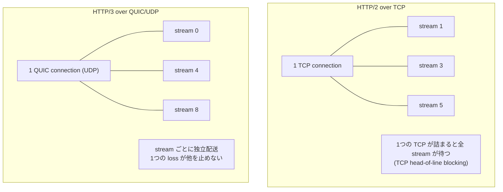

この記事は、ネットワークプロトコルを手を動かして学ぶフリー教材シリーズ **Protocol Lab** の一部です。教材本体（実行スクリプト・サンプル設定・RFCノート）はGitHubで公開しています。

- リポジトリ: https://github.com/pathvector-studio/protocol-lab

[HTTP Lab 10](https://zenn.dev/nkchan/articles/protocol-lab-http-10) の HTTP/1.1 は、1接続で1リクエストずつでした。HTTP/2 は多数のリクエストを **stream** として1本の TCP 接続に多重化します。HTTP/3 はその stream を **QUIC**（UDP の上）に移します。今回はその違いを大まかに観察します。

やることは次の通りです。

- **HTTP/2** で fetch し、ALPN が `h2` になることを確認する。
- 複数リクエストを同時に送り、**1本の TCP 接続に多重化**されるのを見る。
- server が **`Alt-Svc: h3`** で HTTP/3 を広告するヘッダを読む。
- HTTP/3 / QUIC が TCP ではなく **UDP** に乗ることを見る。

最終的に、次の比較を説明できる状態を目指します。

| | HTTP/1.1 | HTTP/2 | HTTP/3 |
|---|---|---|---|
| Transport | TCP | TCP | QUIC over UDP |
| 並行性 | 1 req / 接続 | 多 stream / 1接続 | 多 stream / 1接続 |
| head-of-line blocking | HTTP層 | TCP層 | stream 単位で回避 |
| 広告方法 | — | ALPN `h2` | `Alt-Svc: h3` + ALPN `h3` |

想定時間は55〜70分です。

## このLabで学べること

- stream とは何か、HTTP/2 が stream をどう1接続に多重化するか。
- 1本の TCP 接続でも全 stream が止まりうる理由（TCP head-of-line blocking）。
- QUIC が stream を直接 UDP に載せ、その cross-stream の停止を避ける仕組み。
- ALPN と `Alt-Svc` が、client にバージョンを発見・選択させる仕組み。

今回は扱いません: HTTP/2 の flow control / priority / HPACK 内部、QUIC の輻輳制御 / loss recovery 詳細、0-RTT / connection migration、性能チューニング。

## RFCで読む場所

| RFC | 読むポイント |
|---|---|
| RFC 9113 §4-5 | HTTP/2 の frame と stream（状態・多重化） |
| RFC 9114 §2 | HTTP/3 の stream mapping（QUIC stream への対応） |
| RFC 9000 §2 | QUIC の stream（独立配送） |
| RFC 7301 §3 | ALPN（h2 / h3 の選択） |
| RFC 9110 §3.9 | `Alt-Svc`（alternative service の広告） |

## 実験の全体像

Lab 07 以来の2ノード。server は Caddy（HTTP/1.1・HTTP/2・HTTP/3 を1つの binary で提供）、client は netshoot の curl です。応答本文はその時使われた protocol を書き返す（`Hello over HTTP/2.0 ...`）ので、どの transport で届いたかが本文で分かります。



## 手順

```bash
./scripts/labctl.sh run quic-11   # build → deploy → HTTP/2多重化capture → Alt-Svc確認 → 後片付け
```

以下は手動手順です。

### 1. ビルドして起動する

```bash
cd protocol-lab/examples/quic-11
docker build -t protocol-lab/caddy:2 .
sudo containerlab deploy -t quic-11.clab.yml
```

### 2. HTTP/2 で1回 fetch する

```bash
docker exec clab-quic-11-client curl -k --http2 -sv https://10.0.0.2/one
```

```text
* ALPN: server accepted h2
* using HTTP/2
< HTTP/2 200
Hello over HTTP/2.0 for /one
```

`-k` は自己署名（Caddy internal CA）を許すためです。本文が `HTTP/2.0` と書き返します。

### 3. 複数リクエストを同時に投げて多重化を見る

```bash
docker exec clab-quic-11-client sh -c \
  "curl -k --http2 -sv --parallel --parallel-immediate \
     https://10.0.0.2/a https://10.0.0.2/b https://10.0.0.2/c 2>&1 | grep -Ei 'stream|reused|Connected|HTTP/2'"
```

- 3つのリクエストが別々の **stream**（stream 1, 3, 5 …）。
- 接続は1本（`Re-using existing connection`）。

capture で TCP 接続数を数えると、3リクエストでも SYN は1つ（=1接続に多重化）です。

### 4. HTTP/3 の広告を読む

```bash
docker exec clab-quic-11-client sh -c "curl -k --http2 -sD - -o /dev/null https://10.0.0.2/"
# alt-svc: h3=":443"; ma=2592000
```

これは「同じサービスは h3（HTTP/3）でも `:443`（UDP）で受けられる」という広告です。client は次回から QUIC を試せます。

### 5. HTTP/3 を試す（curl が対応していれば）

```bash
docker exec clab-quic-11-client sh -c "curl -V | grep -i HTTP3"
docker exec clab-quic-11-client curl -k --http3 -sv https://10.0.0.2/three
```

対応していれば本文は `Hello over HTTP/3.0 ...`、capture では TCP ではなく **UDP/443**（QUIC）になります。未対応なら、server 側の UDP リスナーで QUIC の待ち受けを確認します。

```bash
docker exec clab-quic-11-server sh -c "ss -uln"
```

## なぜそう動くのか

HTTP/2 と HTTP/3 の狙いは同じ「1接続で多数のやり取りを同時に流す」です。違いは、その stream を何の上に乗せるか。

- **HTTP/2 = streams over TCP**: 1本の TCP 接続の中を frame 単位で分割し、stream 番号で束ねる。多重化で HTTP/1.1 の「1接続1リクエスト」の制約を外す。ただし下は1本の TCP。あるパケットが失われて再送待ちになると、その後ろの**全 stream** が TCP レベルで止まる（TCP head-of-line blocking）。
- **HTTP/3 = streams over QUIC(UDP)**: QUIC は UDP の上に、暗号化・信頼性・stream を自分で実装する。stream ごとに独立して届けられるので、ある stream の loss が他を止めない。だから loss のある経路で有利。
- **discovery**: client は最初 TCP で来て ALPN で `h2` を選ぶ。server は `Alt-Svc: h3` で「UDP の h3 もある」と教え、client は次回 QUIC を試す。

要点は、**HTTP の意味（method/status/header、Lab 10）は同じまま、運び方（transport と多重化）が変わっている**ことです。

## よくある誤解

- **HTTP/2 に TLS は必須（実運用上）**。curl の `h2` は TLS + ALPN 前提。だから Lab 09 の TLS が土台。
- **多重化と並列接続を混同する**。HTTP/1.1 は複数 TCP 接続で並列化した。HTTP/2 は1接続の中の stream で多重化する。
- **TCP head-of-line blocking**。HTTP/2 は HTTP 層の HoL を消したが、TCP 層の HoL は残る。QUIC がそこを解く。
- **QUIC は UDP の上の独自 transport**。ただの UDP 送信ではなく、暗号化・順序・再送・stream を自前で持つ。
- **HTTP/3 の観察は client 依存**。curl が HTTP/3 対応でないと `--http3` は使えない。

## 確認問題

1. HTTP/2 の stream とは何か。HTTP/1.1 の「1接続1リクエスト」とどう違うか。
2. HTTP/2 で多重化しても残る head-of-line blocking はどの層のものか。QUIC はそれをどう解くか。
3. QUIC はどの transport の上に乗るか。なぜ UDP なのか。
4. `Alt-Svc: h3` は何を伝えるヘッダか。client はそれをどう使うか。
5. HTTP/2 と HTTP/3 で、HTTP の semantics は変わるか。
6. capture で、HTTP/2 と HTTP/3 のパケットはどう見分けられるか。

## 後片付け

```bash
sudo containerlab destroy -t quic-11.clab.yml --cleanup
```

---

**Protocol Lab について**

この記事は、ネットワークプロトコルを手を動かして学ぶフリー教材シリーズ Protocol Lab の一部です。全Labの一覧・実行スクリプト・RFCノートはこちらにあります。

- シリーズ一覧 / リポジトリ: https://github.com/pathvector-studio/protocol-lab

役に立ったら、リポジトリに ⭐️ をいただけると励みになります。

次回はシリーズの締めくくりとして、DNS → TCP → TLS → HTTP を1本につないだ end-to-end の解決を通しで観察します（Lab 12）。
