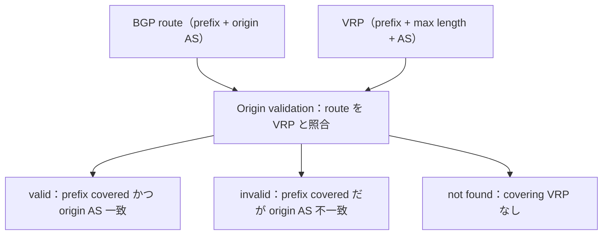

この記事は、ネットワークプロトコルを手を動かして学ぶフリー教材シリーズ **Protocol Lab** の一部です。教材本体（実行スクリプト・サンプル設定・RFCノート）はGitHubで公開しています。

- リポジトリ: https://github.com/pathvector-studio/protocol-lab

[BGP Lab 03](https://zenn.dev/nkchan/articles/protocol-lab-bgp-03) では、同じ prefix が複数の origin AS から見える状態を作り、「BGP table だけでは、どの origin が許可されているか分からない」ところで終わりました。今回はその問いに答えます。

テーマはシンプルです。**BGP は「誰が route を originate したか」を見せてくれる。RPKI origin validation は「その origin が許可されているか」を答える手がかりになる。**

FRRouting を local な RTR (RPKI-to-Router) cache につなぎ、次の3状態を実際に観察します。

| r2 で観測した route | Origin AS | ローカルVRPの内容 | 状態 |
|---|---:|---|---|
| `203.0.113.0/24` via `10.0.12.1` | `65001` | `203.0.113.0/24`, maxLength `24`, AS `65001` | `valid` |
| `203.0.113.0/24` via `10.0.23.2` | `65003` | 同じprefixだがAS `65001` のみ許可 | `invalid` |
| `198.51.100.0/24` via `10.0.24.2` | `65004` | 対応するVRPなし | `not found` |

想定時間は60〜75分です。

## このLabで学べること

- ROA は、ある AS が IP prefix を **max prefix length まで** originate してよいことを許可する。
- router は通常、検証済みの prefix data を **VRP** として RTR cache から受け取る。
- origin validation は、BGP route の prefix と origin AS を VRP と照合する。
- `valid` / `invalid` / `not found` は異なる状態。
- RPKI origin validation は **origin AS** を見る。AS_PATH 全体は見ない。
- router は policy がない限り、`invalid` route を自動的には reject しない。

今回は扱いません: 実RPKI repository の同期、public RTR cache の運用、route filtering policy、ASPA / AS_PATH 全体の検証、本番RPKI運用。

## RFCで読む場所

| RFC | 読むポイント |
|---|---|
| RFC 6482 §3 | ROA が AS と IP prefix を結びつけること |
| RFC 6811 §2 / §2.1 | route / origin AS / VRP / covering prefix、valid / invalid / not found の判定 |
| RFC 8210 §1-2 | validated cache と router が RTR protocol で情報をやり取りすること |
| RFC 5737 §3 | `203.0.113.0/24` と `198.51.100.0/24` が documentation prefix |

## 実験の全体像

4台の FRRouting router と、1台の local StayRTR cache を作ります。

```text
AS65001 / r1 ─┐
AS65003 / r3 ─┼─ AS65002 / r2 ── StayRTR (local RTR cache)
AS65004 / r4 ─┘

r1: 203.0.113.0/24   -> valid 期待
r3: 203.0.113.0/24   -> invalid 期待
r4: 198.51.100.0/24  -> not found 期待

local VRP: 203.0.113.0/24, maxLength 24, AS65001
```



`203.0.113.0/24` と `198.51.100.0/24` は RFC 5737 の documentation prefix です。

:::message
このLabの VRP は実RPKIの署名付き object ではなく、ローカルJSONで StayRTR に渡す実験用データです。実際のRPKIでは、ROA は署名された object として repository から検証されます。
:::

## 手順

```bash
./scripts/labctl.sh run rpki-04   # deploy → 出力確認 → validation state 検査 → destroy
```

以下は手動手順です。

### 1. ローカルVRPデータを読む

```bash
cd protocol-lab/examples/rpki-04
cat stayrtr/roas.json
```

```json
{
  "roas": [
    { "prefix": "203.0.113.0/24", "maxLength": 24, "asn": 65001 }
  ]
}
```

読み方: `203.0.113.0/24` は **AS65001 のみ** originate 可、`maxLength 24` なのでより細かい prefix は不許可、`198.51.100.0/24` に対応する VRP は無し。

### 2. 起動して RTR 接続を確認する

```bash
sudo containerlab deploy -t rpki-04.clab.yml
docker exec -it clab-rpki-04-r2 vtysh -c "show rpki cache-connection"
```

```text
rpki tcp cache 10.0.25.2 8282 pref 1 (connected)
```

r2 が受け取った VRP を見ます。

```bash
docker exec -it clab-rpki-04-r2 vtysh -c "show rpki prefix-table"
```

```text
Prefix            Prefix Length   Origin-AS
203.0.113.0        24 -  24         65001
```

### 3. BGP table で validation state を見る

```bash
docker exec -it clab-rpki-04-r2 vtysh -c "show bgp ipv4 unicast"
```

```text
RPKI validation codes: V valid, I invalid, N Not found

   Network          Next Hop      Metric LocPrf Weight Path
N*> 198.51.100.0/24  10.0.24.2         0             0 65004 i
I*  203.0.113.0/24   10.0.23.2         0             0 65003 i
V*>                  10.0.12.1         0             0 65001 i
```

読み方:

- `V`（valid）: `203.0.113.0/24` を AS65001 が originate、VRPと一致。
- `I`（invalid）: `203.0.113.0/24` を AS65003 が originate、VRPは AS65001 だけを許可。
- `N`（not found）: `198.51.100.0/24` に対応する VRP がない。

状態で絞ることもできます。

```bash
docker exec -it clab-rpki-04-r2 vtysh -c "show bgp ipv4 unicast rpki valid"
docker exec -it clab-rpki-04-r2 vtysh -c "show bgp ipv4 unicast rpki invalid"
```

:::message
`show bgp ipv4 unicast` で `Network` 欄が空に見える行は、同じ prefix の複数 path 表示で prefix が省略されているだけです。上の `V*>` 行も `203.0.113.0/24` に対する path です。
:::

## なぜそう動くのか

RPKI origin validation は、BGP route の prefix と origin AS を、validated cache から得た VRP と照合します。今回の local VRP は1つだけ（`203.0.113.0/24, maxLength 24, AS65001`）。

- `r1` の route は prefix も origin AS も VRP と一致 → **valid**。
- `r3` の route は prefix は covered だが origin AS が `65003` → **invalid**。
- `r4` の route は `198.51.100.0/24` に対応する VRP が無い → **not found**。

注意すべきは、**`invalid` と表示されることと route が自動的に拒否されることは別**だという点です。FRRouting では policy を書かなければ `invalid` route が best path になることもあります。このLabでは validation state を観察するところまでを扱い、filter policy は扱いません。

## よくある誤解

- `not found` は `invalid` ではない。対応する VRP が無い状態。
- `invalid` は「AS_PATH 全体が偽物」という意味ではない。origin AS と VRP の不一致を示す。
- RPKI origin validation は route filtering policy そのものではない。reject には別途 policy が要る。
- このLabの JSON はローカル実験用。実RPKIでは ROA は署名された object として検証される。

## 確認問題

1. `203.0.113.0/24` from AS65001 はなぜ `valid` になるか。
2. `203.0.113.0/24` from AS65003 はなぜ `invalid` になるか。
3. `198.51.100.0/24` from AS65004 はなぜ `not found` になるか。
4. `invalid` route は必ず自動的に reject されるか。
5. RPKI origin validation は AS_PATH 全体を検証しているか。

## 後片付け

```bash
sudo containerlab destroy -t rpki-04.clab.yml --cleanup
```

---

**Protocol Lab について**

この記事は、ネットワークプロトコルを手を動かして学ぶフリー教材シリーズ Protocol Lab の一部です。全Labの一覧・実行スクリプト・RFCノートはこちらにあります。

- シリーズ一覧 / リポジトリ: https://github.com/pathvector-studio/protocol-lab

役に立ったら、リポジトリに ⭐️ をいただけると励みになります。

次回からはレイヤを変えて、DNS の再帰解決を扱います（DNS Lab 05）。
