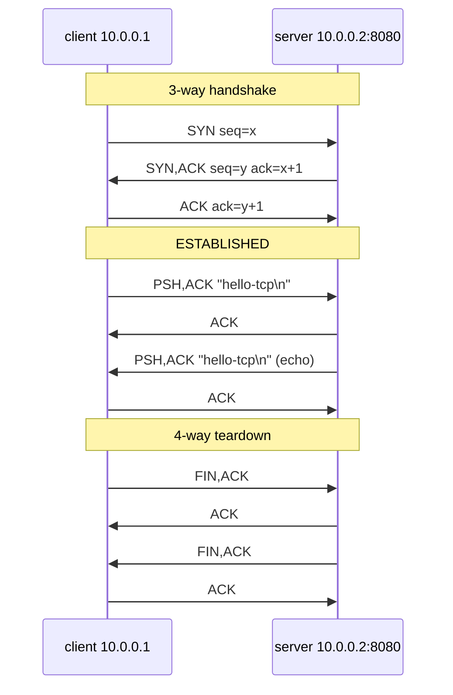

この記事は、ネットワークプロトコルを手を動かして学ぶフリー教材シリーズ **Protocol Lab** の一部です。教材本体（実行スクリプト・サンプル設定・RFCノート）はGitHubで公開しています。

- リポジトリ: https://github.com/pathvector-studio/protocol-lab

DNS編は「名前 → アドレス」で終わりました。今回はその次、実際に1本の TCP 接続を張り、その**一生**をパケットキャプチャで観察します。捕まえて注釈するのは次の3つです。

- **3-way handshake**: `SYN` / `SYN-ACK` / `ACK`
- 小さな **データのやり取り**（sequence と acknowledgment 番号つき）
- **4-way teardown**: `FIN` / `ACK` / `FIN` / `ACK`

最終的に、次のスケッチの各パケットにラベルを付けられる状態を目指します。

```text
client                          server
  | ---- SYN  seq=x ----------->  |   接続要求
  | <--- SYN,ACK seq=y ack=x+1 -  |   受理、server の ISN
  | ---- ACK  ack=y+1 --------->  |   handshake 完了 (ESTABLISHED)
  | ==== data / echo =========>   |   小さな往復
  | ---- FIN ----------------->   |   client 送信終了
  | <--- ACK ------------------   |
  | <--- FIN ------------------   |   server 送信終了
  | ---- ACK ----------------->   |   両方向 close
```

想定時間は50〜65分です。

## このLabで学べること

- TCP の接続確立に、なぜ1つではなく3パケット必要なのか。
- capture 上での SYN / ACK / FIN / RST フラグの意味。
- ISN（初期シーケンス番号）と `ack = seq + 1` が handshake をどう結びつけるか。
- close が4-way になる理由（各方向が独立に閉じる）。
- `tcpdump` のフラグ表記 `[S]` `[S.]` `[.]` `[P.]` `[F.]` `[R]` の読み方。

今回は扱いません: 再送・ウィンドウ・ロス回復（Lab 08）、輻輳制御、TLS やアプリ層、TCP オプションの詳細（MSS / window scaling / SACK / timestamps）。

## RFCで読む場所

RFC 9293 は RFC 793 を置き換えた現行の TCP 仕様です。

| RFC 9293 | 読むポイント |
|---|---|
| §3.1 | header format、control bits（SYN/ACK/FIN/RST） |
| §3.4 | sequence number と ISN、`ack = seq + 1` の考え方 |
| §3.5 | connection establishment（3-way handshake） |
| §3.6 | connection termination（FIN による 4-way close） |
| §3.3.2 | 状態遷移（LISTEN / SYN-SENT / ESTABLISHED / FIN-WAIT / TIME-WAIT） |

## 実験の全体像

2ノードを1本のリンクで繋ぐだけです。server は echo リスナー（受け取ったバイトをそのまま返す）、client は1行送って echo を受け取り、接続を閉じます。その間ずっと client 側で `tcpdump` を回し、handshake から teardown までを1つの pcap に収めます。

```text
client (10.0.0.1) ------ eth1/eth1 ------ server (10.0.0.2:8080)
```



両ノードとも `nicolaka/netshoot`（`ip`・`tcpdump`・`ncat` 同梱）を使うので追加イメージは不要です。

## 手順

```bash
./scripts/labctl.sh run tcp-07   # deploy → echo起動 → tcpdump収集 → 1接続 → 確認 → destroy
```

以下は手動手順です。

### 1. 起動して echo リスナーを立てる

```bash
cd protocol-lab/examples/tcp-07
sudo containerlab deploy -t tcp-07.clab.yml
docker exec -d clab-tcp-07-server ncat --listen --keep-open 8080 --exec "/bin/cat"
```

### 2. client で capture を仕込む

```bash
docker exec -it clab-tcp-07-client tcpdump -i eth1 -n "tcp port 8080"
```

`-n` で名前解決を切ると、アドレスとフラグがそのまま読めます。

### 3. 1回だけ接続する

別シェルで、client から1行送って echo を受け取り、閉じます。

```bash
docker exec -it clab-tcp-07-client sh -c "printf 'hello-tcp\n' | ncat -w2 10.0.0.2 8080"
```

:::message
`tcpdump` を先に起動してから接続してください。順番が逆だと最初の SYN を取り逃します。
:::

### 4. capture を読む

```text
10.0.0.1.44002 > 10.0.0.2.8080: Flags [S],  seq 1000000000               <- SYN
10.0.0.2.8080 > 10.0.0.1.44002: Flags [S.], seq 2000000000, ack 1000000001 <- SYN-ACK
10.0.0.1.44002 > 10.0.0.2.8080: Flags [.],  ack 1                          <- ACK（handshake 完了）
10.0.0.1.44002 > 10.0.0.2.8080: Flags [P.], seq 1:11, ack 1, length 10     <- data "hello-tcp\n"
10.0.0.2.8080 > 10.0.0.1.44002: Flags [P.], seq 1:11, ack 11, length 10    <- echo
10.0.0.1.44002 > 10.0.0.2.8080: Flags [F.], seq 11, ack 11                 <- FIN（client 送信終了）
10.0.0.2.8080 > 10.0.0.1.44002: Flags [F.], seq 11, ack 12                 <- FIN（server 送信終了）
10.0.0.1.44002 > 10.0.0.2.8080: Flags [.],  ack 12                         <- 最後の ACK
```

| 表記 | 意味 |
|---|---|
| `[S]` | SYN |
| `[S.]` | SYN + ACK |
| `[.]` | ACK のみ |
| `[P.]` | PSH + ACK（データ付き） |
| `[F.]` | FIN + ACK |
| `[R]` | RST |

## なぜそう動くのか

TCP は、信頼できない IP の上に信頼できるバイトストリームを作ります。そのために両端が「相手がどこから数え始めるか（ISN）」を合意してからデータを送ります。

- **なぜ3パケットか**: client の SYN は「seq=x から送る」を宣言。server はそれを ACK（`ack=x+1`）しつつ自分の SYN（seq=y）を返す。client が server の SYN を ACK（`ack=y+1`）して双方向の初期 seq が確定する。1往復では片方向しか同期できないので最低3パケット必要。
- **なぜ `ack = seq + 1` か**: SYN は（データが無くても）1バイト分の seq を消費する。だから相手は次に期待する番号 `seq + 1` を返す。FIN も同じく1つ消費する。
- **なぜ4パケットで閉じるか**: TCP の各方向は独立に閉じられる（half-close）。client が FIN を送っても server はまだ送りたいデータがあるかもしれない。だから方向ごとに閉じる。echo サーバはすぐ閉じるので、server 側の ACK と FIN がまとまって見えることもある。

観察している状態遷移（client 視点）: `SYN-SENT → ESTABLISHED → FIN-WAIT-1 → FIN-WAIT-2 → TIME-WAIT`。

## よくある誤解

- **handshake を「1回の握手」と思う**。実際は3パケット。SYN / SYN-ACK / ACK を別々に数える。
- **seq/ack の絶対値を暗記しようとする**。ISN はランダム。大事なのは関係（`ack = 相手の seq + 1`）。`tcpdump` は既定で相対 seq を表示する。
- **`[.]` を「何もない」と読む**。`[.]` は ACK のみのパケット。handshake の3つ目や確認応答に出る。
- **FIN と RST を混同する**。FIN は行儀のよい終了、RST は打ち切り。

## 確認問題

1. TCP の接続確立にパケットが3つ必要なのはなぜか。1つでは何が足りないか。
2. SYN-ACK の `ack` は client の SYN の `seq` とどんな関係か。なぜ `+1` か。
3. `[S]` `[S.]` `[.]` `[F.]` `[R]` はそれぞれ何を表すか。
4. close にパケットが4つ必要なのはなぜか。half-close とは何か。
5. FIN による終了と RST による終了は何が違うか。
6. capture の中で、client が `ESTABLISHED` に入るのはどのパケットの後か。

## 後片付け

```bash
sudo containerlab destroy -t tcp-07.clab.yml --cleanup
```

---

**Protocol Lab について**

この記事は、ネットワークプロトコルを手を動かして学ぶフリー教材シリーズ Protocol Lab の一部です。全Labの一覧・実行スクリプト・RFCノートはこちらにあります。

- シリーズ一覧 / リポジトリ: https://github.com/pathvector-studio/protocol-lab

役に立ったら、リポジトリに ⭐️ をいただけると励みになります。

次回は、同じ接続の上で**パケットが落ちたときに TCP が何をするか**——再送・ウィンドウ・ロス回復を観察します（TCP Lab 08）。
