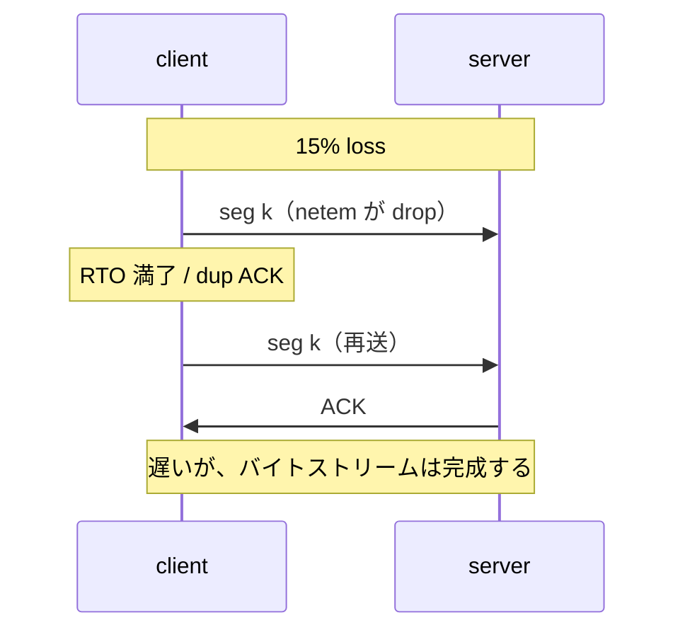

この記事は、ネットワークプロトコルを手を動かして学ぶフリー教材シリーズ **Protocol Lab** の一部です。教材本体（実行スクリプト・サンプル設定・RFCノート）はGitHubで公開しています。

- リポジトリ: https://github.com/pathvector-studio/protocol-lab

前回の [TCP Lab 07](https://zenn.dev/nkchan/articles/protocol-lab-tcp-07) は、完璧なリンク上で接続の開閉を見ました。実際のリンクはパケットを落とします。今回は**わざとリンクを lossy にして**、TCP が loss に気づき回復する様子を観察します。

やることは次の通りです。

- `tc netem` でリンクに遅延とパケットロスを足す。
- 数MBを送って **再送（retransmission）** されたセグメントを数える。
- `ss -ti` で **RTT**・**cwnd**・**retransmit** カウンタが動くのを読む。
- capture で **receive window**（`win`）と window scaling を見る。

最終的に、次の対比を説明できる状態を目指します。

| リンク | 再送セグメント | 転送時間 |
|---|---|---|
| clean | ほぼ0 | 短い |
| 15% loss + 25ms delay | 多い | 長いが、それでも完了する |

想定時間は55〜70分です。

## このLabで学べること

- TCP が再送する理由: ACK されないセグメントは、タイムアウト（RTO）または重複ACKの後で「失われた」とみなされる。
- RTT が retransmission timeout をどう決めるか。
- receive window が広告するものと、window scaling がそれをどう拡張するか。
- loss が転送を「壊さず遅くする」仕組み（信頼できないネットワーク上の信頼性）。
- `ss -ti` から retransmit / cwnd / rtt を、capture から重複セグメントを読む方法。

今回は扱いません: 個別の輻輳制御アルゴリズム（CUBIC/BBR）の詳細、SACK/ECN/pacing の内部、アプリ層の挙動、スループット用の `sysctl` 調整。

## RFCで読む場所

| RFC | 読むポイント |
|---|---|
| RFC 9293 §3.7 | data communication、retransmission timeout、window の使い方 |
| RFC 9293 §3.8.6 | flow control と receive window |
| RFC 6298 | RTT 測定と RTO の計算 |
| RFC 7323 | window scale option（大きな window を可能にする） |
| RFC 5681 | slow start / congestion avoidance / loss への反応（参考） |

## 実験の全体像

Lab 07 と同じ2ノード。今回は client 側リンクに `tc netem` で遅延とロスを入れ、約3MBを2回（クリーン／lossy）送って再送数と所要時間を比べます。

```text
client (10.0.0.1) --[ netem: delay 25ms, loss 15% ]-- server (10.0.0.2:8080)
```



両ノードとも `nicolaka/netshoot`（`ip`・`tc`・`tcpdump`・`ss`・`ncat` 同梱）を使います。

## 手順

```bash
./scripts/labctl.sh run tcp-08   # deploy → クリーン転送 → netem適用 → lossy転送計測 → 後片付け
```

以下は手動手順です。

### 1. 起動して sink を用意する

```bash
cd protocol-lab/examples/tcp-08
sudo containerlab deploy -t tcp-08.clab.yml
docker exec -d clab-tcp-08-server sh -c "ncat --listen --keep-open 8080 > /dev/null"
```

server は受け取ったバイトを捨てる sink です。

### 2. クリーンなリンクで送る（基準）

```bash
docker exec clab-tcp-08-client sh -c "cat /proc/net/snmp | grep '^Tcp:'"
time docker exec clab-tcp-08-client sh -c "head -c 3000000 /dev/zero | ncat -w15 10.0.0.2 8080"
docker exec clab-tcp-08-client sh -c "cat /proc/net/snmp | grep '^Tcp:'"
```

`Tcp:` の2行のうち上が列名、下が値です。`RetransSegs` 列の増分がクリーン時の再送数（ふつうほぼ0）。

### 3. リンクを lossy にして、もう一度送る

```bash
docker exec clab-tcp-08-client tc qdisc add dev eth1 root netem delay 25ms loss 15%
```

別シェルで capture と socket 統計を回します。

```bash
docker exec -it clab-tcp-08-client tcpdump -i eth1 -n "tcp port 8080"
docker exec -it clab-tcp-08-client sh -c "while true; do ss -tino dst 10.0.0.2; sleep 0.5; done"
```

そして転送（前後で `RetransSegs` を控える）。

```bash
time docker exec clab-tcp-08-client sh -c "head -c 3000000 /dev/zero | ncat -w15 10.0.0.2 8080"
```

- `RetransSegs` の増分がクリーン時よりずっと大きい。
- `time` の実時間が長い（でも転送は完了する）。
- `ss -tino` に `rtt:` `cwnd:` `retrans:` `rto:` が並ぶ。loss のたびに cwnd が縮み、rto が伸びる。

### 4. netem を外す

```bash
docker exec clab-tcp-08-client tc qdisc del dev eth1 root
```

:::message
次の実験に遅延・ロスが残らないよう、`tc qdisc del dev eth1 root` で必ず netem を外してください。
:::

## なぜそう動くのか

TCP は信頼できないネットワークの上で、信頼できるバイトストリームを約束します。だから「送ったのに ACK が返らない」を loss とみなして送り直します。

- **retransmission の引き金は2つ**: (1) 一定時間 ACK が来ない → RTO タイムアウトで再送。(2) 同じ ACK が重複して届く（dup ACK）→ 受信側が「その先が抜けている」と言っている → fast retransmit。
- **RTO は RTT から作る**（RFC 6298）。RTT とそのばらつきを測り、余裕をもったタイムアウトを決める。RTT が伸びれば RTO も伸びる。
- **receive window** は受信側が「今これだけ受け取れる」と広告する量。送信側はそれを超えて未確認データを積めない（flow control）。16bit では足りないので **window scale option**（SYN で交換）で実効窓を広げる（RFC 7323）。
- **loss は速度を落とすが壊さない**: 再送で抜けを埋め、輻輳制御（RFC 5681）で送信ペースを落とす。だから 15% 落としても、時間はかかるが 3MB は最後まで届く。

要点は「TCP は loss を検出し、再送し、ペースを調整して、それでもストリームを完成させる」ことです。

## よくある誤解

- **再送を「エラー」と読む**。再送は TCP の正常な回復動作。ゼロにはならない。
- **RetransSegs の絶対値を見る**。大事なのはクリーン時との差（増分）。
- **cwnd と receive window を混同する**。cwnd は送信側が輻輳を見て決める窓、receive window は受信側が広告する窓。実際に送れる量は両者の小さい方。
- **loss を大きくしすぎる**。50% などにすると転送が実質止まる。15% 程度が観察に向く。
- **tcpdump は再送に明示ラベルを付けない**。同じ `seq` の再出現や `ss` の `retrans` で判断する。

## 確認問題

1. TCP が「パケットが失われた」と判断する2つのきっかけは何か。
2. RTO は何を元に決まるか。RTT が伸びると RTO はどうなるか。
3. receive window と congestion window（cwnd）の違いは何か。実際に送れる量はどちらで決まるか。
4. window scale option は何のためにあるか。どのパケットで交換されるか。
5. 15% のロスがあっても 3MB の転送が完了するのはなぜか。
6. `ss -tino` の `retrans:X/Y` の X と Y はそれぞれ何を表すか。

## 後片付け

```bash
sudo containerlab destroy -t tcp-08.clab.yml --cleanup
```

---

**Protocol Lab について**

この記事は、ネットワークプロトコルを手を動かして学ぶフリー教材シリーズ Protocol Lab の一部です。全Labの一覧・実行スクリプト・RFCノートはこちらにあります。

- シリーズ一覧 / リポジトリ: https://github.com/pathvector-studio/protocol-lab

役に立ったら、リポジトリに ⭐️ をいただけると励みになります。

次回はレイヤを上げて、TCP の上に載る TLS の handshake と証明書を観察します（TLS Lab 09）。
