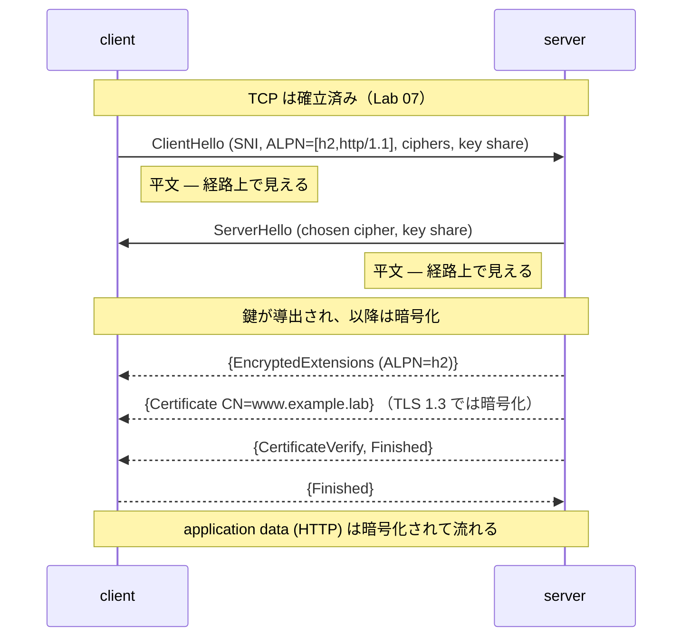

この記事は、ネットワークプロトコルを手を動かして学ぶフリー教材シリーズ **Protocol Lab** の一部です。教材本体（実行スクリプト・サンプル設定・RFCノート）はGitHubで公開しています。

- リポジトリ: https://github.com/pathvector-studio/protocol-lab

[TCP Lab 07/08](https://zenn.dev/nkchan/articles/protocol-lab-tcp-07) で、TCP は信頼できるバイトストリームをくれました。TLS はその上で暗号化とサーバ認証を足します。今回は TLS 1.3 の接続を1本張り、精密な問いを立てます。**暗号化が始まる前に、経路上の観測者には何が見えるのか。**

やることは次の通りです。

- `openssl s_server`（自己署名証明書 + ALPN）を立てる。
- `openssl s_client` を **SNI**（`-servername`）付きで繋ぐ。
- ネゴシエートされた **protocol / cipher / certificate / ALPN** を読む。
- handshake を capture し、**ClientHello（SNI と ALPN offer を含む）は平文**で見え、TLS 1.3 では **certificate が暗号化**されていることを観察する。

最終的に、次の表を埋められる状態を目指します。

| Handshake の項目 | 経路上で見える？(TLS 1.3) | 見た方法 |
|---|---|---|
| SNI (`server_name`) | 見える（ClientHello内） | capture / tshark |
| ALPN offer | 見える（ClientHello内） | capture / tshark |
| 選ばれた cipher / version | 見える（ServerHello内） | capture |
| server 証明書 | 見えない（暗号化） | `s_client` 端点でのみ |

想定時間は55〜70分です。

## このLabで学べること

- TLS の位置: TCP の上、アプリ（HTTP）の下。
- ClientHello と ServerHello が運ぶもの、どの部分が平文か。
- SNI とは何か、なぜ server は証明書を選ぶ前にそれを必要とするか。
- ALPN が何をネゴシエートするか（例: `h2` か `http/1.1`）。
- TLS 1.3 で証明書が暗号化されて送られる理由（TLS 1.2 との違い）。

今回は扱いません: 実CA署名のチェーンや trust-store 検証、client 証明書 / mutual TLS、SNI も隠す ECH、鍵交換の暗号詳細。

## RFCで読む場所

| RFC | 読むポイント |
|---|---|
| RFC 8446 §2 | TLS 1.3 handshake の全体像（1-RTT） |
| RFC 8446 §4.1.2 / §4.1.3 | ClientHello / ServerHello の中身 |
| RFC 8446 §4.4.2 | Certificate message（1.3 では暗号化される） |
| RFC 6066 §3 | Server Name Indication（SNI） |
| RFC 7301 §3 | Application-Layer Protocol Negotiation（ALPN） |

## 実験の全体像

Lab 07/08 と同じ2ノード。server は TLS リスナー、client は SNI=`www.example.lab`、ALPN offer=`h2,http/1.1` で接続し、その handshake を client 側で capture します。



両ノードとも `nicolaka/netshoot`（`openssl`・`tcpdump`・`tshark` 同梱）を使います。

## 手順

```bash
./scripts/labctl.sh run tls-09   # deploy → 証明書生成 → s_server → capture → s_client → 確認 → 後片付け
```

以下は手動手順です。

### 1. 起動して証明書を作る

```bash
cd protocol-lab/examples/tls-09
sudo containerlab deploy -t tls-09.clab.yml
docker exec clab-tls-09-server sh -c \
  "openssl req -x509 -newkey rsa:2048 -nodes \
     -keyout /tmp/server.key -out /tmp/server.crt \
     -subj '/CN=www.example.lab' -days 30 -addext 'subjectAltName=DNS:www.example.lab'"
```

自己署名証明書です（閉じた Lab 用。公開 CA は使いません）。

### 2. TLS リスナーを起動する

```bash
docker exec -d clab-tls-09-server sh -c \
  "openssl s_server -accept 4433 -cert /tmp/server.crt -key /tmp/server.key -alpn h2,http/1.1 -www -quiet"
```

`-alpn h2,http/1.1` で、server が話せる application protocol を宣言します。

### 3. capture を仕込んで TLS で接続する

```bash
docker exec -it clab-tls-09-client tcpdump -i eth1 -s0 -n "tcp port 4433"   # 別シェル
docker exec -it clab-tls-09-client sh -c \
  "echo Q | openssl s_client -connect 10.0.0.2:4433 -servername www.example.lab -alpn h2,http/1.1 -tls1_3"
```

`s_client` の出力:

```text
subject=CN = www.example.lab
issuer=CN = www.example.lab
ALPN protocol: h2
Protocol  : TLSv1.3
Cipher    : TLS_AES_256_GCM_SHA384
Verify return code: 18 (self signed certificate)
```

- `subject=CN = www.example.lab`: server が提示した証明書。
- `ALPN protocol: h2`: `h2`（HTTP/2）で合意。
- `Verify return code: 18`: 自己署名なので検証は失敗扱い（Lab では想定内。公開 CA なら 0）。

### 4. capture から「平文で見える部分」を読む

```bash
docker exec clab-tls-09-client sh -c \
  "tshark -r /tmp/tls-09.pcap -Y 'tls.handshake.type==1' \
     -T fields -e tls.handshake.extensions_server_name -e tls.handshake.extensions_alpn_str"
```

```text
www.example.lab   h2,http/1.1
```

つまり **SNI と ALPN offer は ClientHello に平文で入っている**。一方、証明書は TLS 1.3 では暗号化された後に送られるので、capture から中身は読めません（`s_client` は接続の端点なので復号して表示できる）。

## なぜそう動くのか

TLS は「暗号化」と「相手が本物かの確認」を TCP の上に足す層です。1本の TLS 接続はまず handshake で、暗号方式・鍵・application protocol を決めます。

- **SNI が平文なのはなぜか**: server は1つの IP で複数サイトを提供しうる。どの証明書を出すか選ぶには、鍵が決まる前に「どのサイト宛てか」を知る必要がある。だから ClientHello に平文で入る（これを隠すのが ECH。範囲外）。
- **ALPN は何を決めるか**: `h2` か `http/1.1` かといった上位プロトコルを、handshake の中で1往復で合意する。別途の往復を足さずに済む。
- **TLS 1.3 で証明書が暗号化されるのはなぜか**: ClientHello/ServerHello で key share を交換した直後に鍵が導出され、以降（EncryptedExtensions、Certificate、Finished）は暗号化される。1.2 では証明書は平文だったが、1.3 では隠れる。

要点は **暗号化が始まる境界を capture の上で指させる**こと。ClientHello/ServerHello までは平文、その先は暗号化です。

## よくある誤解

- **SNI と証明書の CN を混同する**。SNI は client が「このサイト宛て」と平文で伝える希望、CN/SAN は server が返す証明書の名前。
- **`Verify return code: 18` をバグと思う**。自己署名だから検証は失敗扱い。公開 CA なら 0。
- **TLS 1.2 と 1.3 の違い**。1.2 では証明書が平文で見える。`-tls1_2` にすると capture で証明書が読めることも確認できる。
- **`-s0` を付け忘れる**。truncate されて handshake を取りこぼすことがある。

## 確認問題

1. TLS はどの層の上に乗り、どの層の下にあるか。
2. SNI は誰が何のために送るか。なぜ平文なのか。
3. ALPN は何を決めるか。このLabでは何が選ばれたか。
4. TLS 1.3 で、capture から読めるのはどのメッセージまでか。証明書は読めるか。理由は。
5. `Verify return code: 18` は何を意味するか。公開 CA だとどうなるか。
6. TLS 1.2 と 1.3 で、証明書の見え方はどう違うか。

## 後片付け

```bash
sudo containerlab destroy -t tls-09.clab.yml --cleanup
```

---

**Protocol Lab について**

この記事は、ネットワークプロトコルを手を動かして学ぶフリー教材シリーズ Protocol Lab の一部です。全Labの一覧・実行スクリプト・RFCノートはこちらにあります。

- シリーズ一覧 / リポジトリ: https://github.com/pathvector-studio/protocol-lab

役に立ったら、リポジトリに ⭐️ をいただけると励みになります。

次回は、この TLS の上に載る HTTP を扱い、リクエスト/レスポンスとキャッシュを観察します（HTTP Lab 10）。

